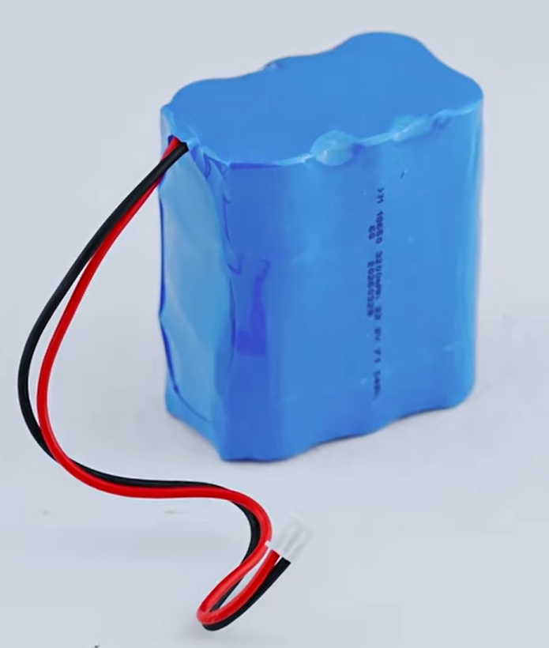
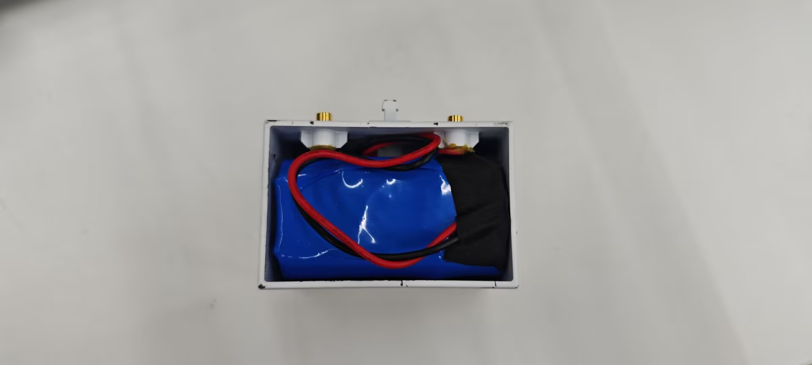
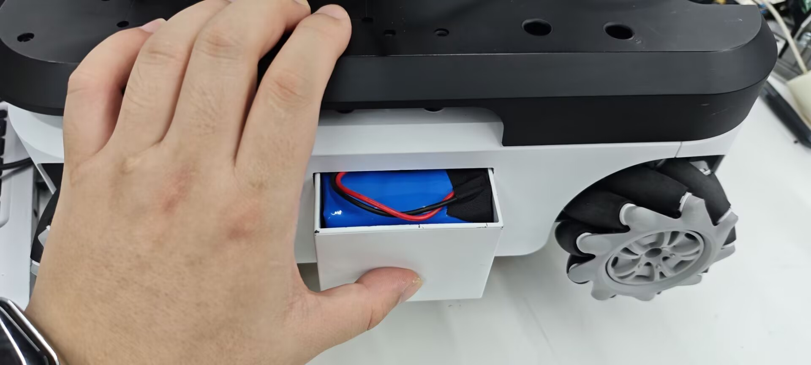
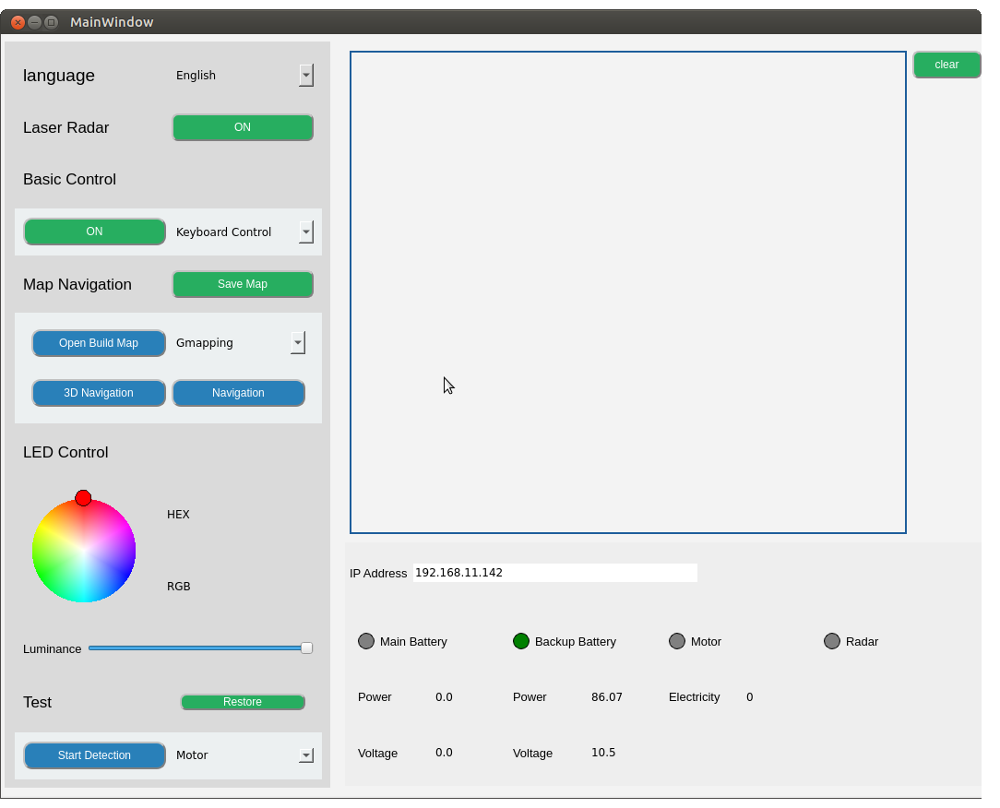

# 备用电池

> **兼容型号：**myAGV Plus 

它与 myAGV Plus 的主电池规格相同，并采用快速安装方法，可延长 myAGV Plus的运行时间。

## 产品参数

| **参数** | **规格**   |
| :------- | :--------- |
| 容量     | 3200mAh    |
| 电压     | 22.2V      |
| 兼容性   | myAGV Plus |

## 如何使用

1.从附件盒中取出备用电池，找到 myAGV Plus左侧的电池仓。

2.用手按压电池仓两侧，电池仓外壳会自动弹出，连接备用电池的正负极接口。

3.将电池直立放入电池仓，然后将白色插头插入空位，以防干扰外壳安装。

> 如何知道电池是否已正确安装和识别？

请打开 **AGV_Plus_UI** 
备用电池的指示灯将亮起，电压值可以返回，表明安装成功。

## 购买链接：

- [淘宝](https://item.taobao.com/item.htm?id=745304010906&spm=a312a.7700824.w4002-23353347473.51.3a00b6e28MpDla)
- [shopify](https://shop.elephantrobotics.com/collections/myagv/products/spare-battery-for-myagv-2023)

---

[← 上一页](../10.1-IPS/1-IPSTouchScreen.md) | [下一页 →](../10.3-DepthCamera/1-AstraPro2.md)
