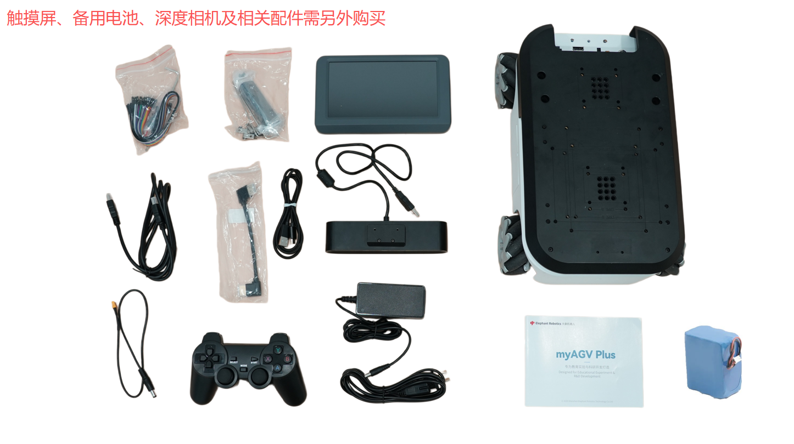
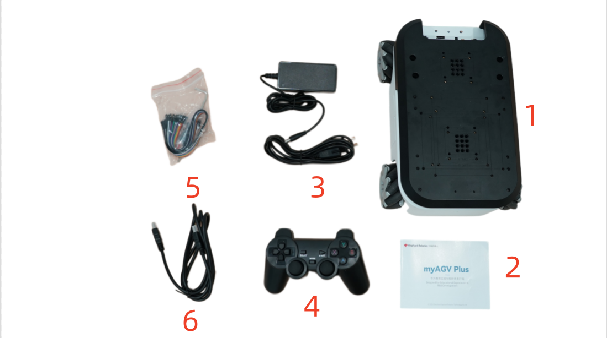
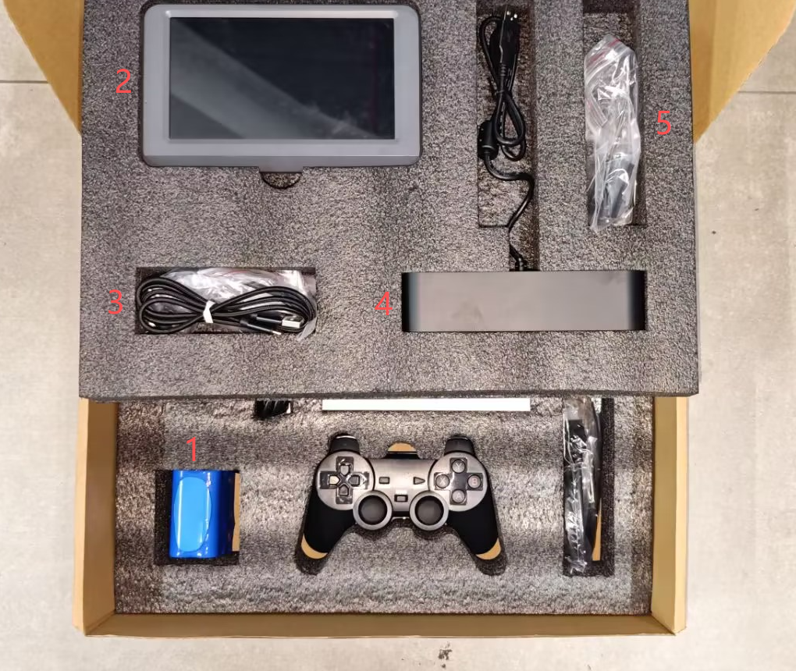

# 产品标准清单

## 1 所有产品列表图片

每件产品都有编号和详细说明，以确保您能准确参考您的清单。

## 2 产品标准清单对照表

| 序号 | 产品                                |
| ---- | ----------------------------------- |
| 1    | myAGV Plus                          |
| 2    | 产品手册                            |
| 3    | 25.2V 1.5A 电源适配器和直流电源接口 |
| 4    | PS2手柄                             |
| 5    | 跳线                                |
| 6    | HDMI 电缆                           |

**注：** 包装箱到手后，请确认机器人包装完好无损。如有损坏，请及时联系物流公司和您所在地区的供应商。开箱后，请根据物品清单检查箱内的实际物品。

## 3 可选产品清单

myAGV Plus现在提供三种可选产品配件，即 7 英寸高清 IPS 触摸显示屏、Astra Pro 2 深度相机和3200mAh 原装备用电池。

| 序号 |                       产品                       |
| :--: | :----------------------------------------------: |
|  1   |               3200mAh 原装备用电池               |
|  2   |            7 英寸高清 IPS 触摸显示屏             |
|  3   | 用于 7 英寸高清 IPS 触摸显示屏的螺钉以及其余配件 |
|  4   |               Astra Pro 2 深度相机               |
|  5   |    用于Astra Pro 2 深度相机的螺钉以及其余配件    |

---

[← 首次安装使用页](README.md) | [下一页 →](4.2-ProductUnboxingGuide.md)
