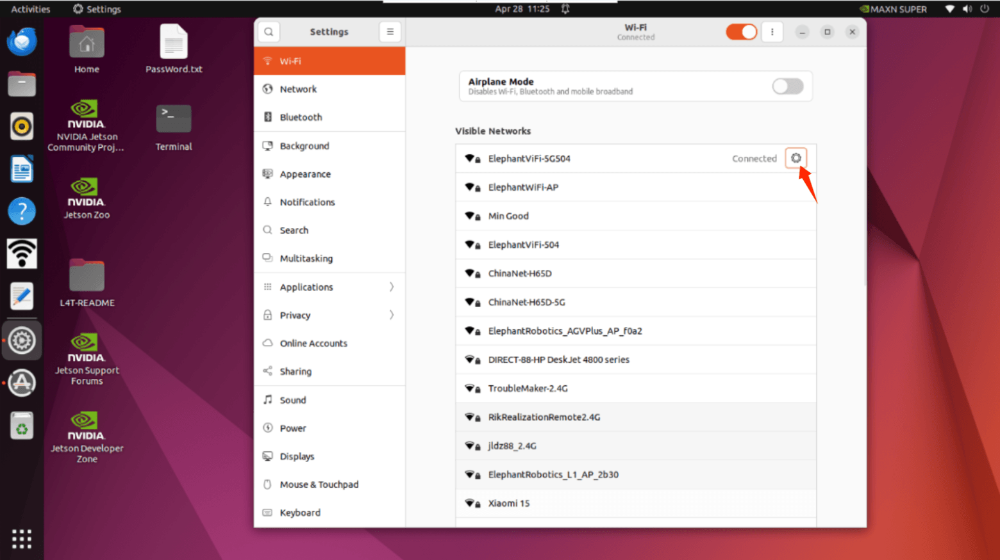
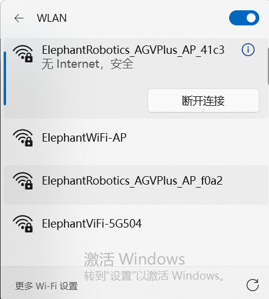
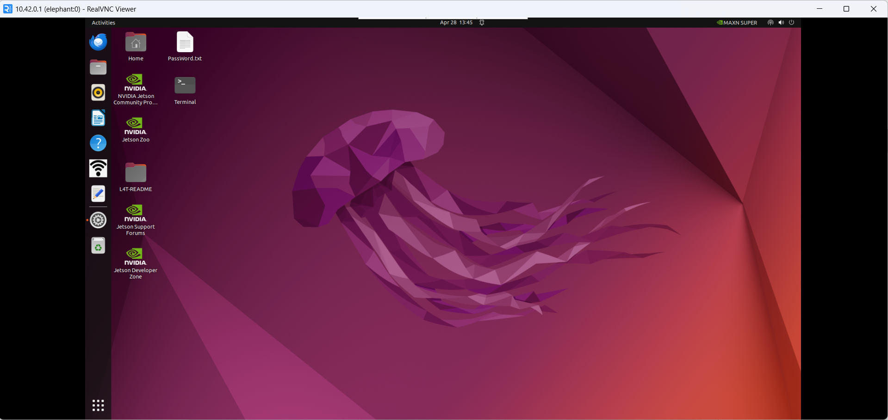
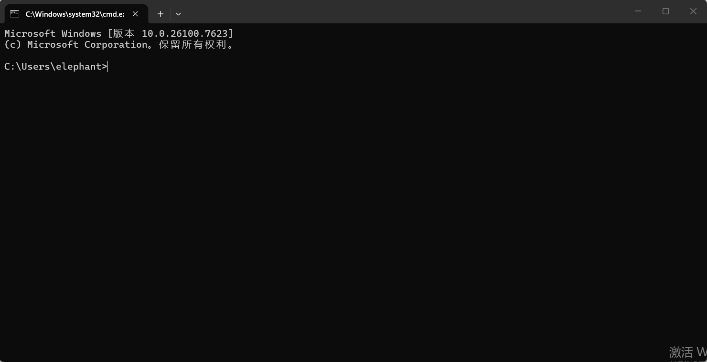
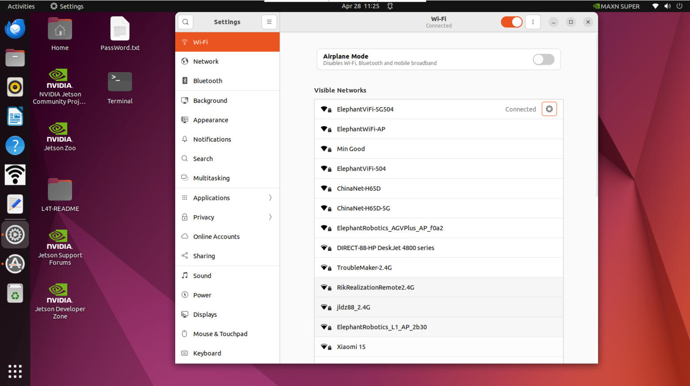
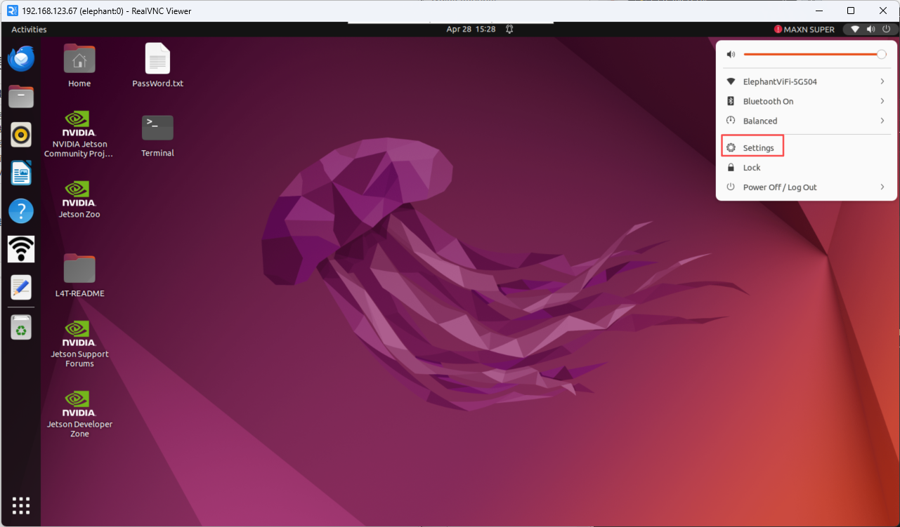

# 系统使用手册

## 5.1.1 机器人系统介绍

**系统**

- Ubuntu 是个人桌面操作系统中使用最广泛的 linux 操作系统。对于初学者来说，熟悉 linux 环境或一些嵌入式硬件操作系统是一个不错的选择。

  

- **功能介绍**

  - **myStudio**：固件刻录软件，用于更新和刻录新固件。
- **myBlockly**：图形化编程软件，可直接通过拖动构件形成运行代码，控制机械臂
  - **ROS2 humble**：开机后直接进入ROS2 环境，可以直接输入相应指令，运行相应的 ROS2 代码
- **HotSpot_ON/OFF**：热点开关，单击打开/关闭热点功能，热点名称为**ElephantRobotics_AGVPlus_AP_XXXX**

## 5.1.2 系统密码说明

- **账户密码、VNC 密码、SSH 密码、root 账户密码**

  - 密码：**Elephant**  

- **如何更改密码**

  - 更改账户密码

    - 使用快捷键 `ctrl + alt + T` 打开终端
    - 输入 `passwd`
    - 输入新密码两次  

  - 更改 vnc 密码

    - 使用快捷键 `ctrl + alt + T` 打开终端
    - 输入 `vncpasswd`
    - 输入两次新密码  

  - 更改 ssh 密码

    - 对于 SSH 远程连接，需要输入管理员账户的密码。无需单独更改密码  

  - 更改 root 帐户密码

    - 使用快捷键 `ctrl + alt + T` 打开终端
    - 输入 `sudo passwd`
    - 输入两次新密码  

## 5.1.3 VNC

- **VNC 简介**

  - 是一种远程控制软件，一般用于远程解决计算机问题或软件调试

- **VNC Port**

  - 当myAGV Plus和电脑连接到同一个 WiFi 时，myAGV Plus的 IP 地址为端口

- **连接 VNC**

  - 有两种无线连接模式。第一种模式需要外接显示器才能对系统进行某些操作。具体步骤如下： 打开设置，找到**"Wi-Fi Settings"**并点击，然后在点击**"Turn off hotspot"**断开myAGV Plus热点连接。

    

    

    关闭小车热点将显示当前可用的 WiFi，点击需要连接的的WiFi输入密码，再点击如图按钮

    

    点开后可查看 IP 地址，如示例所示，**"192.168.123.67"** 是机器人当前的 IP 地址

    

    

    将电脑和机器人连接到同一个 WiFi 上，打开 VNC 查看器，输入 IP 地址（例如：输入 **192.168.123.67**），输入密码 **Elephant**，默认不指定用户名。下面是一个成功连接的示例：

    

  - 第二种方法不需要连接显示器，直接将 Ubuntu 系统热点与 PC 机连接进行远程控制，但这种连接方式不具备上网冲浪的功能，只能远程控制机械臂系统。具体步骤如下：

    连接热点**ElephantRobotics_AGVPlus_AP_XXXX**，输入密码 **Elephant**

    

    打开 VNC 查看器，输入 IP 地址 **10.42.0.1** ，然后输入密码 **Elephant**，默认不指定用户名。下面是一个成功连接的示例：

    

- **如何提高连接流畅性**
  - 远程连接的流畅性取决于所连接 WiFi 的流畅性。建议连接稳定的 WiFi 进行远程控制

## 5.1.4 SSH

- **SSH 简介**

  - SSH 是一种网络协议，用于计算机之间的加密登录。如果用户使用 SSH 从本地计算机登录到另一台远程计算机，我们可以认为这次登录是安全的，即使中间被拦截，密码也不会泄露。

- **SSH 端口**

  - 默认端口号为 22

- **SSH 连接**

  - 按照 **5.1.2 VNC** 中的说明确认机器人的 IP 地址

  - 单击 `win + R` 并输入 **"cmd"**

  - 

  - 输入后，单击 "确定 "打开外壳界面

    

  - 输入 `ssh elephant@IP address`，然后按 `Enter`（IP 地址主要由myAGV Plus显示，图中仅为示例）。

    

  - 输入密码 `Elephant`

    

  - 如上图所示，myAGV Plus已通过 ssh 成功连接

- **如何提高连接流畅性**

  - 远程连接的流畅性取决于所连接 WiFi 的流畅性。建议连接稳定的 WiFi 进行远程控制。

## 5.1.5 网络配置

- **默认 AP 使用情况**

  - 打开机器人电源，默认情况下，系统会连接到自带的热点，热点名称为**ElephantRobotics_AGVPlus_AP_XXXX**，当前 IP 地址为**10.42.0.1**，该热点不具备网上冲浪功能，且传输速率和信息量有限，因此最终成像会有一定的失真和色差，通信传输也会有延迟，属于正常现象。

- **连接至无线局域网**

  点击 **"Turn off hotspot"** 关闭默认热点

  

  关闭默认热点后会显示当前可用的 WiFi

  

  单击要连接的 WiFi 并输入 WiFi 密码，连接成功后，点击设置图标查看 IP 地址

  

  如示例所示，**"192.168.123.67"** 是机器人当前的 IP 地址

  

  **有线网络连接**

  打开机器人电源，机器人默认连接到系统配置的热点：

  **ElephantRobotics_AGVPlus_AP_XXXX**

  

  单击 **"Turn off hotspot"**，断开与默认热点的连接

  将网线连接到机器人的网络端口

  

## 5.1.7 系统分辨率开关

点击屏幕右上角的图标，选择**Settings**，进入控制面板

选择 **Display**，即可切换所需分辨率

---

[← 基础功能使用页](README.md) | [下一页 →](../5-BasicApplication/5.2-ApplicationUse/5.2.1-myblockly/jetsonnano/README.md)
