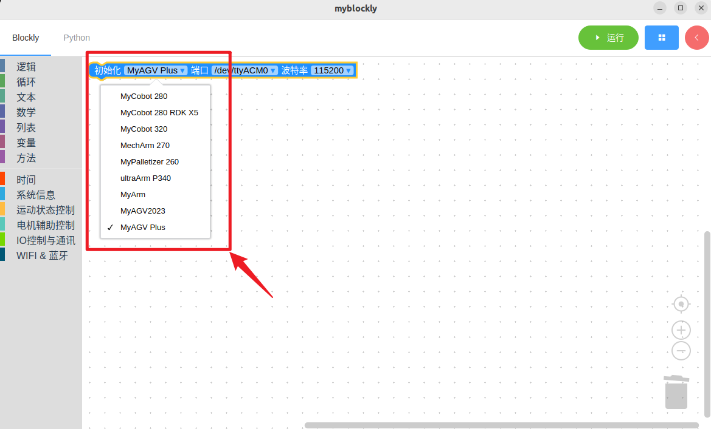
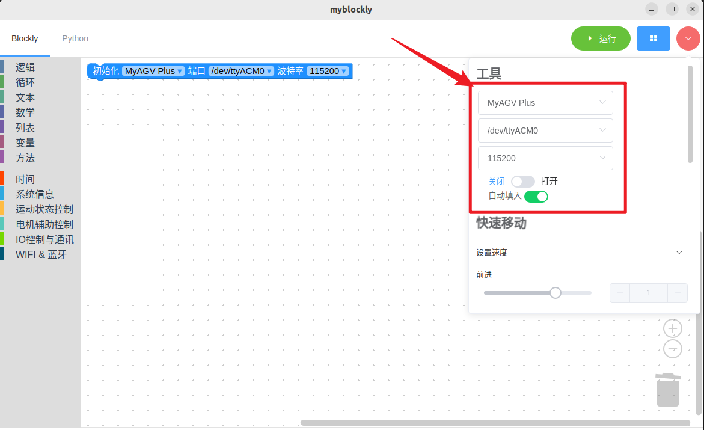
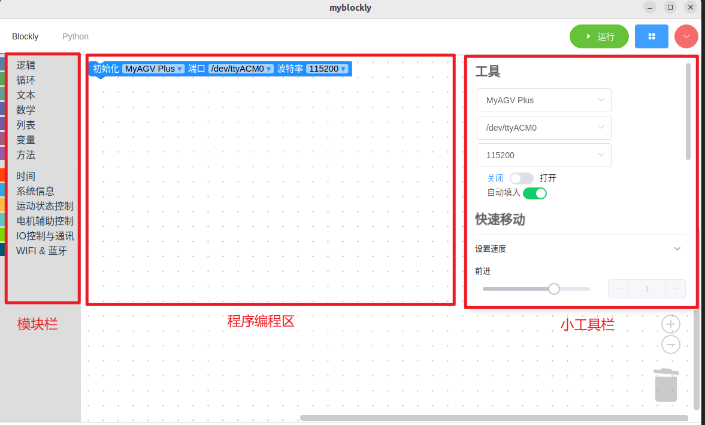
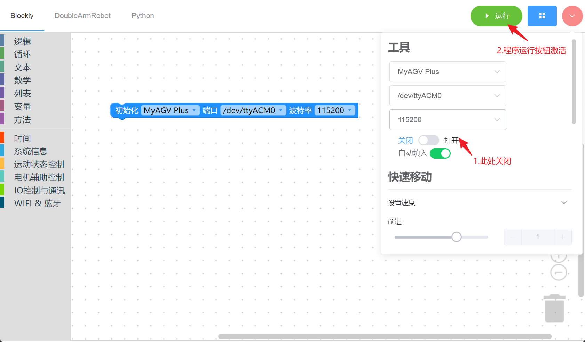
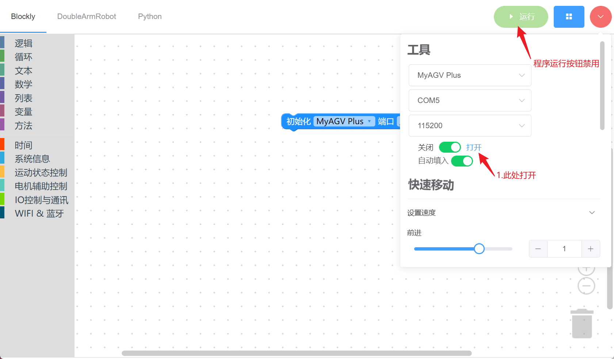
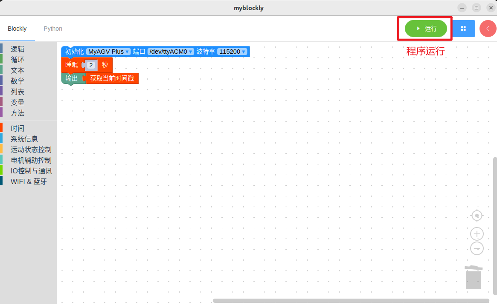
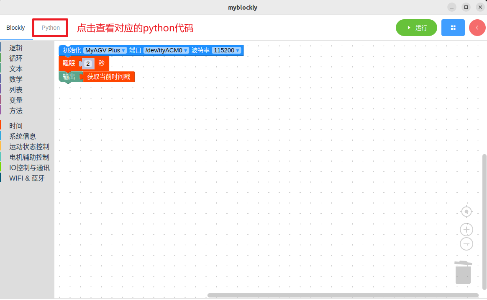
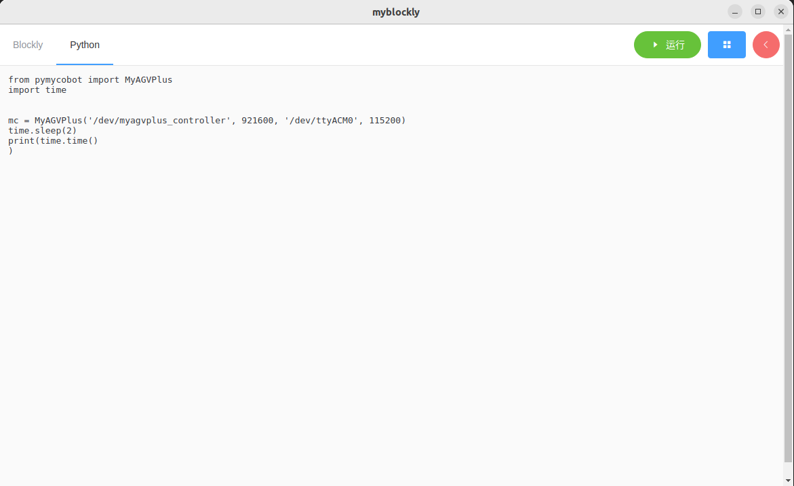
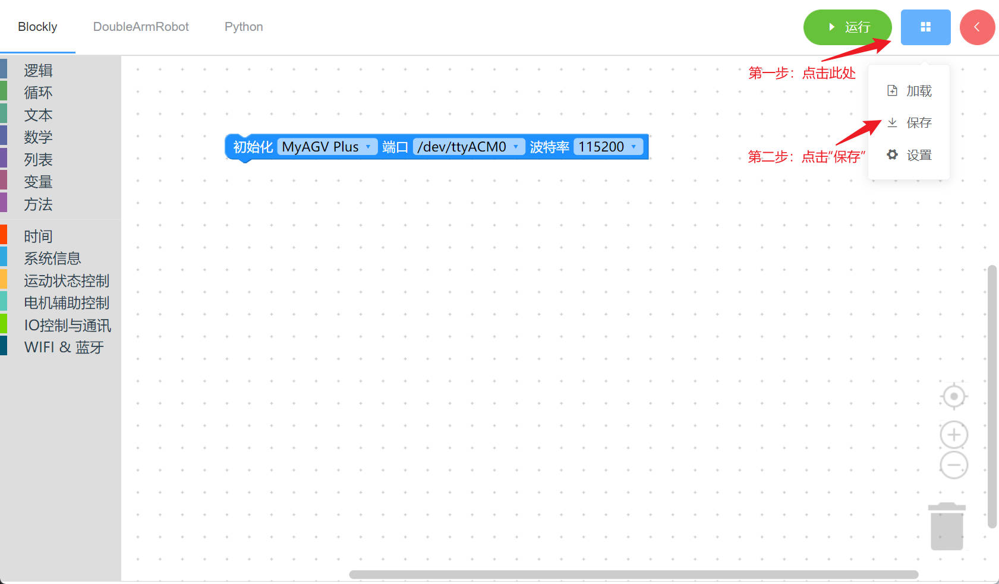
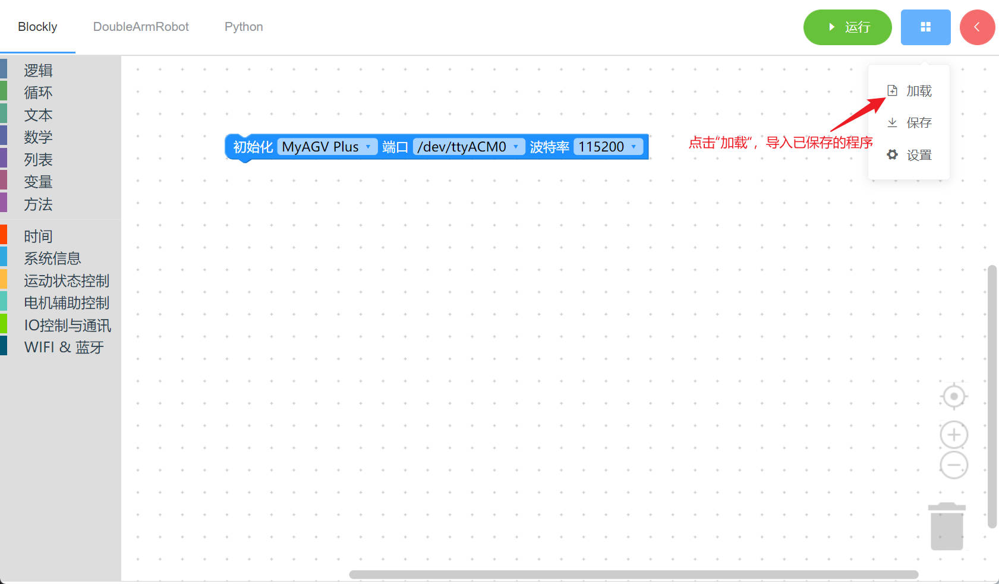

# 1 myBlockly初始使用

## 准备工作

在下载 myBlockly 之前，您需要配置 Python 环境并使用 myStudio 刻录固件。详情请参考以下操作方法。

1. 环境配置。使用 myBlockly 之前，请确保已在计算机上配置好 Python 环境。

> **myAGV Plus 搭载的 NVIDIA Jetson Orin Nano Super 平台，已预装 Ubuntu 22.04 系统及适配的 Python 开发环境，因此无需构建和管理。**

2. 固件刻录。

如何使用 myStudio 刻录固件，请参考[myStudio](../5.2.2-mystudio/README.md)

## myBlockly下载安装

准备工作完成后可以下载安装myBlockly。下载地址：

- [官网地址](https://www.elephantrobotics.com/download/)
  
- [Github地址](https://github.com/elephantrobotics/myblockly-package/releases)

**注意:** 请确保下载最新版本。

## 使用前提

- 正式开始编程使用前，一定要选择对应的**机器型号**，否则容易造成硬件损害

- 用控制面板控制机器时，一定要选择对应的机器型号，否则容易造成硬件损害

## myBlockly界面展示

- 模块栏：
  - 包含程序编写所需的方法模块，可以通过鼠标放入程序编程区进行拼接

- 小工具栏：
  
  点击右上角粉红色按钮会出现一个小工具栏，此处可以选择正确的机型、串口号以及波特率。也可以通过滑动或者直接在输入需设置的运动速度。鼠标点击最底部的运动控制按钮，机器将根据对应的方向进行运动。

- 程序编辑区域：
  
  - 运行程序之前需要在初始化模块中或者小工具栏内选择正确的机型、端口以及波特率，否则程序无法正常运行。
  - 把所需的模块方法拖拽到该区域拼接起来实现自己的程序。

**注意:**

1. 串口号一般为/dev/ttyACM0，波特率一般为115200。

2. 当程序无法运行的时候请检查小工具栏是否断开链接（如下图所示）。

## 程序运行

拖动想要的方法模块，编辑自己的程序（如上图所示），每个模块结构相结合在一起（有ki的声音），再点击“运行”就可以将代码上传到机械臂当中运行了。

**注意：** 操作机械臂运动的程序是需要时间来完成的，所以在一个动作之后需要接上一个睡眠模块，给机械臂运动的时间再进行下一个运动。（自己因情况决定所需的时间，机械臂默认设定跑myBlockly最低的睡眠时间不低于0.5s）否则会导致机械臂无法达到理想的运动。

点击左上角“Python”选项可以查阅对应的Python代码，如下图所示。

## 程序保存和载入

myBlockly的程序以 **.json** 格式保存，点击界面右上角蓝色方框，出现“保存”选项点击后，即可保存程序。

同样点击蓝色方框，点击”加载“选项，可以导入已保存的程序。

---

[← 上一页](./README.md) | [下一页 →](./2-controlRGB.md)
