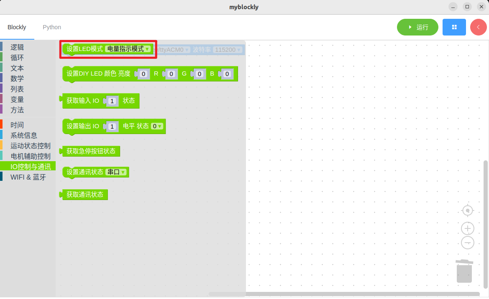
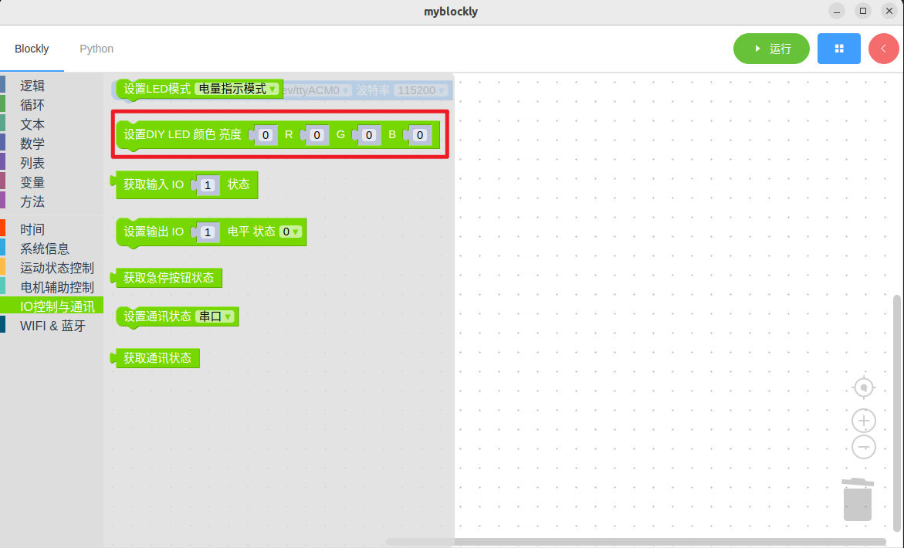
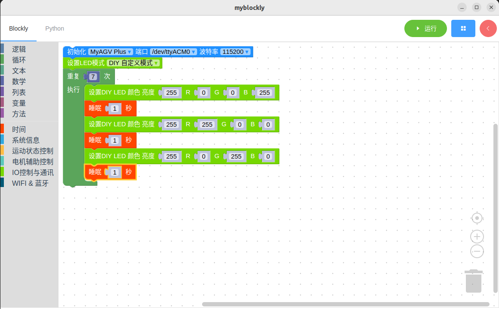

# 控制RGB灯板

*开始前确保机器正常*

*机器已上电*

## 本章学习内容

如何使用myBlockly控制RGB灯板

API介绍

- 方法模块：1.设置LED模式
  
  

- 方法模块：2.设置DIY LED 颜色
  
  

- 参数介绍：
  
  - 需要设置的参数为亮度、 R（x）、G（x）、 B（x），不同的数值代表不同的颜色
  
  - 参数范围（具体可以查阅RGB参数表）

- 目的：控制RGB灯板颜色

简单演示

- 图形代码如下：
  
  

- 实现的内容：
  
  将LED模式设置为DIY自定义模式，控制机械RGB灯板颜色由“蓝-红-绿”顺序变化，整个过程循环七次。

  结束程序。

---

[← 上一页](./1-myBlocklyFirstUse.md) | [下一页 →](./3-controlMove.md)