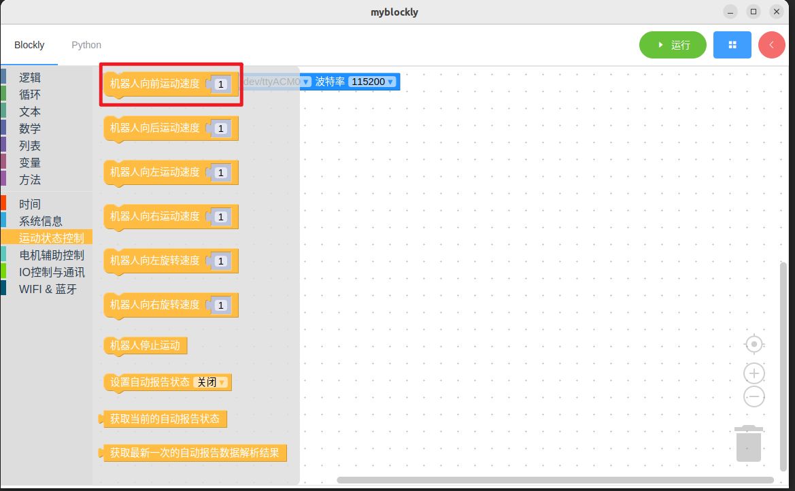
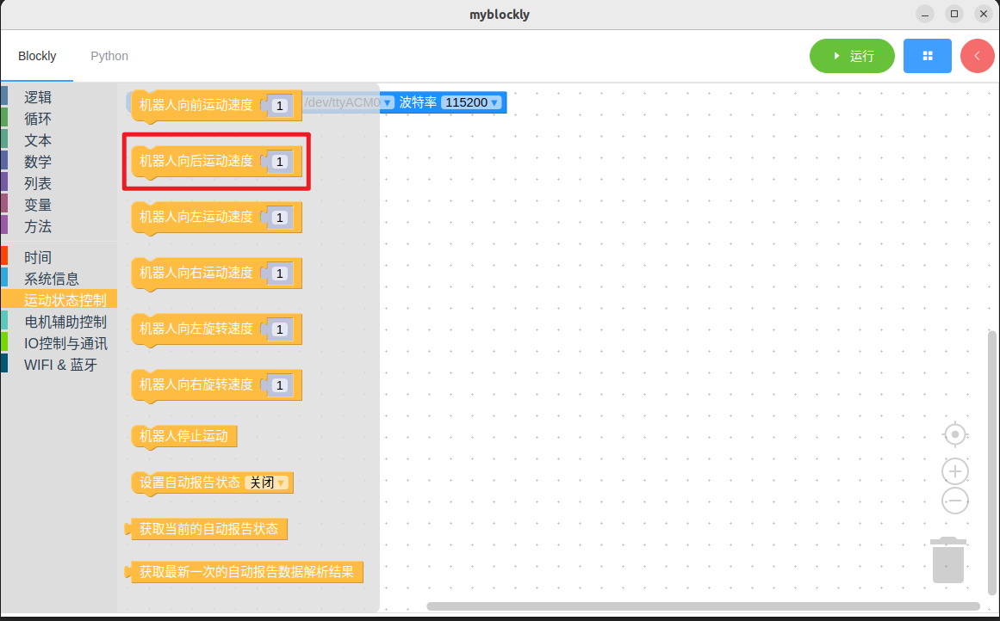
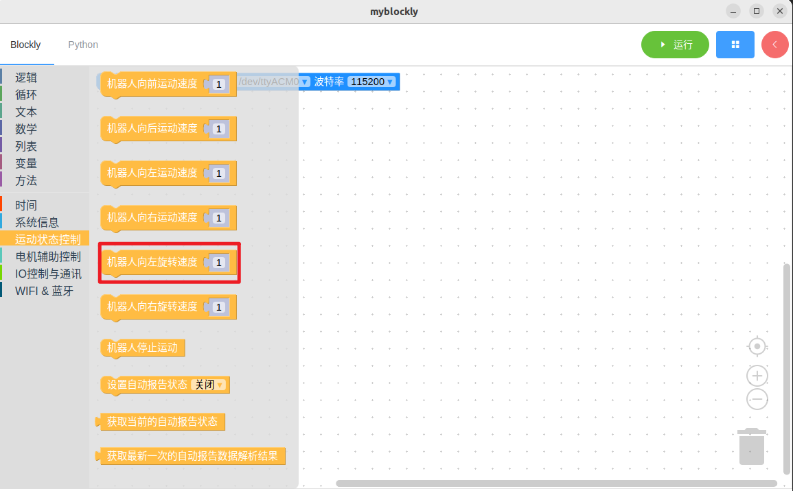
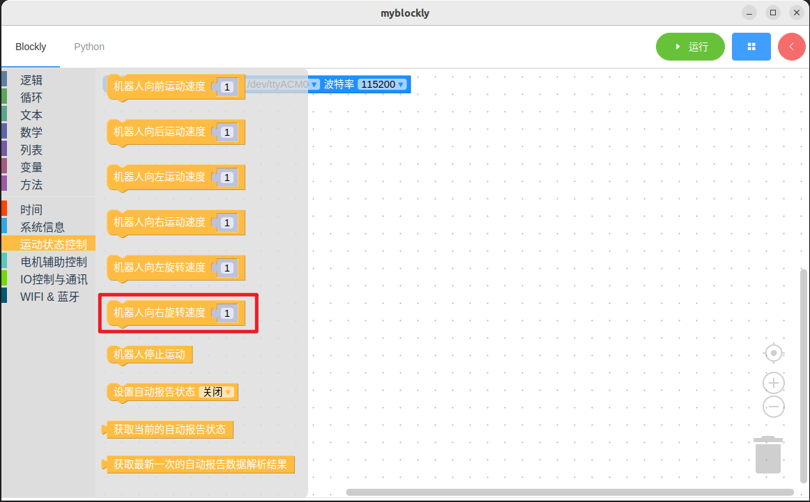
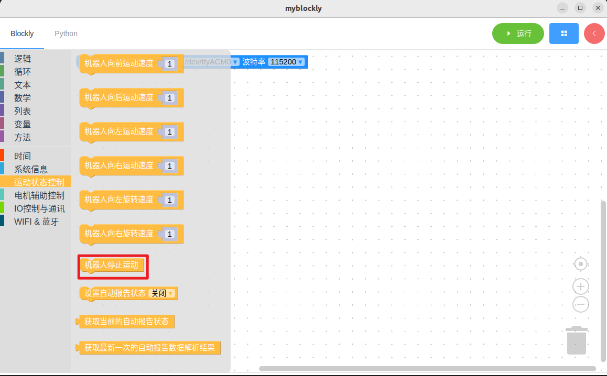
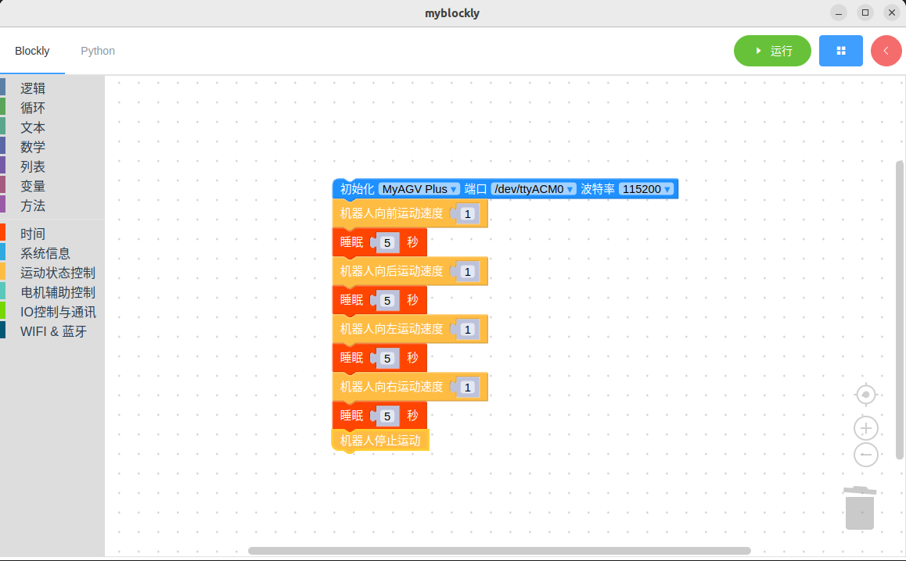

# 控制小车运动

*开始前确保机器正常*

*机器已上电*

## 本章学习内容

如何使用myBlockly控制小车运动

API介绍

- 方法模块：1.向前运动
  
  

- 方法模块：2.向后运动
  
  

- 方法模块：3.向左旋转
  
  

- 方法模块：4.向右旋转
  
  

- 方法模块：5.停止
  
  

- 参数介绍：
  
  - 以上模块均只有一个速度参数（0.01 ~ 1.5 m/s）可以调整，模式为1，滑块仅支持整数单位滑动，可以通过双击参数块输入的方式进行修改

- 目的：控制机器向前、向后运动，向左、向后旋转，最后停止运动

简单演示

- 图形代码如下：
  
  

- 实现内容：
  
  控制机器以给定速度向前运动，过5秒后，
  
  控制机器以给定速度向后运动，过5秒后，

  控制机器以给定速度向左旋转，过5秒后，

  控制机器以给定速度向右旋转，过5秒后，

  停止运动，结束程序。

---

[← 上一页](./2-controlRGB.md) | [下一页 →](./4-ioTest.md)