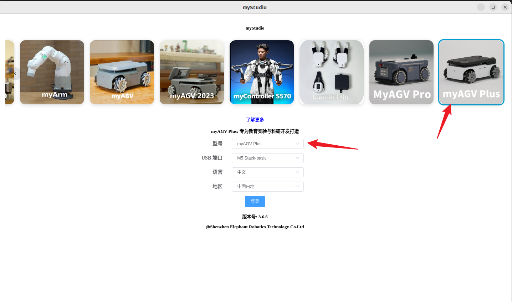
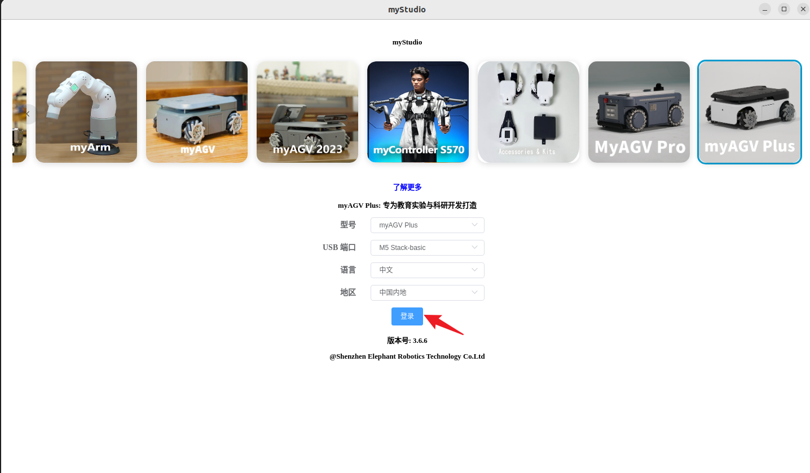
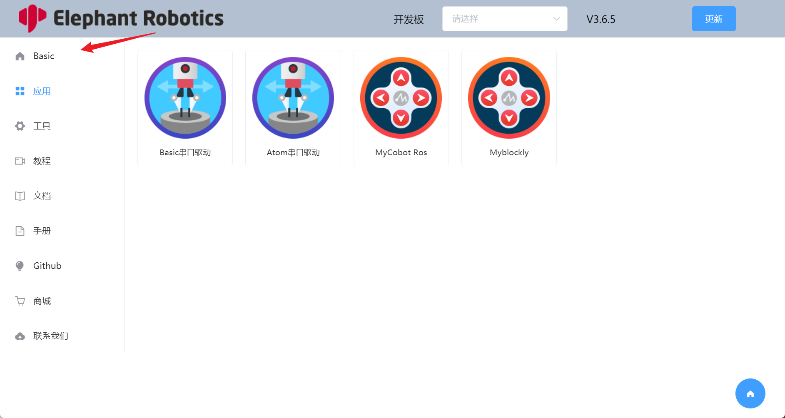
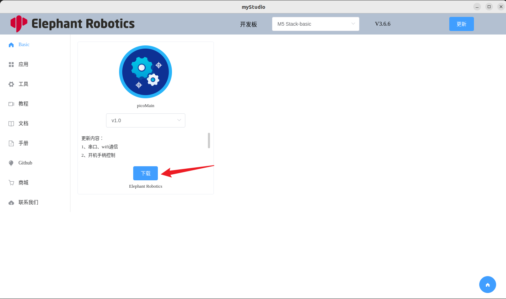
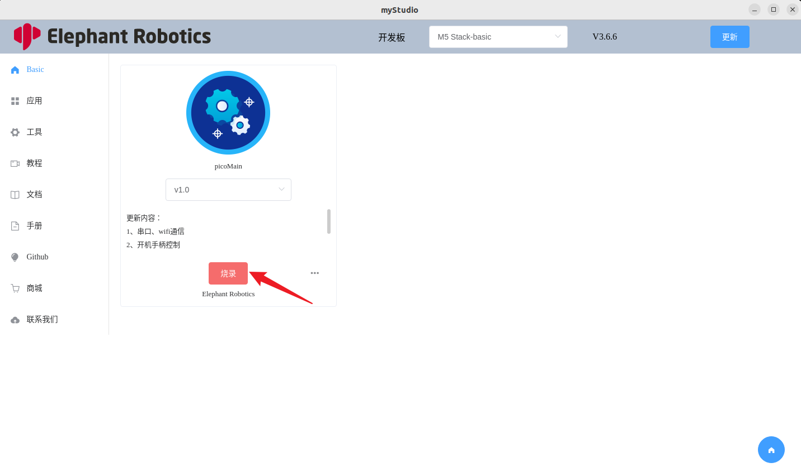
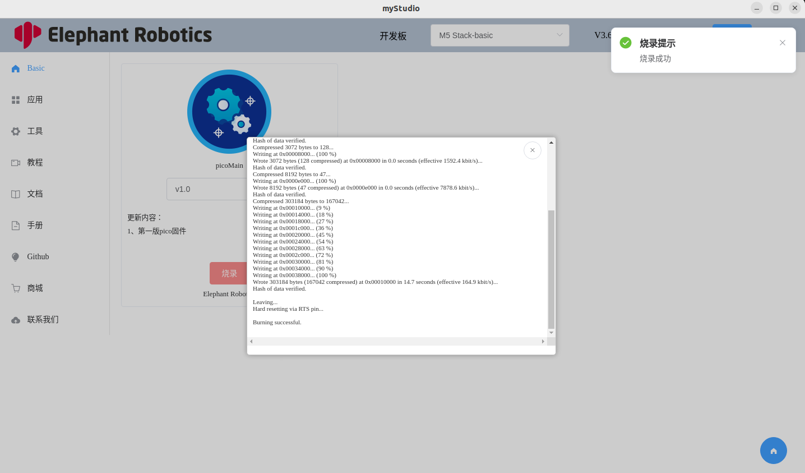

# 烧录固件

## 如何使用 myStudio 烧录固件

- 打开 myStudio，选择机器为 `myAGV Plus`，等待 `USB Port` 被成功识别。

  

- 点击 `LOGIN`

  

- 点击 `Basic` 进入基本页面

  

- 点击下载固件

  

- 点击烧录

  

- 成功烧录

  

## FAQ

##### Q：如何验证固件是否烧录成功？

- A：如下图所示，如果出现烧录成功的提示，不一定是烧录成功，如果烧录后机器可以正常控制和使用固件，则视为烧录成功。

##### Q：如何处理烧录失败？

- A：

  - 您可以尝试烧录更多次

  - 检查烧录过程中是否有任何错误。如果有任何错误，请反馈给售后服务部门

  - 使用 Cutecom 检查机器的串行端口是否正常工作。正常情况下，串行端口会返回数据。如果不正常，请重新启动机器

##### Q：烧录固件后，机器会失控吗？

- A：如果烧录固件后机器无法控制，可以尝试多次烧录。如果无法解决，请联系售后服务。

---

[← 上一页](./2-install_driver.md) | [下一页 →](./4-other_function.md)
