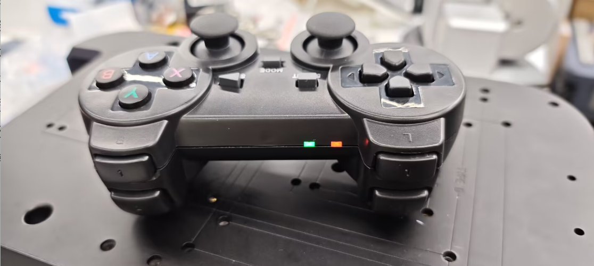

# 基于 ROS2 的基本控制

基本控制包括 **键盘控制和操纵杆控制**。我们先来讨论键盘控制方法：

- 1 启动小车底层的通信。

首先，检查激光雷达是否已通电并启用。如果没有接通电源，请使用终端通过脚本文件接通电源并启动激光雷达。如果激光雷达已经接通电源并正在旋转，则可以跳过接通电源并启用激光雷达的步骤。

```bash
sudo busybox devmem 0x2434098 w 0x000
python start_ydlidar.py
ros2 launch ydlidar_ros2_driver ydlidar_launch.py
```

打开激光雷达电源后，打开终端控制台（快捷键<kbd>Ctrl</kbd>+<kbd>Alt</kbd>+<kbd>T</kbd>），在命令行中输入以下命令：

```bash
ros2 launch  myagv_plus_bringup myagv_plus_bringup.launch.py
```

打开 SLAM 激光扫描和小车车轮所需的启动文件。如果您看到

> Now lidar is scanning...
> ......
> process has finished cleanly 

它表示汽车激光雷达和车轮之间的通信成功。终端将显示如下状态：


- 2 启动键盘通信

打开一个新的终端控制台，在终端命令行中输入以下命令：

```bash
ros2 run teleop_twist_keyboard teleop_twist_keyboard
```


|   按键    |        方向        |
| :-------: | :----------------: |
|     i     |      向前移动      |
|     ,     |      向后移动      |
|     j     |      向左旋转      |
|     l     |      向右旋转      |
|     u     |    向左前方移动    |
|     o     |    向右前方移动    |
|     k     |        停止        |
|     m     |    向左后方移动    |
|     .     |    向右后方移动    |
| Shift + j |      向左平移      |
| Shift + l |      向右平移      |
| Shift + u |    向左前方平移    |
| Shift + o |    向右前方平移    |
| Shift + m |    向左后方平移    |
| Shift + . |    向右后方平移    |
|     q     | 提高线速度和角速度 |
|     z     | 降低线速度和角速度 |
|     w     |     提高线速度     |
|     x     |     降低线速度     |
|     e     |     增加角速度     |
|     c     |     降低角速度     |

**手柄控制**

- 1 启动小车底层的通信。

首先，检查激光雷达是否已通电并启用。如果没有接通电源，请使用终端通过脚本文件接通电源并启动激光雷达。如果激光雷达已经接通电源并正在旋转，则可以跳过接通电源并启用激光雷达的步骤。

```bash
sudo busybox devmem 0x2434098 w 0x000
python start_ydlidar.py
ros2 launch ydlidar_ros2_driver ydlidar_launch.py
```

打开激光雷达电源后，打开终端控制台（快捷键<kbd>Ctrl</kbd>+<kbd>Alt</kbd>+<kbd>T</kbd>），在命令行中输入以下命令：

```bash
ros2 launch  myagv_plus_bringup myagv_plus_bringup.launch.py
```

打开 SLAM 激光扫描和汽车车轮所需的启动文件。如果您看到

> process has finished cleanly 
> ......
> Now lidar is scanning...

它表示汽车激光雷达和车轮之间的通信成功。终端将显示如下状态：


- 2 启动操纵杆控制文件

第一步将蓝牙手柄的USB接收器插到小车上，打开一个新的控制台终端，在命令行中输入：

```bash
ros2 run myagv_plus_joystick_control joystick_controller 
```

此时手柄亮绿灯和红灯，终端出现：




如果手柄只亮红灯则需要长按3秒MODE，切换模式


如果成功走到这里了，就可以成功用手柄控制小车的行走了。手柄操作可以参考以下图片。**注：目前手柄控制机械臂暂时仅支持控制mechArm 270 **


- [← 上一页](6.2.3-Using_Common_ROS2_Tools.md) | [下一页 →](6.2.5-Real-time_Mapping_with_Gmapping.md)
