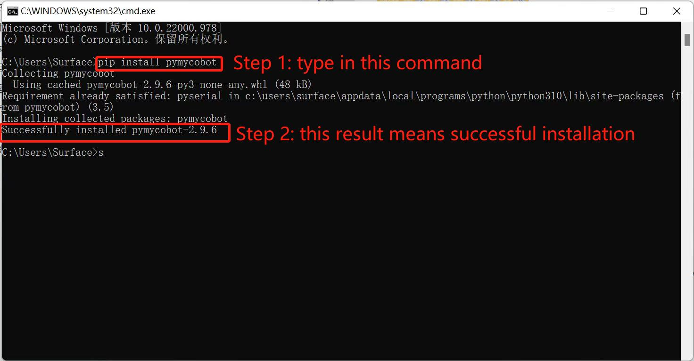

# 10 Q&A

本章列出了使用 myBlockly 控制机械臂的常见问题，以供参考。

**Q1：运行 myBlockly 时，出现错误信息 `ModuleNotFoundError: No module named 'pymycobot'`**

A: 这是因为在设置 Python 环境时没有安装 pymycobot 库。要安装 pymycobot 库，需要打开终端（Win 键 + R 键），输入 `pip install pymycobot --upgrade --user`点击回车键，即可看到 "成功安装 pymycobot"。

**Q2：由于未添加 `sleep` 方法模块，机械臂没有响应**

A: 操作机械臂的程序需要一定时间才能完成，因此在完成一个动作后，需要连接一个 `sleep` 模块，让机械臂在进行下一个动作前有足够的时间（所需时间取决于具体情况和机器，机械臂的默认设置是运行 myBlockly 时休眠时间最短不少于 0.5 秒），否则机械臂将无法实现理想的动作。

**Q3：右上角的 `Run` 按钮无法点击，呈灰绿色。**

A: 新版 myBlockly 增加了检测机械臂串行通信的功能。如果机械臂当前已与电脑连接，则需要进行检查：

(1) 是否有后台程序占用机械臂的串行端口；

(2) 右侧红色箭头下的工具栏是否关闭。如果打开，则需要手动关闭。

**Q4：为什么运行程序后会机器没有反应？**

A：请确认端口号选择是否正确`/dev/ttyACOM0`，若端口无误还是没有反应，请联系售后。

**Q5: 程序运行结果显示，子进程以代码 1 退出。**
A: 这不是错误。所有程序运行后都会返回二进制数 1。这意味着所有程序都已成功运行。

---

[← 上一页](./4-ioTest.md) | [下一页 →](../6.3.2-mystudio/README.md)
