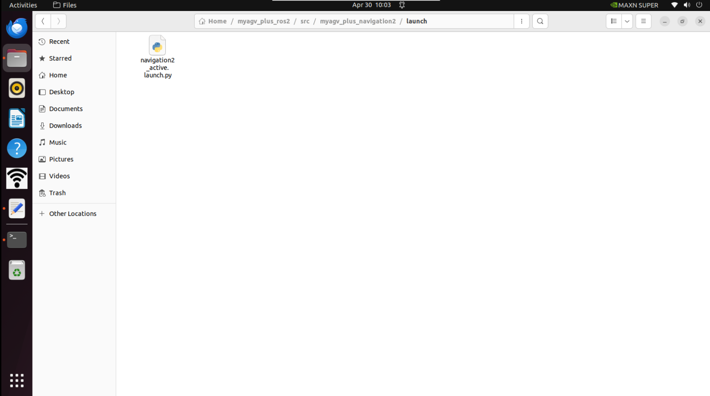
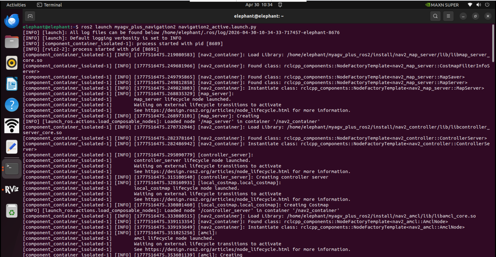
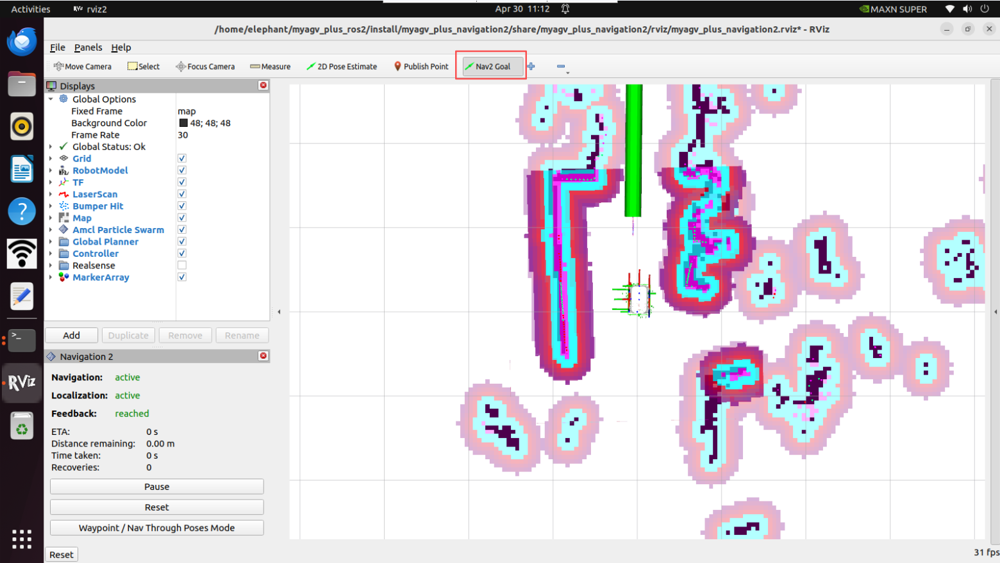
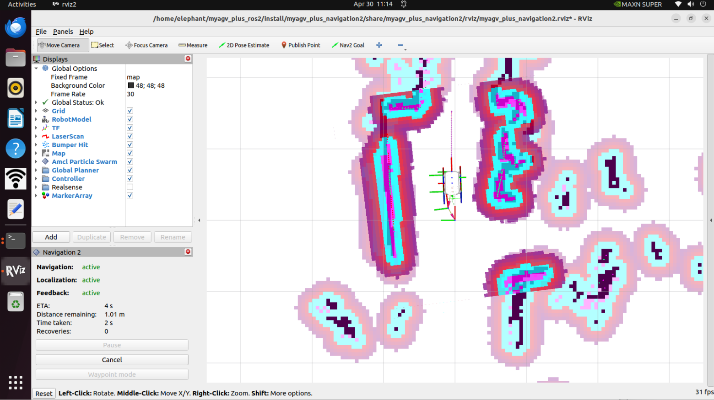
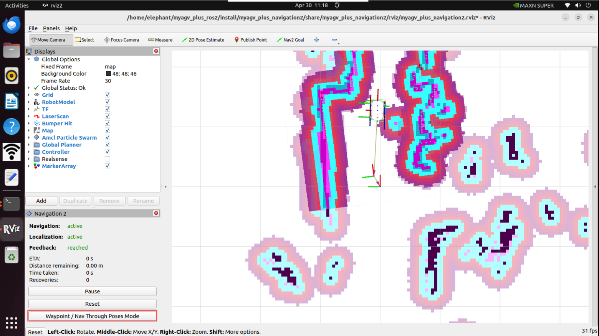
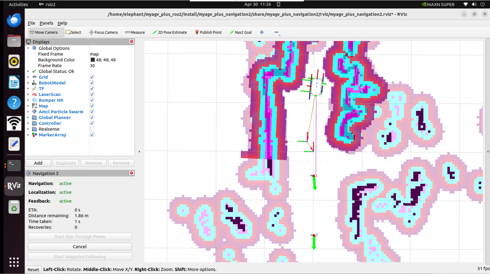

# NAV2


Nav2 是 ROS Navigation Stack 的继任者，部署了为移动和表面机器人技术提供动力的相同类型的技术。该项目允许移动机器人在复杂的环境中导航，以使用几乎任何类别的机器人运动学完成用户定义的应用任务。它不仅可以从 A 点移动到 B 点，还可以具有中间姿势，并表示其他类型的任务，例如对象跟踪、完整覆盖导航等。

# 地图导航

在此之前，我们已经成功创建了空间地图，并获得了一组地图文件，即位于 ~/myagv_plus_ros2/src/myagv_plus_navigation2/map 目录下的 **map_test.pgm 和 map_test.yaml**。


现在，让我们看看如何使用创建的地图为小车导航。

- #### 1 修改launch文件

打开并编辑位于~/myagv_plus_ros2/src/myagv_plus_navigation2/launch/ 的 **navigation2_active.launch.py** 文件。

```
cd /myagv_plus_ros2/src/myagv_plus_navigation2/launch
sudo gedit navigation2_active.launch
```



找到参数 "map_file"，并将 **/map/map.yaml** 更改为 **/map/map_test.yaml**。然后保存修改后的文件并退出。如果不做任何修改，系统将默认加载 **map.yaml** 文件。


- #### 2 编译文件

  修改完成后需要重新编译才可以正常加载所需要的地图

  ```
  cd myagv_plus_ros2
  colcon build --packages-select myagv_plus_navigation2
  source install/setup.bash
  ```

  

- #### 3 运行启动文件

打开 myagv 电源后，打开终端控制台（快捷键：Ctrl+Alt+T）并输入以下命令：

```
ros2 launch  myagv_plus_bringup myagv_plus_bringup.launch.py
```

打开另一个终端控制台（快捷键：Ctrl+Alt+T）并输入以下命令：

```
ros2 launch myagv_plus_navigation2 navigation2_active.launch.py
```



- #### 4 您将看到一个 Rviz 仿真窗口已经打开。

首先，在地图上找到机器人的位置。检查您的机器人在地图中的位置。

在 RViz 中设置机器人的姿势。单击 2D Pose Estimate 按钮，并在地图上指出机器人的位置。绿色箭头的方向是 myAGV Plus的朝前方向。

然后3D 模型会移动到该位置。观察激光雷达跟地图障碍物是否匹配，估计位置中的小误差是可以容忍的。


- #### 5 开始导航

设置任务的目标点数量，点击确认并保存。然后点击工具栏上的 **"Nav2 Goal"**，在地图上定义目标点。（每次设置点时，都要先点击 **"Nav2 Goal"**）。目标点区分方向，箭头代表车辆的到达目标位置和目标方向。点击后在 Rviz 中，您将看到一条从起点到目标点的规划路径，车辆将沿着这条路线行驶到达目的地。





- #### 6 路径点跟随模式

  点击rviz2左下框的Waypoint/Nav Through Poses Mode，可以切换成路径点跟随模式

  

  点击Nav2 Goal 发布两个导航点

  

  点击左下角的Start Waypoint Following，然后就会依次按顺序进行导航。

  

  


---

[← 上一页](6.2.4-Real-time_Mapping_with_Gmapping.md) | [下一页 →](6.2.6-Rtabmap.md)
