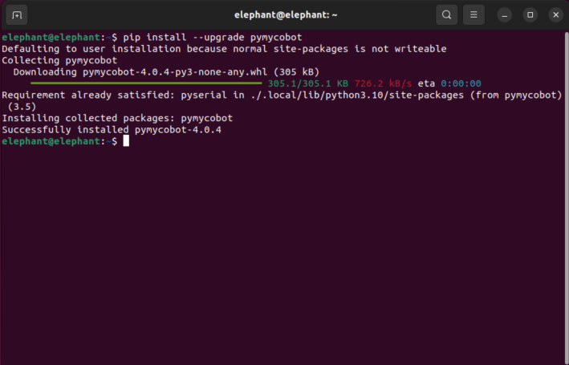

# 配置

pymycobot 是一个 Python 软件包，用于与小车进行串行通信。它支持 Python2、Python3.5 及更高版本。

使用 pymycobot 之前，请确保构建了 Python 环境。按照以下步骤安装 Python。

## 1 下载和安装 Python

目前，Python 有两个版本：2.x 和 3.x。这两个版本互不兼容。本节以版本 `3.x` 为例，因为它越来越受欢迎。

### 1.1 安装 Python

Plus版本自带 Ubuntu（V-22.04）系统和内置 Python 开发环境，因此无需单独构建和管理。

## 2 准备工作

在终端中输入以下命令进行安装或更新（建议保持最新版以获得完整底层兼容）：

```bash
pip install --upgrade pymycobot
```



## 3 简单演示

创建一个新的 Python 文件 `move_agv.py`，并输入以下代码。

```python
from pymycobot.myagvplus import MyAGVPlus
import time

# 初始化 MyAGVPlus 对象
# 注意：底盘电机串口（motor_port）与底层状态读取串口（esp32_port）视设备实际情况而定。
# 默认配置中已支持多线程死锁保护与自动欠压监控。
agv = MyAGVPlus('/dev/myagvplus_controller', baudrate=921600, esp32_port='/dev/ttyACM0', esp32_baud=115200, debug=True)

# 开启机器人
# 调用此接口会自动开启继电器上电并使能电机，内置了约6秒的安全等待时间以确保大疆DM电机启动与双通讯正常建立。
agv.power_on()

# 设置移动速度 (支持的速度范围为 0.01 到 1.60 m/s)
speed = 0.5 

print("向前移动")
agv.move_forward(speed)
time.sleep(2)  # 持续 2 秒
agv.stop()
time.sleep(0.5)

print("向后移动")
agv.move_backward(speed)
time.sleep(2)
agv.stop()
time.sleep(0.5)

print("左横向移动")
agv.move_left_lateral(speed)
time.sleep(2)
agv.stop()
time.sleep(0.5)

print("右横向移动")
agv.move_right_lateral(speed)
time.sleep(2)
agv.stop()

# 运行完毕，安全关闭机器人电源并释放电机（防止耗电过大或过热）
agv.power_off()
```

## 4 运行示例文件：

```bash
python3 move_agv.py
```

默认情况下，该示例脚本会控制 AGV 向四个不同的方向各移动 2 秒钟。若运行过程中终端报红提示 `BACKGROUND VOLTAGE DETECTED!`，代表检测到底层电池馈电（<19.0V），为了保护硬件，将强制拦截本次运行并锁死电机。

---

[← 上一页](README.md) | [下一页 →](6.1.2-API.md)
