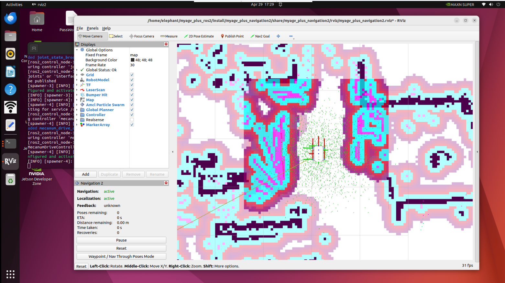
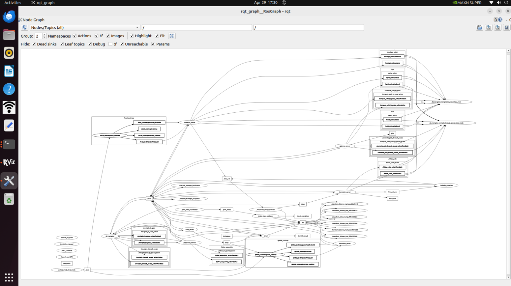

# 使用常见的 ROS2 工具

- 启动文件

ROS 2 Humble 中的启动文件是同时启动多个节点的核心手段。它能自动管理节点生命周期，方便对每个节点进行配置、命名空间设置、参数加载等，极大简化多节点程序的运行。

（1）`<launch>` 标签

`<launch>` 标签是启动文件的根标签。所有启动文件都以 `<launch>` 开始，以 `</launch>` 结束，所有配置标签必须写在两者之间。

```
<launch>
……
……
</launch>
```

（2）`<node>` 标签

`<node>` 标签是最核心的配置项，用于启动一个 ROS 2 节点。属性相比 ROS1 有小幅调整，常用格式如下：

```
<node pkg="package-name" exec="executable-name" name="node-name" />
```

| 标签属性          | 属性功能                                             |
| :---------------- | :--------------------------------------------------- |
| name="NODE_NAME"  | 为节点指定名称，覆盖代码中定义的节点名称             |
| pkg="PACKAGE_NAME | 包含节点的软件包名称                                 |
| exec="FILE_NAME"  | 节点的可执行文件名                                   |
| output="screen"   | 向终端屏幕输出节点的标准输出；默认为日志文件         |
| respawn="true"    | 设置为 true 时，节点会在终止时自动重启；默认为 false |
| ns = "NAME_SPACE" | 命名空间，为节点内的相对名称添加命名空间前缀         |
| args="arguments"  | 节点所需的输入参数                                   |

（3）`<include>` 标签

该标签用于在当前启动文件中，引入另一个 ROS 2 启动文件，实现模块化配置。

| 标签属性                                         | 属性功能         |
| :----------------------------------------------- | :--------------- |
| file ="$(find pkg-name)/path/filename.launch.py" | 指定要包含的文件 |

e.g.

```
<include file="$(find demo)/launch/demo.launch.py" />
```

（4）`<remap>` 标签

用于话题重映射，实现节点间话题名称的适配，无需修改代码，用法与 ROS1 完全一致。

例如，节点订阅的 `/chatter` 话题，需要重映射为 `/demo/chatter`：

```
<remap from="chatter" to="demo/chatter"/>
```

（5）`<parameter>` 标签

`<parameter>` 标签用于向参数服务器设置单个参数。

例如，添加一个值为 1 的整数参数 `demo_param`：

```
<parameter name="demo_param" type="int" value="1"/>
```

（6）`<parameters>` 标签

`<parameters>` 标签用于从 YAML 文件批量加载参数。

用法如下：

```
<parameters from="$(find pkg-name)/path/name.yaml"/>
```

（7）`<arg>` 标签

`<arg>` 标签作为启动文件的局部变量，仅用于启动文件内部传参，与节点逻辑无关。

语法如下：

```
<arg name="arg-name" default="arg-value"/>
```

- Rviz2

  **rviz2** 是 ROS 2 Humble 官方的三维可视化工具，完全适配 ROS 2 通信架构，兼容各类机器人平台。

  它可以可视化显示机器人模型、传感器数据（激光雷达、点云、相机）、TF 坐标变换、导航路径、地图等核心信息，同时支持通过界面交互控制机器人。



- Qt Toolbox

计算图可视化工具（rqt_graph）:  
rqt_graph 工具实时展示当前 ROS 2 系统中节点与话题的通信关系。

```
rqt_graph
```

成功启动后，将显示计算图表，如下图所示。



TF 关系可视化工具 (rqt_tf_tree)

rqt_tf_tree 工具以图形方式显示运行节点之间的当前 TF 关系。要在运行图形构建功能时启动该工具，请使用以下命令：

```
ros2 run rqt_tf_tree rqt_tf_tree
```

成功启动后，将显示 TF 关系图，如下图所示。


---

[← 上一页](6.2.1-ROS2_Introduction.md) | [下一页 →](6.2.3-Basic_Control_Based_on_ROS2.md)
