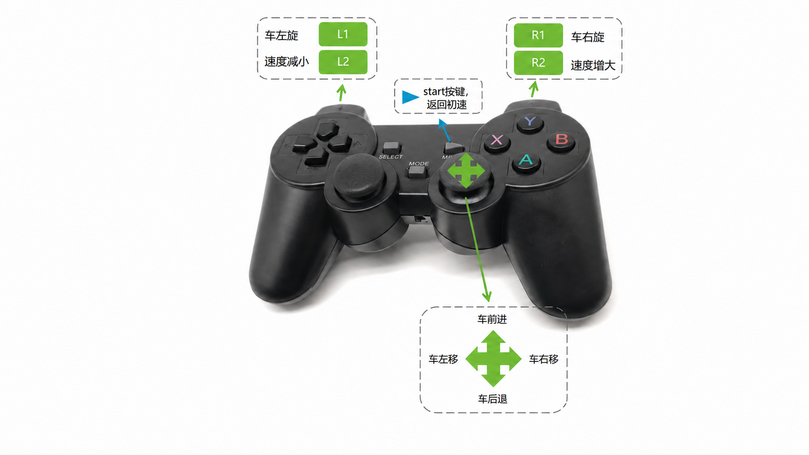

# 基于 ROS2 的基本控制

基本控制包括 **键盘控制和操纵杆控制**。下面是操作示例视频：

<video id="my-video" class="video-js" controls preload="auto" width="100%"
poster="" data-setup='{"aspectRatio":"16:9"}'>
<source src="https://download.elephantrobotics.com/video/myAGV%20Plus/myAGV%20Plus%20ROS2%20%E5%9F%BA%E6%9C%AC%E6%8E%A7%E5%88%B6.mp4"></video>


## 键盘控制

#### 1 启动小车底层的通信。

打开终端控制台（快捷键<kbd>Ctrl</kbd>+<kbd>Alt</kbd>+<kbd>T</kbd>），在命令行中输入以下命令：

```bash
ros2 launch myagv_plus_bringup myagv_plus_bringup.launch.py
```

终端将显示如下状态：


#### 2 启动键盘通信

打开一个新的终端控制台，在终端命令行中输入以下命令：

```bash
ros2 run teleop_twist_keyboard teleop_twist_keyboard
```


|   按键    |        方向        |
| :-------: | :----------------: |
|     i     |      向前移动      |
|     ,     |      向后移动      |
|     j     |      向左旋转      |
|     l     |      向右旋转      |
|     u     |    向左前方移动    |
|     o     |    向右前方移动    |
|     k     |        停止        |
|     m     |    向左后方移动    |
|     .     |    向右后方移动    |
| Shift + j |      向左平移      |
| Shift + l |      向右平移      |
| Shift + u |    向左前方平移    |
| Shift + o |    向右前方平移    |
| Shift + m |    向左后方平移    |
| Shift + . |    向右后方平移    |
|     q     | 提高线速度和角速度 |
|     z     | 降低线速度和角速度 |
|     w     |     提高线速度     |
|     x     |     降低线速度     |
|     e     |     增加角速度     |
|     c     |     降低角速度     |

## **手柄控制**

#### 1 启动小车底层的通信。

打开终端控制台（快捷键<kbd>Ctrl</kbd>+<kbd>Alt</kbd>+<kbd>T</kbd>），在命令行中输入以下命令：

```bash
ros2 launch myagv_plus_bringup myagv_plus_bringup.launch.py
```

终端将显示如下状态：


#### 2 启动操纵杆控制文件

第一步将蓝牙手柄的USB接收器插到小车上，打开一个新的控制台终端，在命令行中输入：

```bash
ros2 run myagv_plus_joystick_control joystick_controller 
```

此时手柄亮绿灯和红灯，终端出现：


如果手柄只亮红灯则需要长按3秒MODE，切换模式


如果成功走到这里了，就可以成功用手柄控制小车的行走了。



------

[← 上一页](6.2.2-Using_Common_ROS2_Tools.md) | [下一页 →](6.2.4-Real-time_Mapping_with_Gmapping.md)
