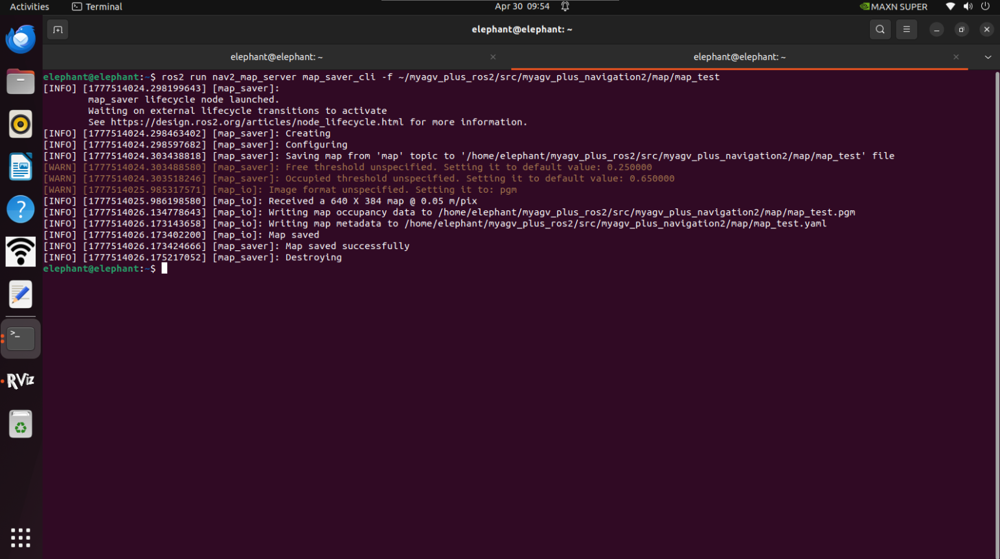

# 使用 Gmapping 实时制图

## 1. 启动小车底层的通信。

打开终端控制台（快捷键<kbd>Ctrl</kbd>+<kbd>Alt</kbd>+<kbd>T</kbd>），在命令行中输入以下命令：

```bash
ros2 launch  myagv_plus_bringup myagv_plus_bringup.launch.py
```

终端将显示如下状态：


## 2. 打开 Gmapping 建图 launch 文件

打开一个新的终端控制台，在命令行中输入以下命令：

```
ros2 launch slam_gmapping slam_gmapping.launch.py 
```

## 3. 打开键盘控制文件

打开一个新的终端控制台，在终端命令行中输入以下命令：

```
ros2 run teleop_twist_keyboard teleop_twist_keyboard
```


|   按键    |        方向        |
| :-------: | :----------------: |
|     i     |      向前移动      |
|     ,     |      向后移动      |
|     j     |      向左旋转      |
|     l     |      向右旋转      |
|     u     |    向左前方移动    |
|     o     |    向右前方移动    |
|     k     |        停止        |
|     m     |    向左后方移动    |
|     .     |    向右后方移动    |
| Shift + j |      向左平移      |
| Shift + l |      向右平移      |
| Shift + u |    向左前方平移    |
| Shift + o |    向右前方平移    |
| Shift + m |    向左后方平移    |
| Shift + . |    向右后方平移    |
|     q     | 提高线速度和角速度 |
|     z     | 降低线速度和角速度 |
|     w     |     提高线速度     |
|     x     |     降低线速度     |
|     e     |     增加角速度     |
|     c     |     降低角速度     |

## 4. 开始建图

现在，小车可以在键盘控制下开始移动。操纵小车在所需的映射空间内旋转。同时，您可以在 Rviz 空间中观察到，随着小车的移动，我们的地图也在逐渐构建。

注意：使用键盘操作小车时，请确保运行 teleop_twist_keyboard.py 文件的终端是**当前选定的终端**；否则，键盘控制程序将无法识别按键。此外，为了获得更好的映射效果，建议在键盘控制时**使用键盘控制默认速度**，因为**较低的速度**往往会产生更好的映射效果。


## 5. 保存构建的地图

打开另一个新的终端控制台，在命令行中输入以下命令，保存扫描的地图：

```
ros2 run nav2_map_server map_saver_cli -f ~/myagv_plus_ros2/src/myagv_plus_navigation2/map/map_test
```

执行成功后，将在当前路径**(~/myagv_plus_ros2/src/myagv_plus_navigation2/map)**下生成两个默认地图参数文件，即**map_test.pgm**和**map_test.yaml**。




---

[← 上一页](6.2.3-Basic_Control_Based_on_ROS2.md) | [下一页 →](6.2.5-Navigation-Map_Navigation.md)
