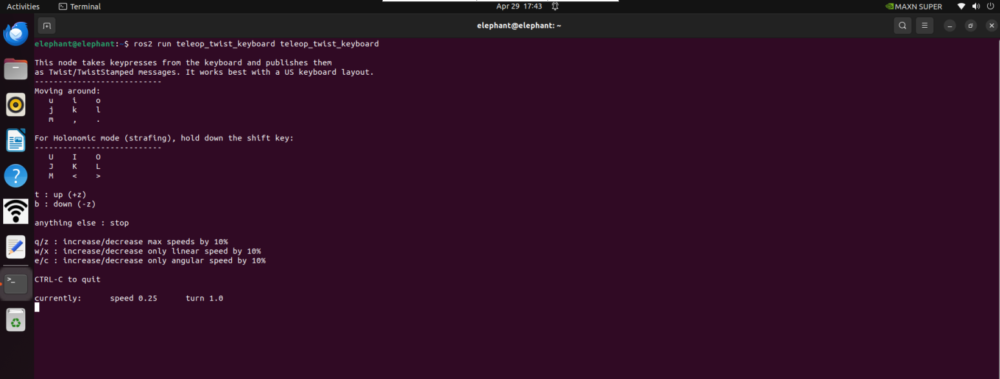
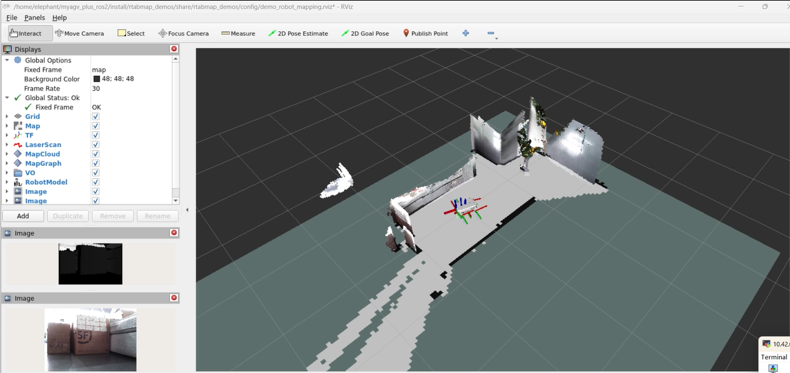
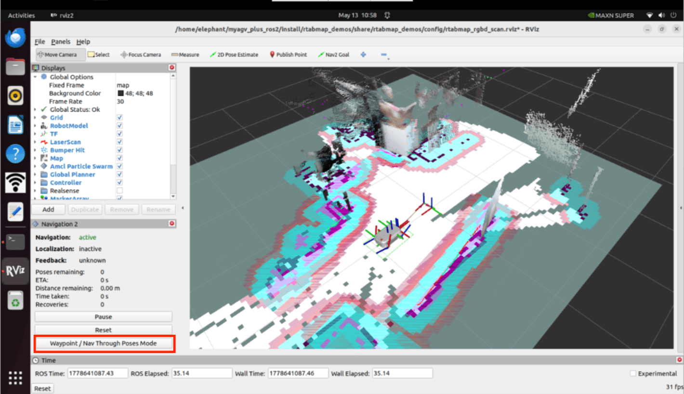
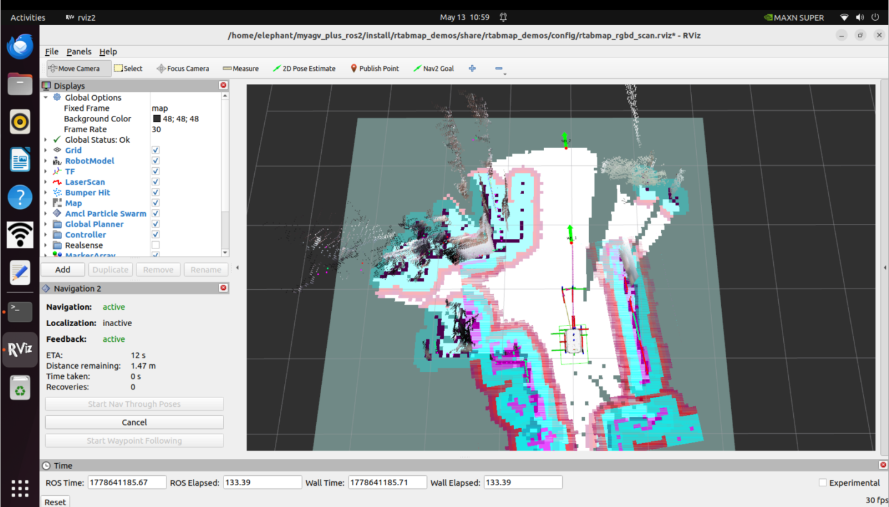
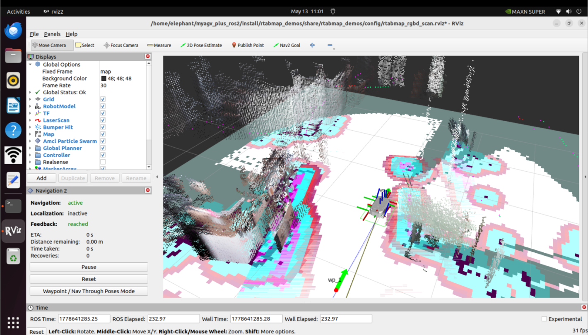

# myAGV Plus-rtabmap建图

## 1.打开slam激光扫描launch文件

先检测激光雷达是否上电使能，没有开启则需要终端通过脚本文件上电启动激光雷达，如果雷达上电使能，则可以跳过上电使能雷达步骤。

```bash
sudo busybox devmem 0x2434098 w 0x000
python start_ydlidar.py
ros2 launch ydlidar_ros2_driver ydlidar_launch.py
```

上电使能雷达后，打开3个控制台终端(快捷键<kbd>Ctrl</kbd>+<kbd>Alt</kbd>+<kbd>T</kbd>)，分别在命令行中输入以下指令:

```bash
//启动里程计和激光雷达
ros2 launch  myagv_plus_bringup myagv_plus_bringup.launch.py
//启动深度相机对应的launch文件
ros2 launch orbbec_camera astra_pro2.launch
//启动rtabamp建图算法
ros2 launch rtabmap_demos robot_mapping_demo.launch.py rviz:=true rtabmap_viz:=false
```

## 2.打开键盘控制文件

重新打开一个控制台终端，在终端命令行中输入：

```bash
ros2 run teleop_twist_keyboard teleop_twist_keyboard
```



| 按键      | 方向               |
| --------- | ------------------ |
| i         | 向前移动           |
| ,         | 向后移动           |
| j         | 向左旋转           |
| l         | 向右旋转           |
| u         | 向左前方移动       |
| o         | 向右前方移动       |
| k         | 停止               |
| m         | 向左后方移动       |
| .         | 向右后方移动       |
| Shift + j | 向左平移           |
| Shift + l | 向右平移           |
| Shift + u | 向左前方平移       |
| Shift + o | 向右前方平移       |
| Shift + m | 向左后方平移       |
| Shift + . | 向右后方平移       |
| q         | 提高线速度和角速度 |
| z         | 降低线速度和角速度 |
| w         | 提高线速度         |
| x         | 降低线速度         |
| e         | 增加角速度         |
| c         | 降低角速度         |



现在小车可以在键盘的控制下开始移动了，操控小车在所需建图的空间内转一圈吧。与此同时，可以看到在Rviz空间里我们的地图也会跟着小车的移动一点点的把地图构建出来了。
***注意：在用键盘操作小车的时候，确保运行 teleop_twist_keyboard.py文件的终端是当前选中的窗口，否则键盘控制程序无法识别键盘的按键。而且速度越慢，建图效果越好，建议线速度设置0.2，角速度设置0.4进行键盘控制***
键盘控制小车移动建完图后，使用ctrl+c停止建图节点，就会~/.ros/rtabmap.db生成地图数据。`~/.ros`为隐藏文件夹，可以按下键盘`ctrl+h`显示隐藏文件夹。

## 3.导航使用

除了键盘控制外，还可以进行同时建图和导航，同样在上电使能雷达后，myagv Plus打开3个控制台终端(快捷键<kbd>Ctrl</kbd>+<kbd>Alt</kbd>+<kbd>T</kbd>)，分别在命令行中输入以下指令:

```bash
//启动里程计和激光雷达
roslaunch myagv_odometry myagv_active.launch
//启动深度相机对应的launch文件
ros2 launch orbbec_camera astra_pro2.launch
//启动rtabamp建图算法
ros2 launch rtabmap_demos myagv_plus_rgbd_scan.launch.py 
```

启动rviz2可视化界面后，会显示激光雷达和深度相机生成的栅格地图和点云建图效果，并且左下角已经加载了nav2的插件。同时可以在rviz看到nav2代价地图中的障碍物地图层+体素层+膨胀层可视化数据。其中体素层由rtabmap的`/camera/obstacles`和`/camera/ground`点云数据和`/scan`2d激光雷达数据进行维护。相比于单个2d激光雷达导航，能实现更优的路径规划导航。


点击rviz2左下框的Waypoint/Nav Through Poses Mode，可以切换成路径点跟随模式



实际使用效果如下：通过rviz发布导航点，同时导航与建图，到达导航点





---

[← 上一页](6.2.5-Navigation-Map_Navigation.md) | [下一章 →](../../7-Development_case/7.1-AGVPIus_270M5Pi_Handle_Control/README.md)
