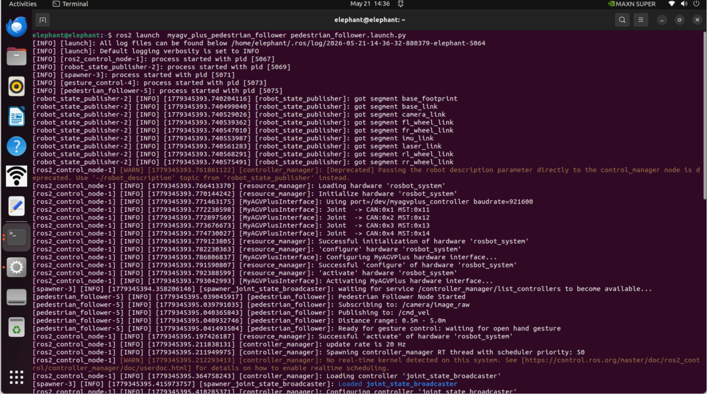

# myAGV Plus 行人跟随案例

**功能**：myAGV Plus 行人跟随功能

## 1 功能启动

1.打开一个终端，输入命令启动行人跟随功能。

**注：用SSH启动功能可能会报错，应使用VNC或者连接显示屏后使用键盘启动功能**

```bash
ros2 launch  myagv_plus_pedestrian_follower pedestrian_follower.launch.py 
```




2.功能成功启动后保持2m左右的距离蹲下挥手，即可开启行人跟随功能

## 2 案例展示


[← 上一节](../7.1-AGVPIus_270M5Pi_Handle_Control/7.1.3-PS2+270.md) | [下一章 →](../../8-FilesDownload/README.md)

