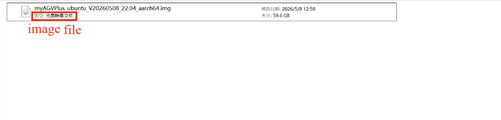
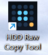
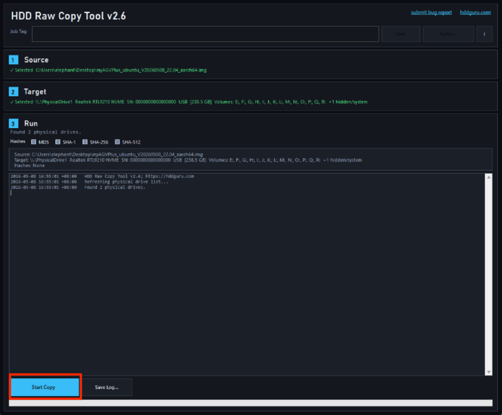

# 镜像烧录

## JN 版本机器人介绍

### 1.1 下载步骤

**Step 1:** 解压缩软件包后，会出现[一个镜像文件](8.4.1-System_Image.md)样式。

**Step 2:** 下载 HDD Raw Copy Tool。

请访问 [HDD Raw Copy Tool](https://hddguru.com/software/HDD-Raw-Copy-Tool/) 下载。

**Step 3:** 根据图片卸下对应的螺丝，用镊子取出myAGV PLUS 的固态硬盘。然后将固态硬盘连接到电脑。

> 外壳

**Step 4:** 将硬盘盒接到电脑上并打开 HDD Raw Copy Tool。

**Step 5:** 选择软件和设备（E 盘），然后将软件写入 PC。

---

[← 上一页](8.4.1-System_Image.md) | [下一页 →](../8.5-PublicityMaterial.md)
