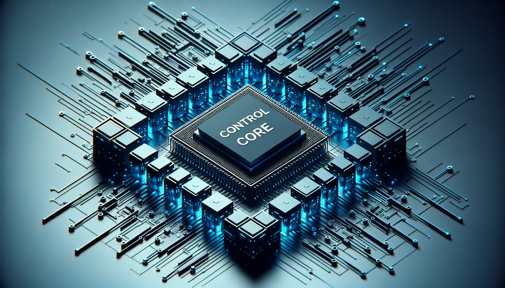

# Control core parameter

## 1 Master controller specification table

| Index                | Parameter                                                    |
| :------------------- | :----------------------------------------------------------- |
| Main Control         | Jetson orin nano Super 8GB                                   |
| CPU                  | Architecture: ARM   Number of Cortex-A57：6  Maximum Clock Frequency:1.728 GHz   L2 Cache:1.5 MiB |
| GPU                  | NVIDIA Ampere architecture, 1024 CUDA cores                  |
| Memory               | 8 GB                                                         |
| Bluetooth            | Onboard, can be enabled via `rfkill unblock bluetooth`       |
| Wireless             | Realtek RTL8822CE 802.11ac Wireless Network Card             |
| Core Video Interface | HDMI interface\*1   DisplayPort(DP)interface\*1           |
| USB                  | USB 3.0 \*2                                                  |
| Ethernet             | RJ45\*1                                                      |
| IO                   | G7, G8, G9, G10, G11, G17,   G18, G22, G23, G24, G25, G27 |

---

[← Previous Page](2.1-MachineSpecification.md) | [Next Page →](../2-ProductFeature/2.3-MechanicalStructureParameter.md)
