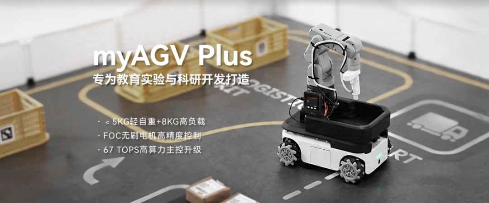

# 产品规格参数

|         Indicator          |                          Parameters                          |
| :--------------: | :--------------------------------------: |
|            Name            |                         Mobile Robot                         |
|           Model            |                          myAGV Plus                          |
|           Motors           |              FOC planetary brushless gear motor              |
|           Wheels           |                        Mecanum Wheels                        |
|          Payload           |                             8Kg                              |
|           Weight           |                             <5Kg                             |
| Laser Radar Scanning Range |                           0.12-8M                            |
|     Laser Radar Angle      |                             360°                             |
|      Built-in Camera       | 8 megapixels   77° field of view   2.96mm focal length |
|        Standby Time        |                            328min                            |
|         Endurance          |                            181min                            |
|   Maximum Movement Speed   |                            1.6m/s                            |
|        Power Supply        |                          12.6V, 2A                           |
|   Operating Temperature    |                          -5°C-45°C                           |

---

[← Previous Page](../2-ProductFeature/README.md#chapter-summary) | [Next Page →](../2-ProductFeature/2.2-ControlCoreParameter.md)
