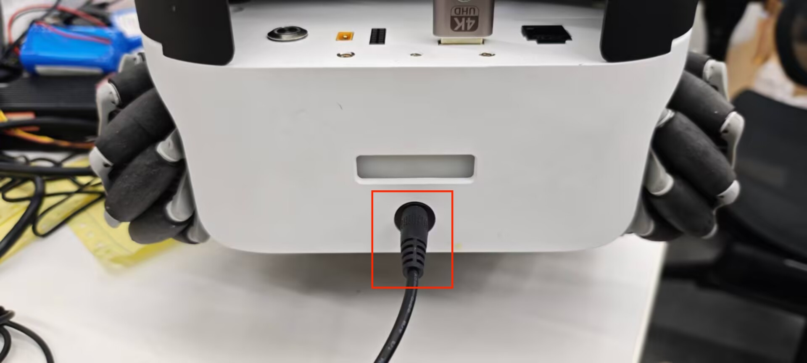
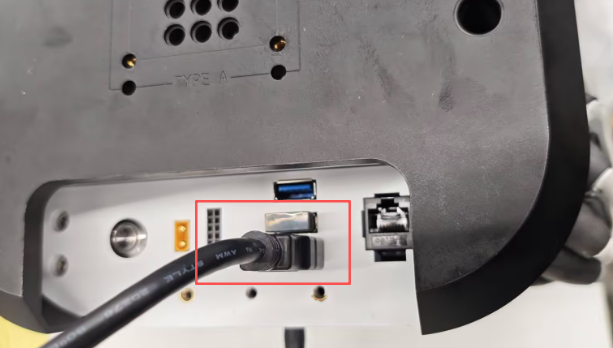
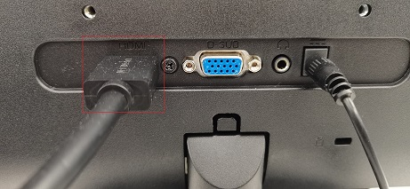
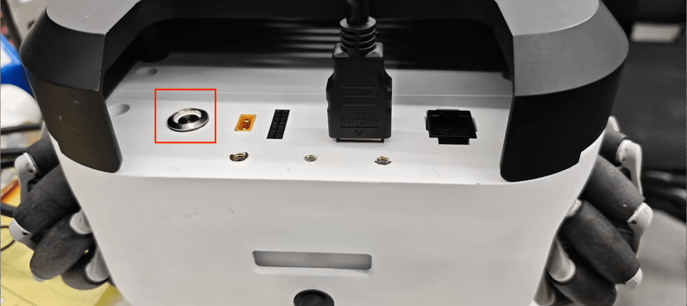
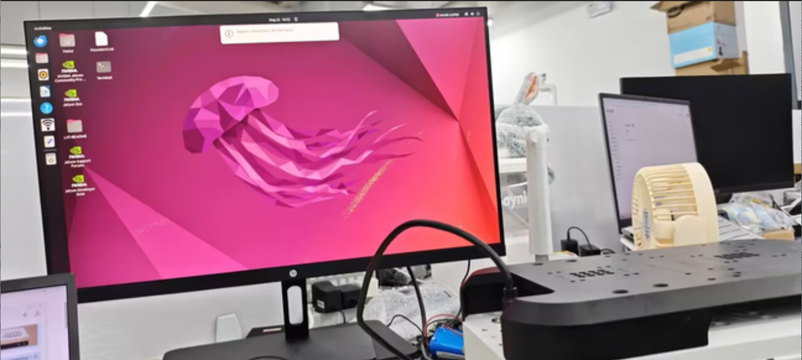

# Power-on detection guide

The content of this chapter explains the boot-up test guide, aimed at ensuring the hardware functions properly before utilizing the features of myagv Plus development. This is essential for the smooth operation of the subsequent myagv Plus software functionalities. If any issues arise during the boot-up test guide, refer to the [common problems and solutions](../3-UserNotes/3.4-FAQs.md) or contact technical support for assistance.

## 1 External cable connection

Before operation, confirm that you have read Chapter Safety Instructions to ensure [safe operation](../3-UserNotes/3.1-SafetyInstruction.md).

Due to the limitations of myagv Plus express delivery safety, the battery power is generally very low when users first get myagv Plus. At this time, the power is not enough to start myagv Plus, so you need to charge myagv Plus. Take out the 25.2V power adapter from the accessory box and connect the DC power supply to charge myagv Plus.

Product accessories include HDMI cable and Bluetooth controller. We connect them all to myagv Plus, and then we also need to prepare an additional monitor with HDMI interface and a USB keyboard and mouse.

Connect the HDMI cable to the monitor.

## 2 Power on status display

After connecting the necessary external devices, press the power button to start myAGV Plus.

- At this moment, you will observe the following phenomena:

  - 1 Upon pressing the power button, the button will illuminate with a white light.
  - 2 The LED light at the rear of the myagv Plus will flash, then remain steady.
  - 3 The monitor will display system information and successfully enter the operating system desktop.

3. If the system fails to start successfully, the following common issues may be the cause. If myagv still cannot enter the system, please contact technical support personnel for assistance in troubleshooting:

   1.Pressing the power button, but the button's light does not illuminate.
   
   - The lithium battery has entered battery protection mode. The voltage is too low to power the myagv Plus. Please use a 25.2V power adapter to [charge](#1-external-cable-connection) the myagv Plus. 
   
   2.The power button's indicator light remains steady white, and the rear LED light is also lit, but there is no display on the monitor.
   
   - Please check if the HDMI cable is damaged and if the monitor's power is turned on. You can try replacing the HDMI cable or the monitor. If the issue persists after trying these steps, it indicates damage to the internal interfaces of the myagv Plus. Please contact customer support for further assistance.
   
   3.System startup failure, unable to successfully enter the system desktop.
   
   - The system files are damaged. You can try [replacing them with the latest image system.](../8-FilesDownload/8.2-System_Image.md)

---

[← Previous Page](4.2-ProductUnboxingGuide.md) | [Next chapter →](../5-SDKDevelopment/README.md)
