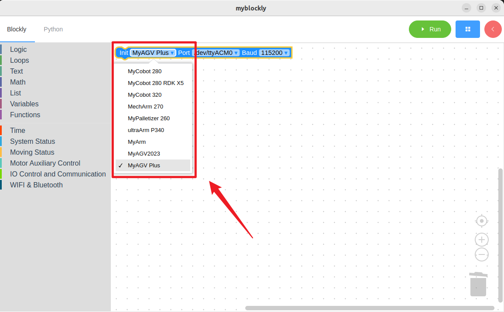
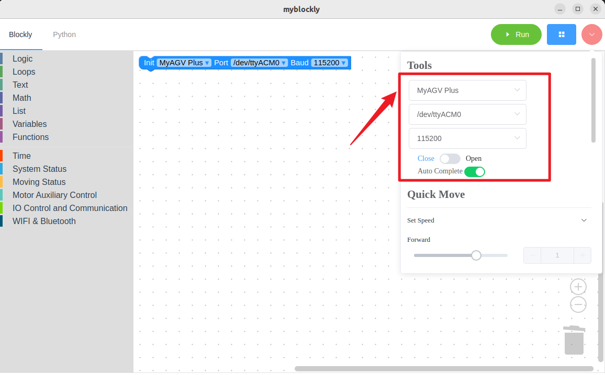
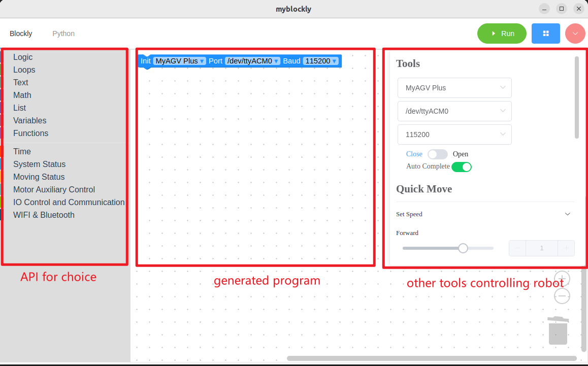
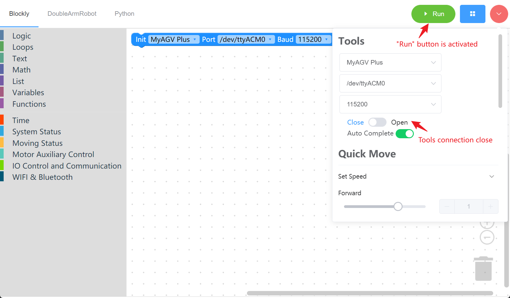
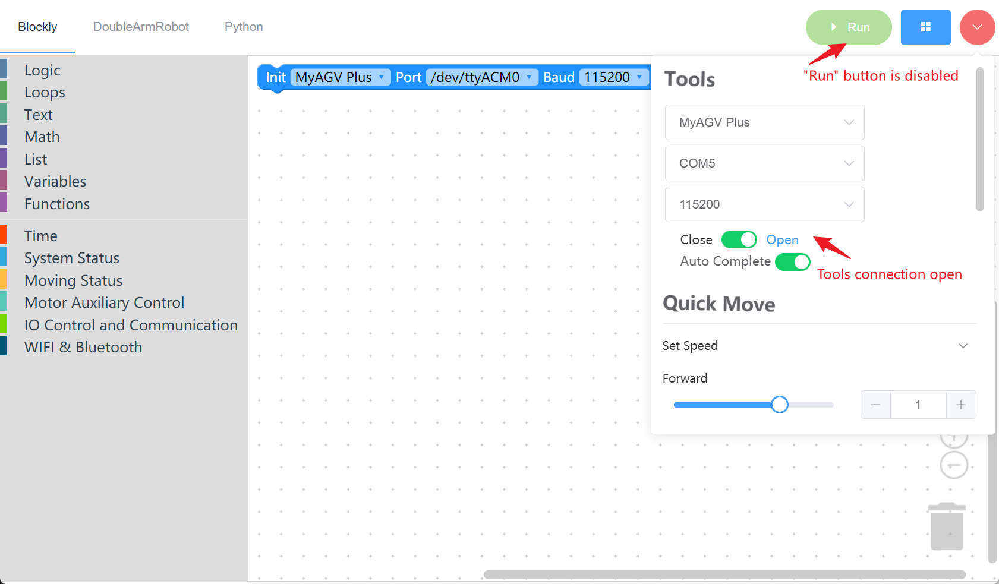
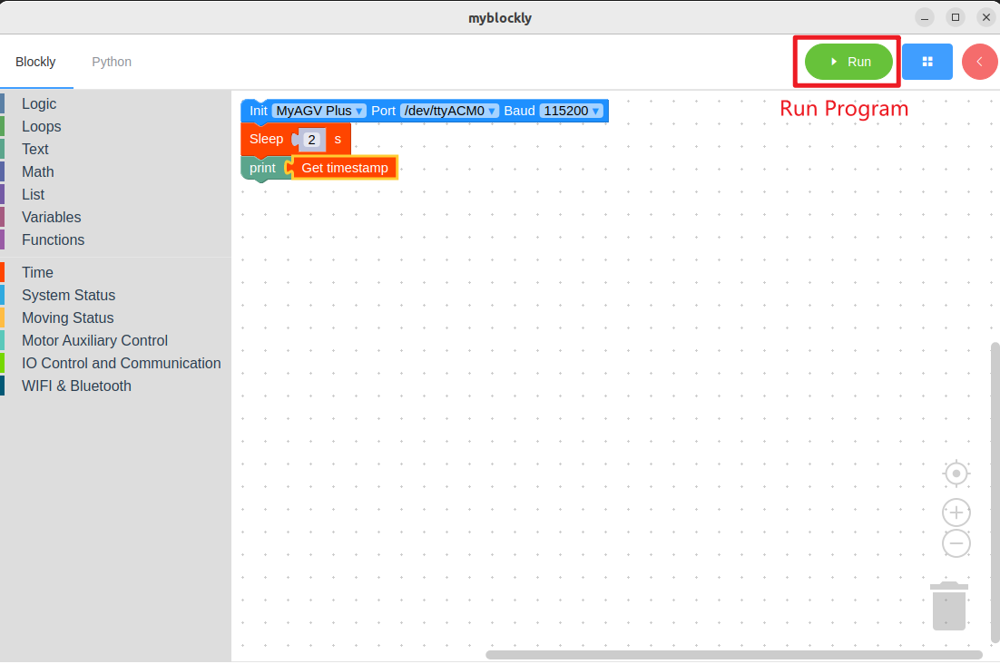
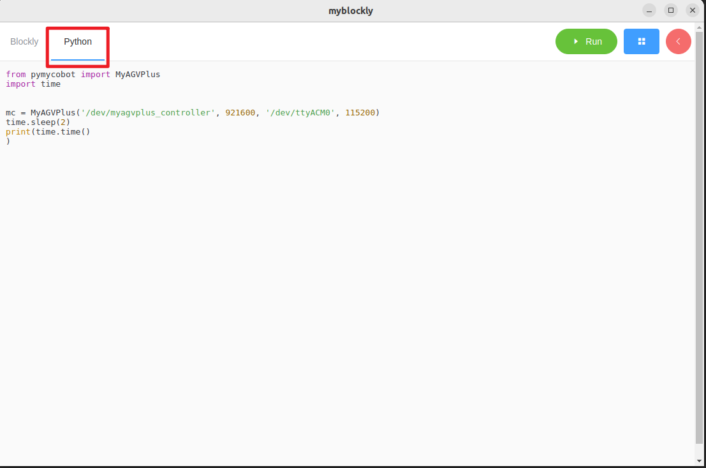
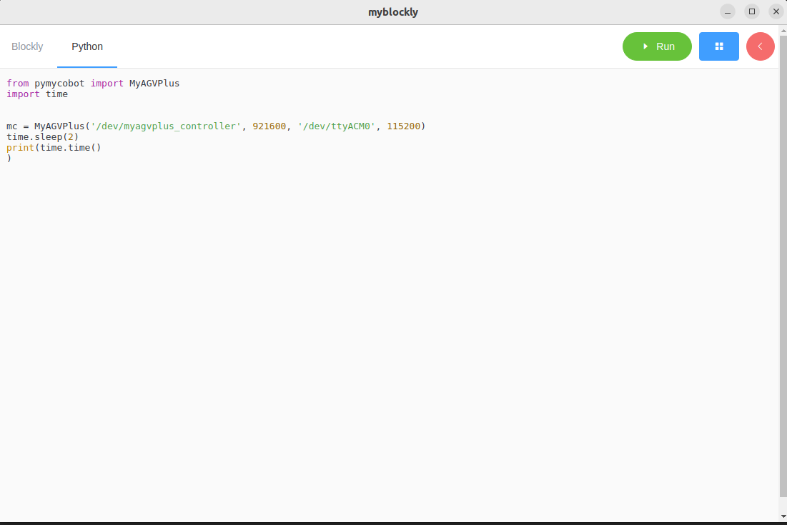
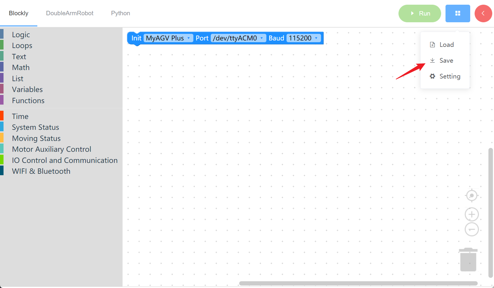
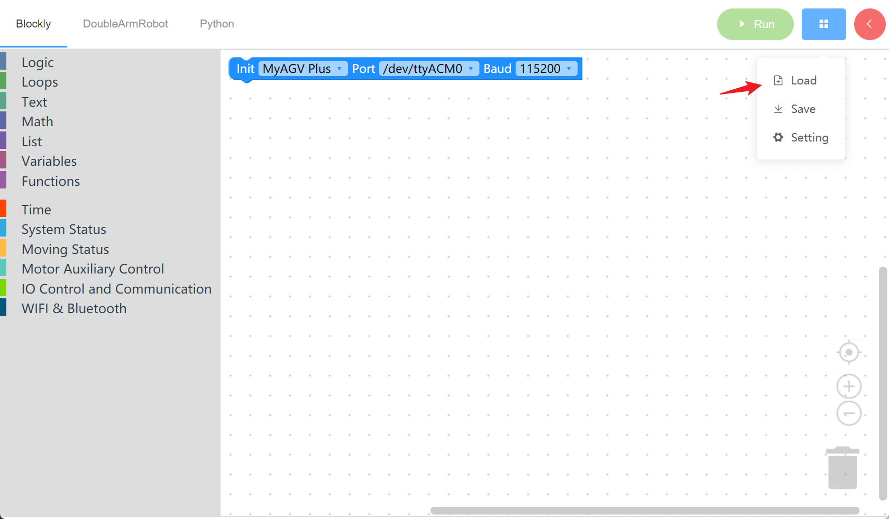

# 1 Initial Use of myBlockly 

## Preparation Work 

Before downloading myBlockly, you need to configure the Python environment and use myStudio to burn the firmware. For detailed instructions, please refer to the following operation methods. 

1. Environment configuration. Before using myBlockly, please make sure that the Python environment has been properly configured on your computer. 

> The NVIDIA Jetson Orin Nano Super platform equipped in myAGV Plus comes pre-installed with the Ubuntu 22.04 system and the corresponding Python development environment. Therefore, there is no need for building and managing. 

2. Firmware burning. 
   

For instructions on how to use myStudio to burn firmware, please refer to [myStudio](../5.3.3-mystudio/README.md) 

## Download and Install myBlockly

After the preparations are completed, you can download and install myBlockly. The download address is: 

- [Official Website Address](https://www.elephantrobotics.com/download/) 
  
- [Github ](https://github.com/elephantrobotics/myblockly-package/releases)
  

**Note:** Please make sure to download the latest version.

## Prerequisites for Use 

- Before officially starting the programming process, it is essential to select the correct **machine model**; otherwise, it is likely to cause damage to the hardware. 

 

- When controlling the machine through the control panel, make sure to select the corresponding machine model; otherwise, it may cause hardware damage.

 

## My Blockly Interface Display 

 

- Module Bar:
  
  Contains the method modules required for program writing. These modules can be dragged into the program programming area for assembly. 
  
- Small toolbar: 
  
  Clicking the pink button on the top right corner will reveal a small toolbar. Here, you can select the correct model, serial port, and baud rate. You can also slide or directly input the desired movement speed. By clicking the movement control button at the bottom, the machine will move in the corresponding direction. 

- Program Editing Area: 
  
  - Before running the program, you need to select the correct model, port and baud rate in the initialization module or the small toolbar. Otherwise, the program will not run properly.
  
  - Drag the required module methods into this area to assemble them and implement your own program. 
  

**Note:** 

1. The serial port address is usually /dev/ttyACM0, and the baud rate is generally 115200. 
2. If the program fails to run, please check whether the small toolbar is disconnected (as shown in the following picture). 

 

 

## Program run 

 

Drag the desired method module, edit your own program (as shown in the above picture), combine the structures of each module together (with the sound of ki), and then click "Run" to upload the code and run it on the robotic arm. 

**Note:** The program for controlling the movement of the robotic arm takes time to complete. Therefore, after one movement, a sleep module needs to be inserted to give the robotic arm sufficient time for movement before the next one. (The duration required is determined by yourself. The robotic arm is set by default to have a minimum sleep time of no less than 0.5 seconds for running myBlockly.) Otherwise, it will cause the robotic arm to fail to achieve the desired movement. 

Clicking on the "Python" option in the top left corner allows you to view the corresponding Python code, as shown in the following picture. 

 

 

## Program Saving and Loading 
The program of myBlockly is saved in the **.json** format. Click the blue box at the top right of the interface, and a "Save" option will appear. After clicking it, the program can be saved. 

 

Similarly, click on the blue box and select the "Load" option to import the saved program. 

 

---

[← Previous page](./README.md) | [Next page →](./2-controlRGB.md)