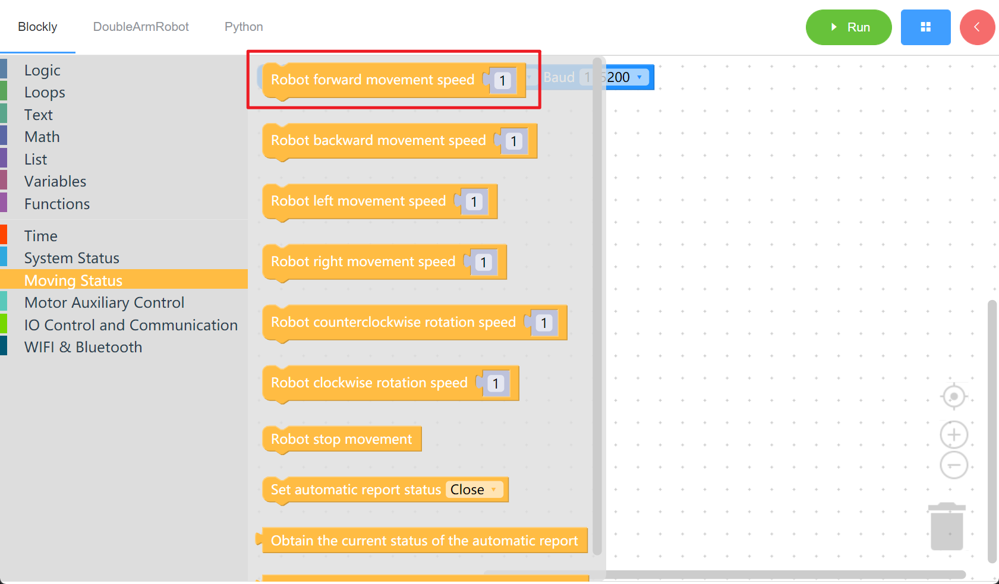
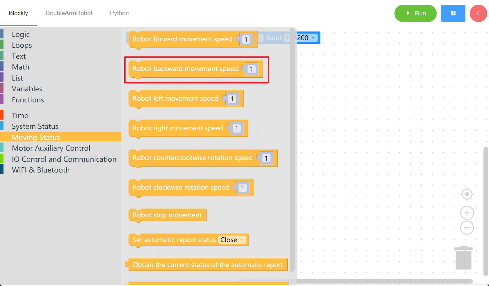
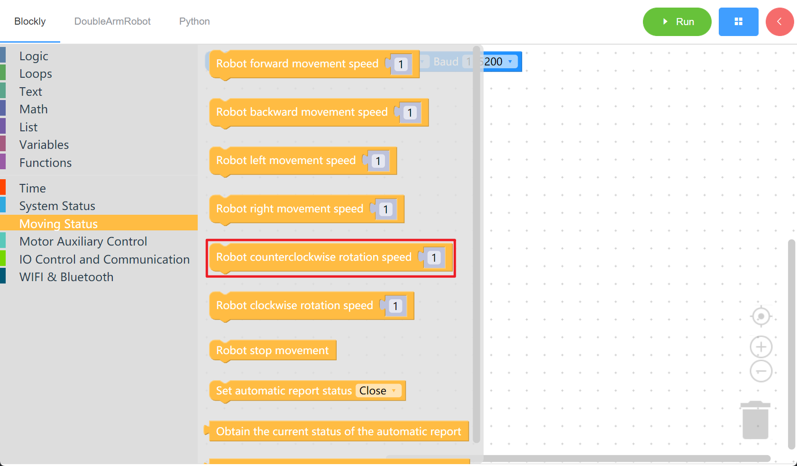
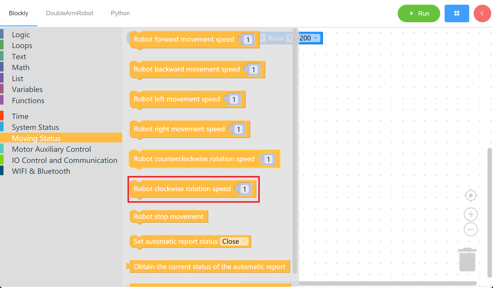
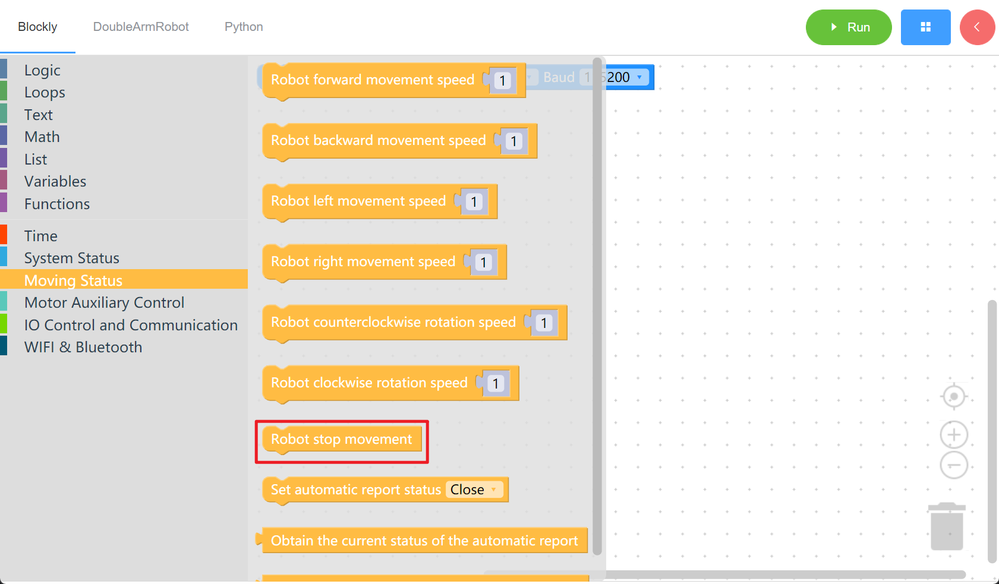
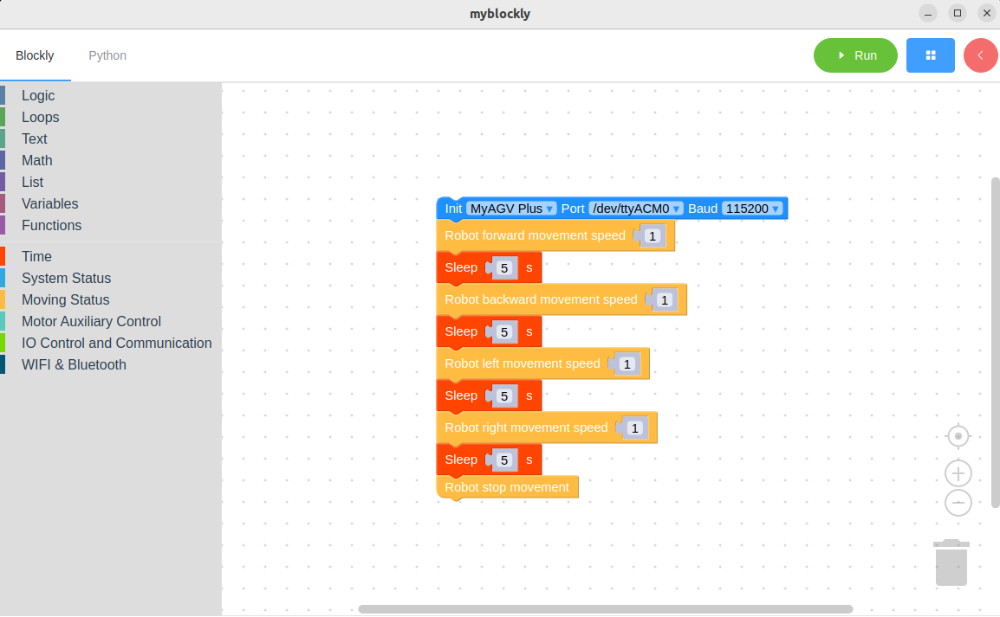

# Control the movement of the car

*Make sure the machine is working before starting*

*The machine has been powered on.*

## The learning content of this chapter

How to control the movement of the car using myBlockly

API Introduction

- Method Module: 1. Move forward
  
   

- Method Module: 2. Moving backward
  
   

- Method module: 3. turn left
  
   

- Method module: 4. turn right
  
  

- Method module: 5. stop
  
  

- Parameter Introduction:
  
  - All of the above modules have only one speed parameter (0.01 ~ 1.5 m/s) that can be adjusted. The mode is 1. The slider only supports integer unit sliding and can be modified by double-clicking the parameter block.

- Objective: To control the machine to move forward, backward, rotate left and right, and finally stop moving.

Simple demonstration

- The graphic code is as follows:
  
  

- The content to be achieved:
  
  Control the machine to move forward at a given speed. After 5 seconds,
  
  Control the machine to move backward at a given speed. After 5 seconds,

  Control the machine to turn left at a given speed. After 5 seconds,

  Control the machine to turn right at a given speed. After 5 seconds,

  Stop the movement and end the program..

---

[← Previous page](./2-controlRGB.md) | [Next page →](./4-ioTest.md)