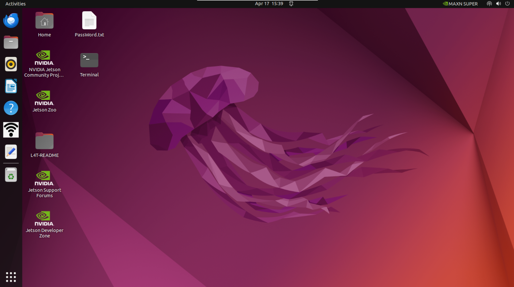
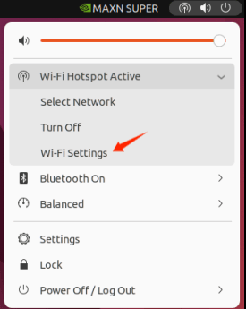
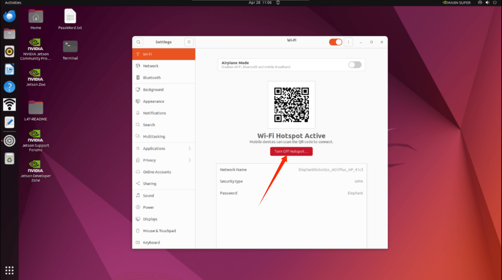
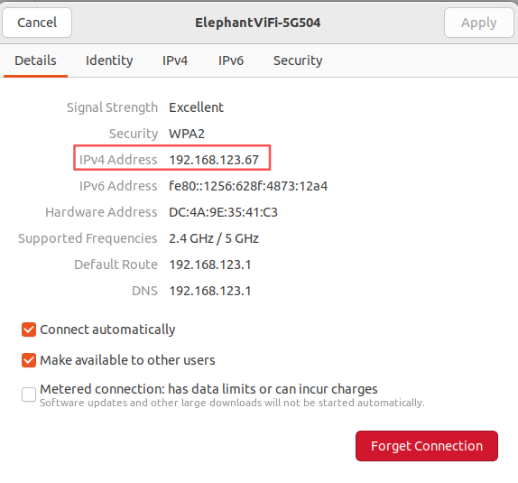
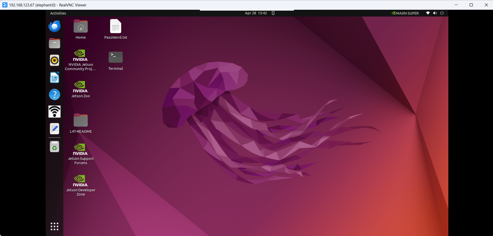
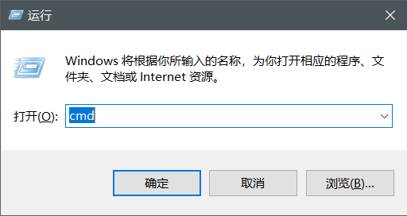
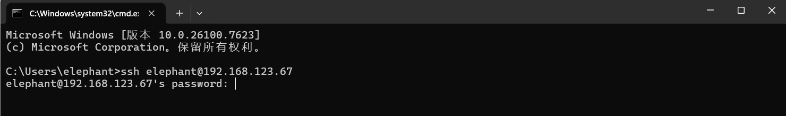
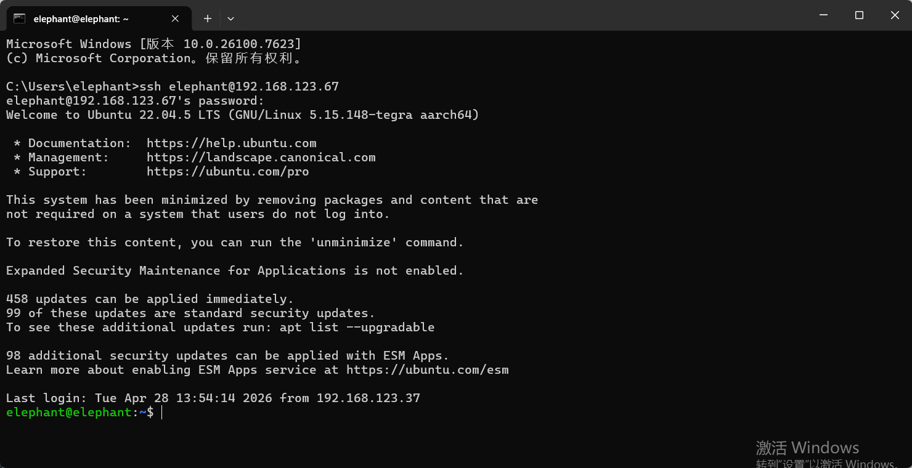
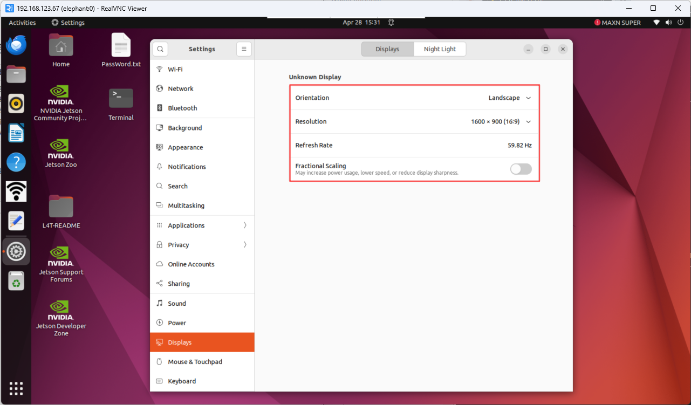

# System instruction manual

## 5.1.1 Robot system introduction

- **System**

  - Ubuntu is the most widely used linux operating system for personal desktop operating systems. It is a good choice for beginners to familiarise themselves with the linux environment or some embedded hardware operating systems.

  

- **功能介绍**

- **myStudio**：Firmware burning software for updating and burning new firmware.

- **myBlockly**：Graphical programming software, can be directly by dragging building blocks to form running code, control the robot arm
  
- **ROS2 humble**：Directly enter the compiled ROS2 environment, you can directly enter the corresponding instructions, run the corresponding ROS2 code
  
- **HotSpot_ON/OFF**：Hotspot switch, click to turn on/off the hotspot function, the hotspot name is **ElephantRobotics_AGVPlus_AP_XXXX**

## 5.1.2 System password description

- **account password & VNC password & SSH password & root account password**
  - Password：**Elephant**
  
- **How to change password**
  - change account password
  
    - Use the shortcut key `ctrl + alt + T` to open the terminal
    - Enter `passwd`
    - Enter the new password twice
  
  - change vnc password
  
    - Use the shortcut key `ctrl + alt + T` to open the terminal
    - Enter `vncpasswd`
    - Enter the new password twice
  
  - change ssh password
  
    - For SSH remote connection, the password of the administrator account is entered. You do not need to change the password separately
  
  - change root account password
  
    - Use the shortcut key `ctrl + alt + T` to open the terminal
    - Enter `sudo passwd`
    - Enter the new password twice

## 5.1.3 VNC

- **VNC Introduction**

  - Is a remote control software, generally used to remotely solve computer problems or software debugging

- **VNC Port**

  - When the robot arm and PC are connected to the same WiFi, the IP address of the robot arm is the port

- **Connect VNC**

  - There are two wireless connection modes. The first mode requires an external monitor to perform certain operations on the system. The specific steps are as follows: Open Settings, find **'Wi-Fi Settings'** and click, then click **'Turn off hotspot'** to disconnect from the myAGV Plus hotspot.

    

    

    Turning off the car hotspot will display the currently available WiFi. Click on the WiFi you want to connect to, enter the password, and then click the button as shown in the picture.

    After clicking, you can view the IP address. As shown in the example, **"192.168.123.67"** is the current IP address of the robot.

    

    

    Connect the computer and the robot to the same WiFi, open the VNC Viewer, enter the IP address (for example: enter **192.168.123.67**), enter the password **Elephant**, and by default do not specify a username. Here is an example of a successful connection:

    

  - The second method does not require connecting a monitor. You can directly connect the Ubuntu system hotspot to the PC for remote control. However, this connection method does not have internet browsing functionality; it can only remotely control the robotic arm system. The specific steps are as follows:

    Connect to the hotspot **ElephantRobotics_AGVPlus_AP_XXXX** and enter the password **Elephant**

    

    Open the VNC viewer, enter the IP address **10.42.0.1**, then enter the password **Elephant**, with no username specified by default. Below is an example of a successful connection:

    

- **How can I improve connection fluency**
  
  - The fluency of the remote connection depends on the fluency of the connected WiFi. It is recommended to connect to a stable WiFi for remote control

## 5.1.4 SSH

- **SSH Introduction**

  - SSH is a network protocol used for encrypted logins between computers. If a user logs in from a local computer to another remote computer using SSH, we can assume that this login is secure, even if it is intercepted in the middle, the password will not be disclosed.

- **SSH Port**

  - The default port number is 22

- **SSH Connect**

  - Confirm the IP address of the robot by following instructions in **5.1.2 VNC**

  - Click `win + R` and enter **"cmd"**

    

  - After input, click OK to open the shell interface

    

  - Enter `ssh elephant@IP address`, then press `Enter` (the IP address is mainly displayed by myAGV Plus, the one in the picture is just an example).

    

  - Enter password `Elephant`

    

  - As shown in the figure above, myAGV Plus has successfully connected via ssh

- **How can I improve connection fluency**

  - The fluency of the remote connection depends on the fluency of the connected WiFi. It is recommended to connect to a stable WiFi for remote controll

## 5.1.5 Network configuration

- **Default AP usage**

  - Turn on the robot power. By default, the system will connect to the built-in hotspot, with the hotspot name **ElephantRobotics_AGVPlus_AP_XXXX** and the current IP address **10.42.0.1**. This hotspot does not support internet surfing, and both the transmission speed and information capacity are limited. Therefore, the final imaging may have some distortion and color deviation, and there may also be communication transmission delays, which are normal phenomena.

- **Connect to WLAN**

  Click **"Turn off hotspot"** to turn off the default hotspot

  

  After turning off the default hotspot, the currently available WiFi will be displayed.

  

  Click the WiFi you want to connect to and enter the WiFi password. After successfully connecting, click the settings icon to view the IP address.

  

  As shown in the example, **"192.168.123.67"** is the robot's current IP address

  

  **Wired Network Connection**

  Turn on the robot power. By default, the robot connects to the hotspot configured by the system:

  **ElephantRobotics_AGVPlus_AP_XXXX**

  

  Click **"Turn off hotspot"** to disconnect from the default hotspot

  Connect the network cable to the robot's network port

## 5.1.7 System resolution switch

Click the icon in the upper right corner of the screen, select **Settings**, and enter the control panel

Select **Display** to switch to the desired resolution.

---

[← Previous Page](README.md) | [Next Section →](../5-BasicApplication/5.2-ApplicationUse/5.2.1-myblockly/jetsonnano/README.md)
