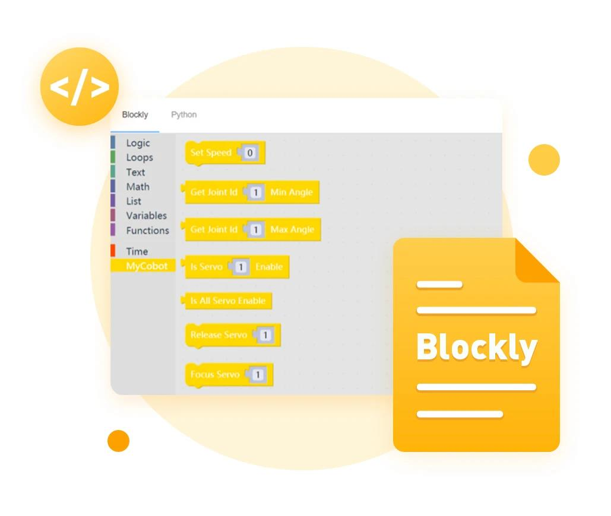

## What is myBlockly?

**myBlockly** is a completely visual modular programming software that is a graphical programming language.

**myBlockly** is similar in function/design to MIT's children's programming language Scratch.

When using **myBlockly**, users can build code logic by dragging modules. The process is like building blocks.

From the user's perspective, **myBlockly** is a simple and easy-to-use visual tool for generating code. From a developer's perspective, myBlockly is a text box that contains the code entered by the user.

The process of generating code into the text box is the process of the user dragging it in **myBlockly**.

## myBlockly installation

**The download link for myBlockly is:**

- Official website address: https://www.elephantrobotics.com/download/

- Github address: https://github.com/elephantrobotics/myblockly-package/releases

## MyBlockly Development and Usage Guide

You can use myBlockly to develop our robotic arm according to the following guidelines.

1.[Initial Use of myBlockly](./1-myBlocklyFirstUse.md)

2.[Control the RGB light panel](./2-controlRGB.md.md)

3.[Control the movement of the car](./3-controlMove.md)

4.[IO Test](./4-ioTest.md)

5.[Q&A](./5-Q&A.md)

---

[← 基础功能使用页](../../README.md#52-应用用途) | [下一页 →](./1-myBlocklyFirstUse.md)
