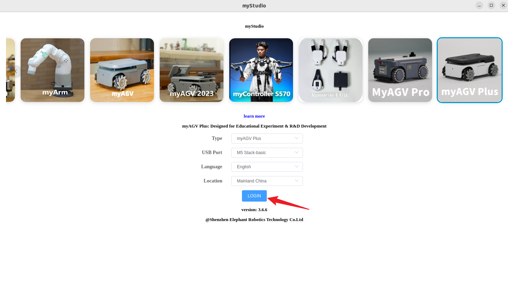
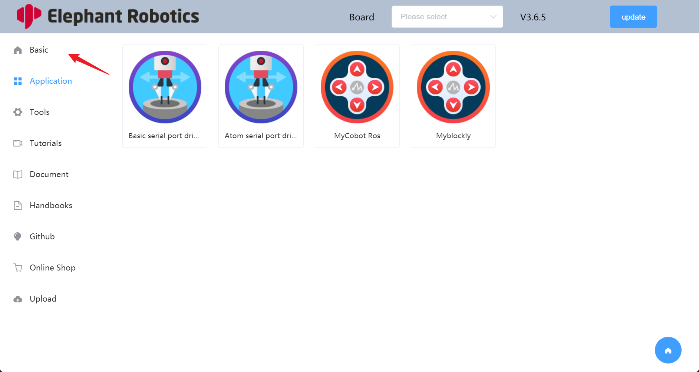
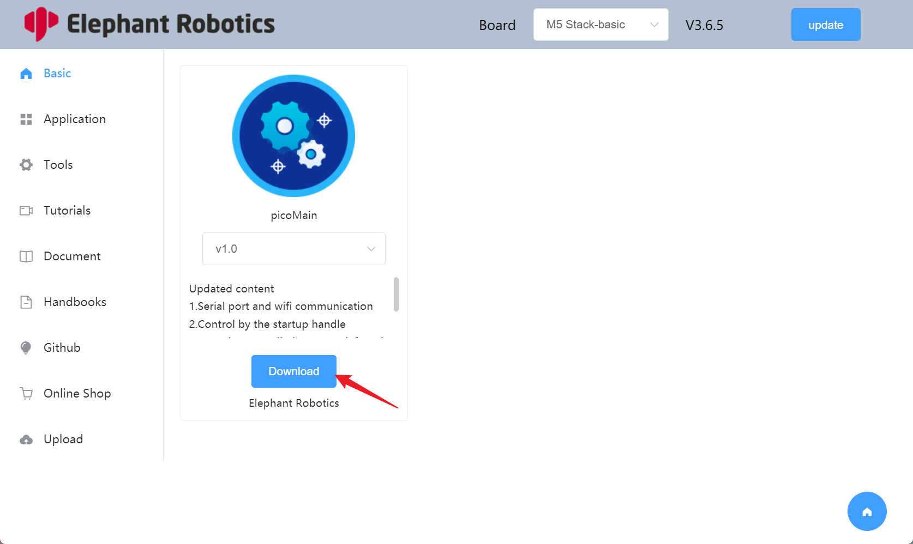
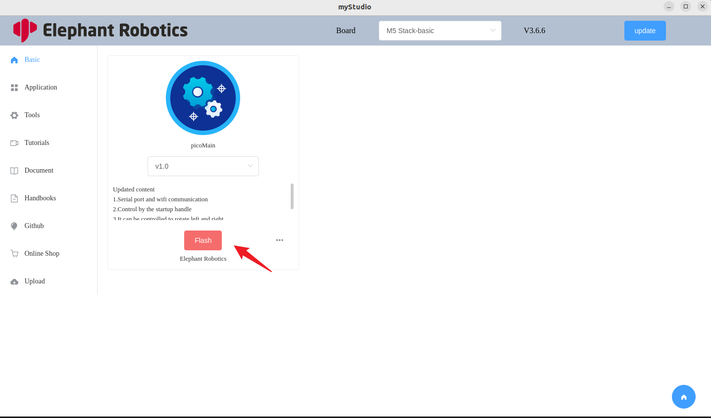
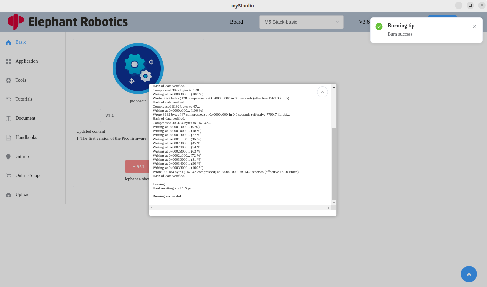

# Burn the firmware

## How to Burn Firmware Using myStudio

- Open myStudio, select the machine as `myAGV Plus`, and wait for the `USB Port` to be successfully recognized.

  

- Click `LOGIN` button.

  

- Click on `Basic` to enter the basic page.

  

- Click to `Download` the firmware

  

- Click to `Flash`

  

- Burn success

  

## FAQ

##### Q：How can one verify whether the firmware has been successfully burned? 

- A：As shown in the figure below, if there is a prompt indicating successful burning, it does not necessarily mean that the burning was successful. If the machine can operate normally after the burning and use the firmware, then it is considered as a successful burning. 

##### Q：How to handle burning failure?

- A：

  - You can try burning more times

  - Check if there are any errors during the burning process. If there are any errors, please provide feedback to the after-sales service

  - Use Cutecom to check if the machine's serial port is working properly. Under normal circumstances, the serial port will return data. If it is not normal, please restart the machine

##### Q：After burning the firmware, the machine is out of control?

- A：If the machine becomes uncontrollable after burning the firmware, you can try burning it multiple times. If it cannot be resolved, please contact after-sales service.

---

[← 上一页](./2-install_driver.md) | [下一页 →](./4-other_function.md)
