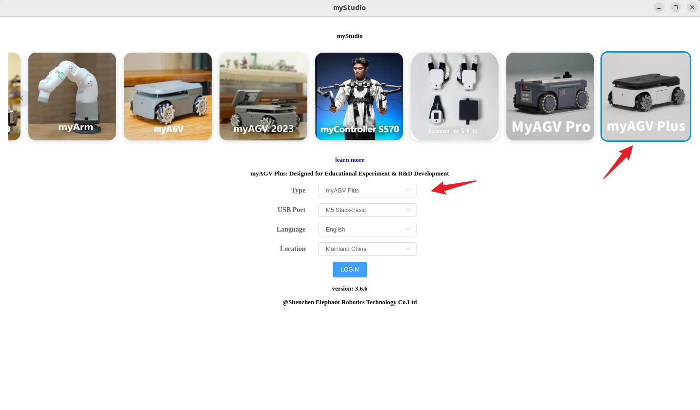

# myStudio

## 1 myStudio design original intention

- myStudio is a one-stop platform for using for robots.

- It is convenient for users to select different firmware and download it according to their own usage scenarios, while learning relevant teaching materials and browsing tutorial videos online.

## 2 myStudio latest version and supported platforms

- Latest version: V3.5.7

- Available on:

  - Windows
  - Mac
  - Linux arm64

## 3 myStudio function

- Burn and update firmware
- Provide robot usage tutorials, such as user manuals, video tutorials, Q&A, etc.
- Information on maintenance and repairs

**Skip to sections:**

- [1.set up](1-setup.md)
- [2.install driver](2-install_driver.md)
- [3.flash firmwares](3-flash_firmwares.md)
- [4.other function](4-other_function.md)

----

[[← Basic functions use page]](../../5-Basic features/README.md)  | [Next Page →](./1-setup.md)

