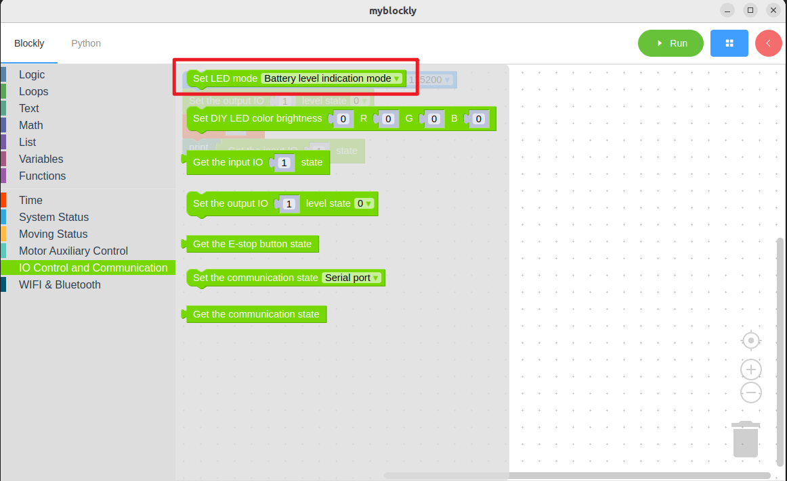
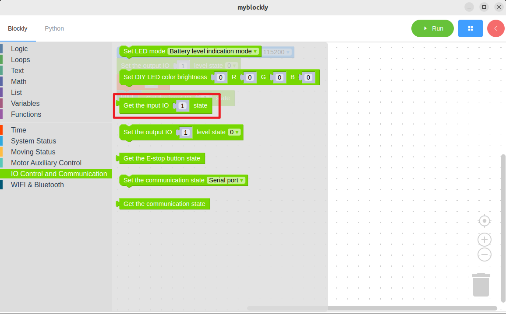
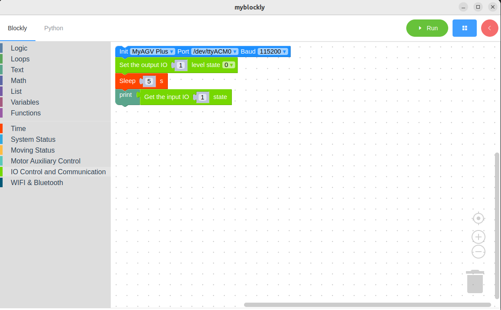

# IO Test

*Make sure the machine is working before starting*

*The machine has been powered on.*

## The learning content of this chapter

How to use myBlockly to quickly test whether the IO is functioning properly

API Introduction

- Method module: 1. Set the output IO status
  
   

- Method module: 2. Get input IO status
  
  

- Parameter Introduction:
  
  - IO ports 1-6, level states 0 - low level, 1 - high level

- Objective: By modifying the IO state through setting the building blocks, and then using the method of obtaining the building blocks to check whether the reading of the IO high and low levels is successful

Simple demonstration

- The graphic code is as follows:
  
  

- The content to be achieved:
  
  Set the output of port 1 as a high level, and after 5 seconds,
  
  Read the status of the IO port.
  
  End the program.

---

[← Previous page](./3-controlMove.md) | [Next page →](../5.3.3-mystudio/README.md)