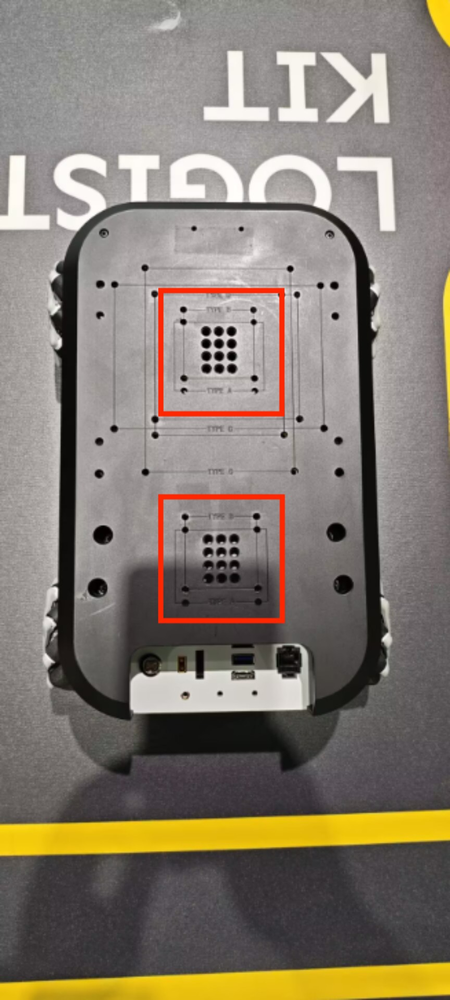
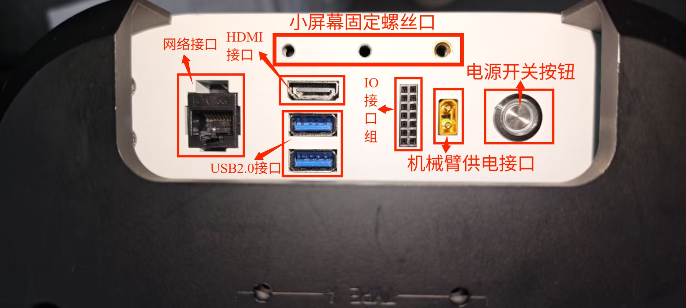
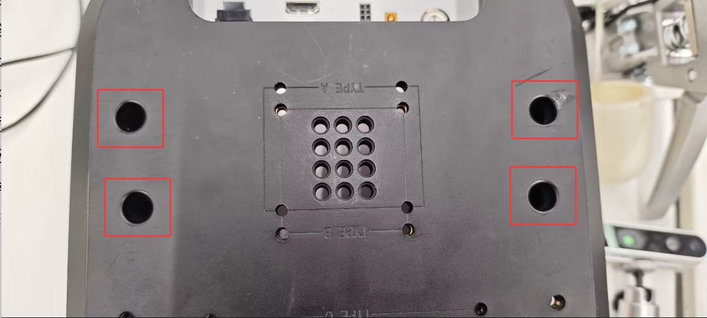
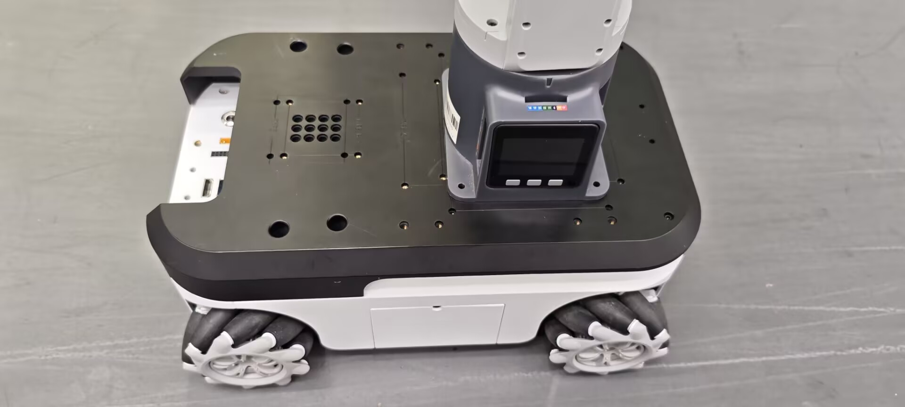
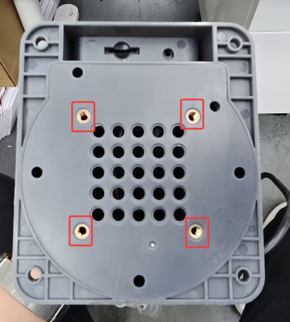
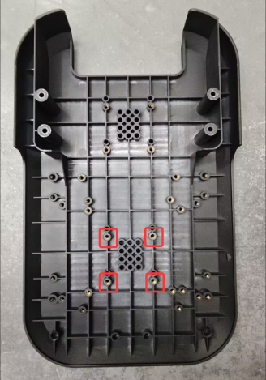

# 1 Installation Instructions

## 1.1 Installing the Robotic Arm

First, you need to install the robotic arm onto the myAGV Plus. You can use LEGO keys or screws to install the robotic arm on the top of the myAGV Plus, and it can be installed at the front or rear according to your needs.

## 1.2 Connecting the Robotic Arm

Use a DC power cable to connect to the power interface of the robotic arm, and connect the other end to the robotic arm's power input. The cart can supply power to the robotic arm (12V 5A).

Example: mechArm 270, the same applies to other robotic arms.

1. Use a hex wrench to remove these four M4*8 hexagon socket screws

2. Install the correct direction of the X-axis corresponding to the mechArm 270 robotic arm, and then screw in the four M4*8 screws to secure the mechArm 270.

---

[← Previous Chapter](../../5-SDKDevelopment/README.md) | [Next page →](6.1.2-CommunicationsControl.md)
