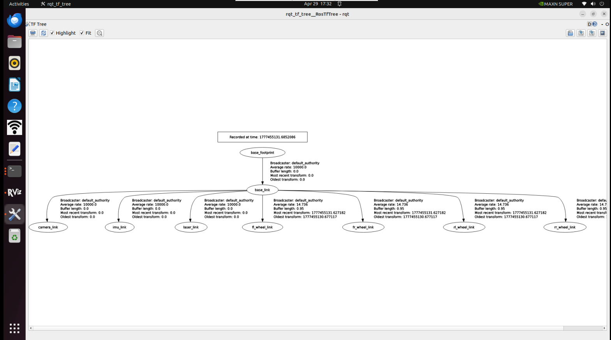

# Using Common ROS2 Tools

- Launch Files

Launch files in ROS 2 Humble are the core means for starting multiple nodes simultaneously. They can automatically manage the lifecycle of nodes, making it convenient to configure each node, set namespaces, load parameters, and greatly simplify the operation of multi-node programs.

（1）`<launch>` Tag

The `<launch>` tag is the root tag of a launch file. All launch files start with `<launch>` and end with `</launch>`, and all configuration tags must be written between them.

```
<launch>
……
……
</launch>
```

（2）`<node>` Tag

The `<node>` tag is the most core configuration item, used to start a ROS 2 node. The attributes have slight adjustments compared to ROS1, and the commonly used format is as follows:

```
<node pkg="package-name" exec="executable-name" name="node-name" />
```

| Tag Attribute     | Attribute Function                                           |
| :---------------- | :----------------------------------------------------------- |
| name="NODE_NAME"  | Specify a name for the node, overriding the node name defined in the code |
| pkg="PACKAGE_NAME | Package name containing the node                             |
| exec="FILE_NAME"  | The executable file name of the node                         |
| output="screen"   | Output the node's standard output to the terminal screen; default is log file |
| respawn="true"    | When set to true, the node will automatically restart upon termination; the default is false. |
| ns = "NAME_SPACE" | Namespace, add a namespace prefix to relative names within a node |
| args="arguments"  | Input parameters required by the node                        |

（3）`<include>` Tag

This tag is used to include another ROS 2 launch file in the current launch file to achieve modular configuration.

| Label attribute                                  | Attribute Function           |
| :----------------------------------------------- | :--------------------------- |
| file ="$(find pkg-name)/path/filename.launch.py" | Specify the files to include |

e.g.

```
<include file="$(find demo)/launch/demo.launch.py" />
```

（4）`<remap>`  Tag

Used for topic remapping, to achieve adaptation of topic names between nodes, and its usage is completely consistent with ROS1.

For example, if a node subscribes to the `/chatter` topic and it needs to be remapped to `/demo/chatter`:

```
<remap from="chatter" to="demo/chatter"/>
```

（5）`<parameter>` Tag

`<parameter>` tag is used to set a single parameter on the parameter server.

For example, adding an integer parameter `demo_param` with a value of 1:

```
<parameter name="demo_param" type="int" value="1"/>
```

（6）`<parameters>` Tag

The `<parameters>` tag is used to batch load parameters from a YAML file.

Usage is as follows:

```
<parameters from="$(find pkg-name)/path/name.yaml"/>
```

（7）`<arg>` Tag

The `<arg>` tag serves as a local variable for the launch file and is only used for passing parameters within the launch file itself, unrelated to the node logic.

The syntax is as follows:

```
<arg name="arg-name" default="arg-value"/>
```

- Rviz2

  **rviz2** is the official 3D visualization tool for ROS 2 Humble, fully compatible with the ROS 2 communication architecture and suitable for various robotic platforms. 

  It can visualize robot models, sensor data (lidar, point clouds, cameras), TF coordinate transformations, navigation paths, maps, and other core information, while also supporting interactive control of robots through the interface.


- Qt Toolbox

Computational Graph Visualization Tool (rqt_graph):
rqt_graph tool displays the communication relationships between nodes and topics in the current ROS 2 system in real time.

```
rqt_graph
```

After successfully starting, the calculation chart will be displayed, as shown in the figure below.


TF Relationship Visualization Tool (rqt_tf_tree)

The rqt_tf_tree tool visually displays the current TF relationships between running nodes. To launch this tool while running the graph building function, use the following command:

```
ros2 run rqt_tf_tree rqt_tf_tree
```

After a successful launch, the TF relationship diagram will be displayed, as shown in the figure below.



---

[← Previous Page](6.2.2-ROS_Installation.md) | [Next Page →](6.2.4-Basic_Control_Based_on_ROS.md)
