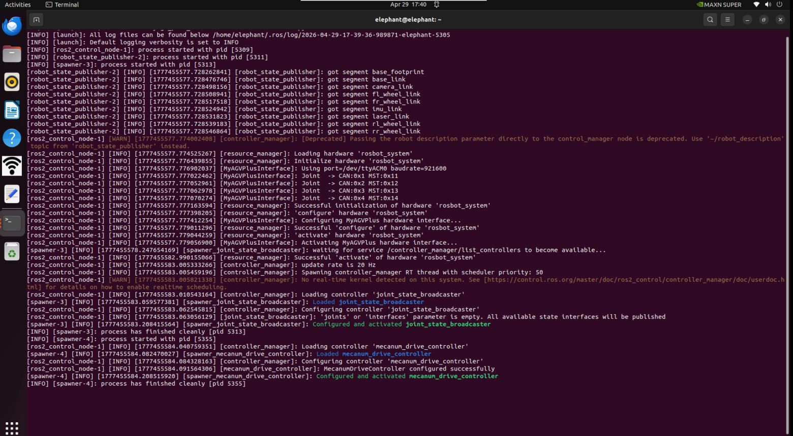
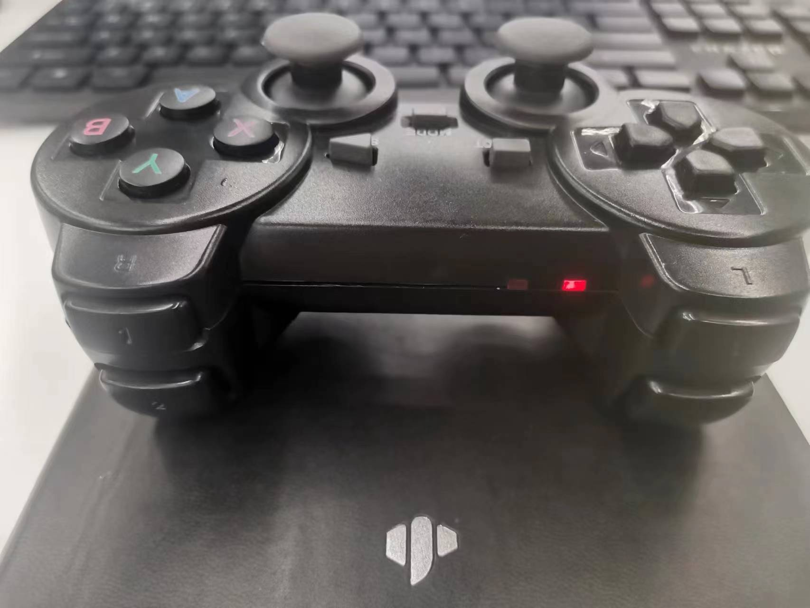
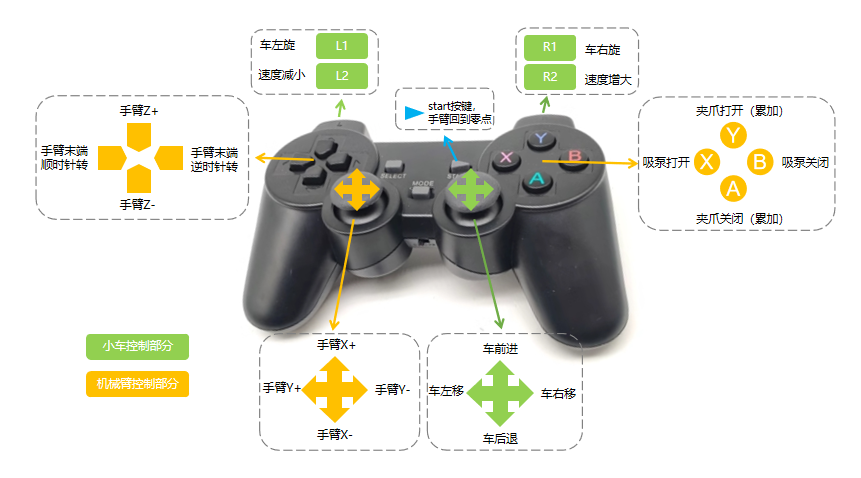

# Basic Control Based on ROS2

Basic control includes **keyboard control and joystick control**. Let's first discuss the keyboard control method:

- 1 Start the communication of the car's lower layer.

First, check whether the LiDAR is powered on and enabled. If it is not powered on, use the terminal to turn on the power and start the LiDAR through a script file. If the LiDAR is already powered on and rotating, you can skip the steps of turning on the power and enabling the LiDAR.

```bash
sudo busybox devmem 0x2434098 w 0x000
python start_ydlidar.py
ros2 launch ydlidar_ros2_driver ydlidar_launch.py
```

After turning on the LiDAR power, open the terminal console (shortcut <kbd>Ctrl</kbd> <kbd>Alt</kbd> <kbd>T</kbd>), and enter the following command in the command line:

```bash
ros2 launch  myagv_plus_bringup myagv_plus_bringup.launch.py
```

Open the startup files required for SLAM laser scanning and the car wheels. If you see

> Now lidar is scanning...
> ......
> process has finished cleanly 

It indicates successful communication between the car's LiDAR and the wheels. The terminal will display the following status:



- 2 Start Keyboard Communication

Open a new terminal console and enter the following command in the terminal command line:

```bash
ros2 run teleop_twist_keyboard teleop_twist_keyboard
```


|    Key    |              Direction               |
| :-------: | :----------------------------------: |
|     i     |               Forward                |
|     ,     |               Backward               |
|     j     |              Move Left               |
|     l     |              Move Right              |
|     u     |        Move to the left-front        |
|     o     |       Move to the right-front        |
|     k     |                 Stop                 |
|     m     |        Move to the left-rear         |
|     .     |        Move to the right-rear        |
| Shift + j |           Move to the left           |
| Shift + l |          Move to the right           |
| Shift + u |       Move forward to the left       |
| Shift + o |      Move forward to the right       |
| Shift + m |     Move backward  to the  left      |
| Shift + . |     Move backward  to the right      |
|     q     | Increase Linear and Angular Velocity |
|     z     | Decrease Linear and Angular Velocity |
|     w     |       Increase Linear Velocity       |
|     x     |       Decrease Linear Velocity       |
|     e     |      Increase Angular Velocity       |
|     c     |      Decrease Angular Velocity       |

Handle control

- 1 Start the underlying communication of the trolley.

First, check whether the LiDAR is powered on and enabled. If it is not powered on, please use the terminal to power it on and start the LiDAR through a script file. If the LiDAR is already powered on and rotating, you can skip the steps of powering on and enabling the LiDAR.

```bash
sudo busybox devmem 0x2434098 w 0x000
python start_ydlidar.py
ros2 launch ydlidar_ros2_driver ydlidar_launch.py
```

After turning on the LiDAR power, open the terminal console (shortcut <kbd>Ctrl</kbd> <kbd>Alt</kbd> <kbd>T</kbd>), and enter the following command in the command line:

```bash
ros2 launch  myagv_plus_bringup myagv_plus_bringup.launch.py
```

Open the startup files required for SLAM laser scanning and car wheels. If you see

> process has finished cleanly 
> ......
> Now lidar is scanning...

It indicates successful communication between the car's LiDAR and the wheels. The terminal will display the following status:


- 2 Start joystick control file

The first step is to plug the Bluetooth controller's USB receiver into the car, open a new console terminal, and enter the following in the command line:

```bash
ros2 run myagv_plus_joystick_control joystick_controller 
```

At this time, the handle lights up green and red, and the terminal shows:


If the controller only shows a red light, you need to press and hold MODE for 3 seconds to switch modes.



If you have successfully reached this point, you can successfully control the movement of the car with the controller. The controller operation can be referred to in the following image. **Note: Currently, controller control of the robotic arm temporarily only supports controlling the mechArm 270**



- [← Previous Page](6.2.3-Using_Common_ROS2_Tools.md) | [Next Page →](6.2.5-Real-time_Mapping_with_Gmapping.md)
