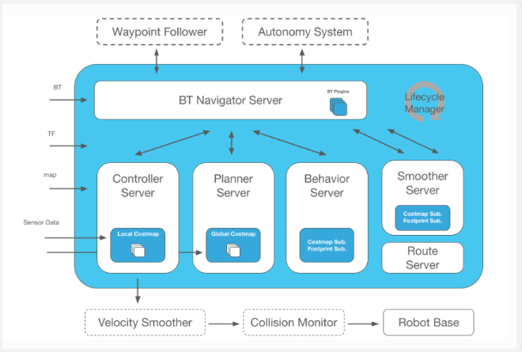
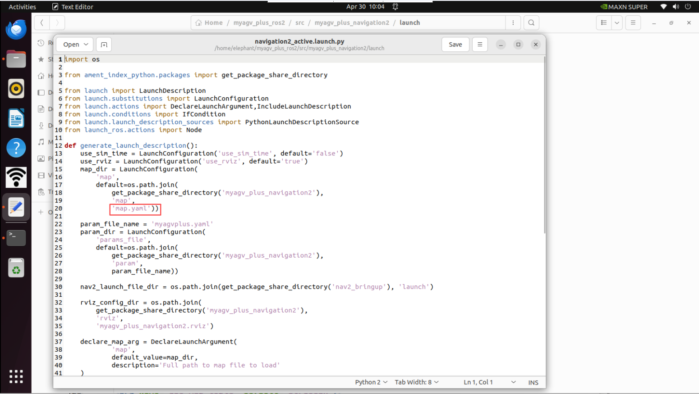
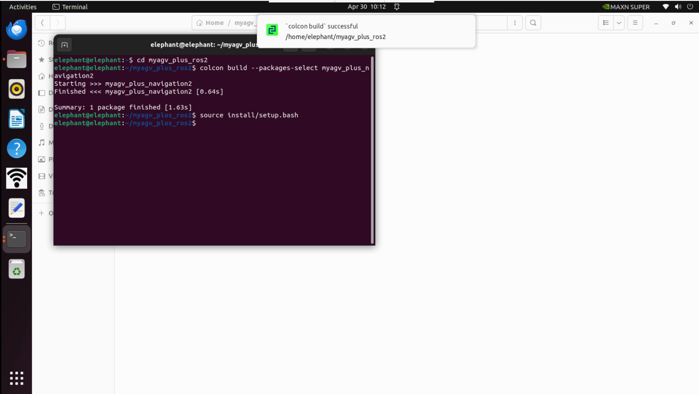
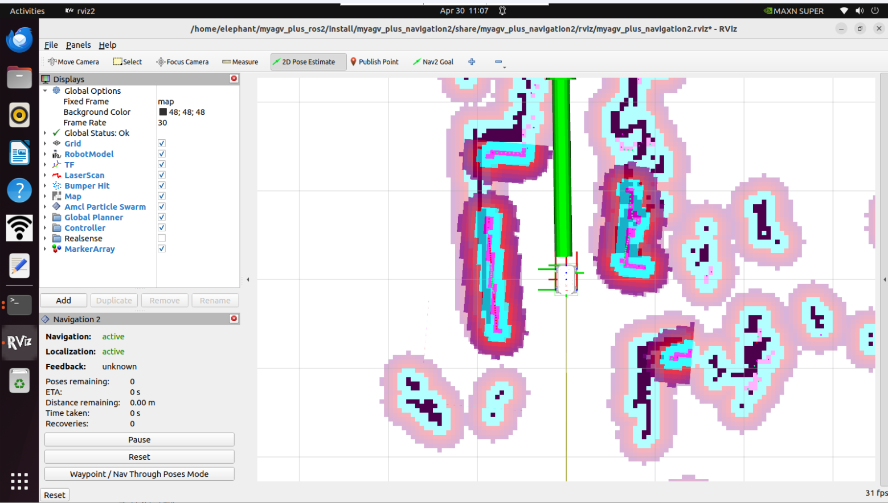
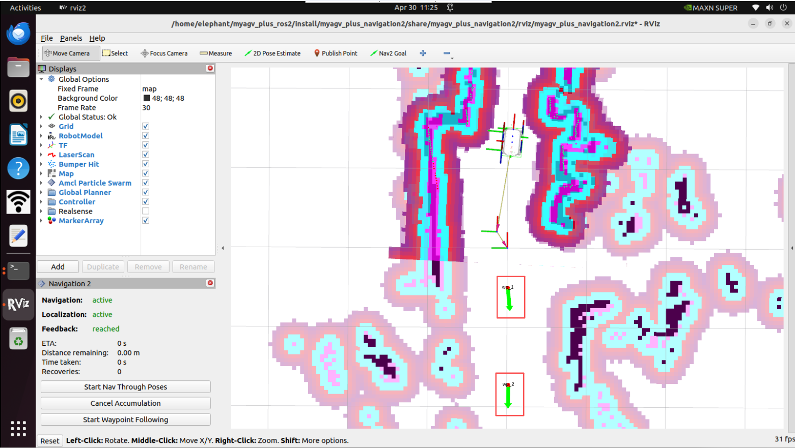
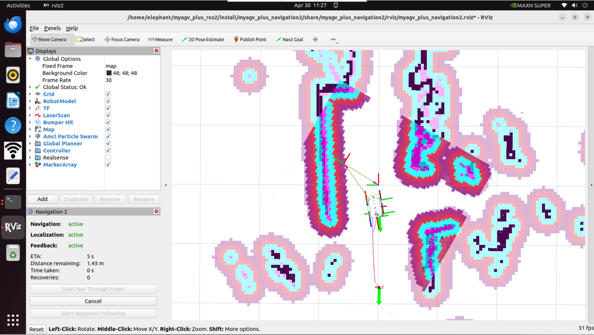

# NAV2



Nav2 is the successor to the ROS Navigation Stack, deploying the same type of technology that powers mobile and surface robotics. The project allows mobile robots to navigate in complex environments to perform user-defined application tasks with almost any category of robot kinematics. It can not only move from point A to point B but also handle intermediate poses and represent other types of tasks, such as object tracking, full coverage navigation, and more.

# Map Navigation

Before this, we have successfully created a spatial map and obtained a set of map files, namely **map_test.pgm and map_test.yaml** located in the ~/myagv_plus_ros2/src/myagv_plus_navigation2/map directory.


Now, let's see how to use the created map to navigate the car.

- #### 1 Modify the launch file

Edit and open the **navigation2_active.launch.py** file located at ~/myagv_plus_ros2/src/myagv_plus_navigation2/launch/.

```
cd /myagv_plus_ros2/src/myagv_plus_navigation2/launch
sudo gedit navigation2_active.launch
```


Find the parameter "map_file" and change **/map/map.yaml** to **/map/map_test.yaml**. Then save the modified file and exit. If no changes are made, the system will default to loading the **map.yaml** file.

- #### 2 Compile file

  After making modifications, you need to recompile before you can properly load the required map.

  ```
  cd myagv_plus_ros2
  colcon build --packages-select myagv_plus_navigation2
  source install/setup.bash
  ```

  

- #### 3 Run the startup file

After turning on the myagv power, open the terminal console (shortcut:<kbd>Ctrl</kbd>+<kbd>Alt</kbd>+<kbd>T</kbd>) and enter the following command:

```
ros2 launch  myagv_plus_bringup myagv_plus_bringup
```

Open another terminal console (shortcut: <kbd>Ctrl</kbd>+<kbd>Alt</kbd>+<kbd>T</kbd>) and enter the following command:

```
ros2 launch myagv_plus_navigation2 navigation2_active.launch.py
```


- #### 4 You will see that an Rviz simulation window has been opened.

First, locate the robot on the map. Check the position of your robot on the map.

Set the robot's pose in RViz. Click the 2D Pose Estimate button and indicate the robot's position on the map. The direction of the green arrow is the forward direction of myAGV Plus.

Then the 3D model will move to that position. Observe whether the laser radar matches the obstacles on the map; small errors in the estimated position are acceptable.



- #### 5 Start Navigation

Set the number of target points for the task, click Confirm and Save. Then click **"Nav2 Goal"** on the toolbar to define the target points on the map. (Each time you set a point, you need to click **"Nav2 Goal"** first). The target points distinguish direction, and the arrow represents the vehicle's arrival position and target orientation. After clicking, you will see a planned path from the starting point to the target point in Rviz, and the vehicle will follow this route to reach the destination.


- #### 6 Waypoint Following Mode

  Click on the Waypoint/Nav Through Poses Mode in the bottom left box of rviz2 to switch to the waypoint following mode.

  

  Click Nav2 Goal to publish two navigation points

  

  Click the Start Waypoint Following in the lower left corner, and then navigation will proceed in order one by one.

  

  


---

[← Previous Page](6.2.5-Real-time_Mapping_with_Gmapping.md) | [Next Page →](6.2.7-Rtabmap.md)
