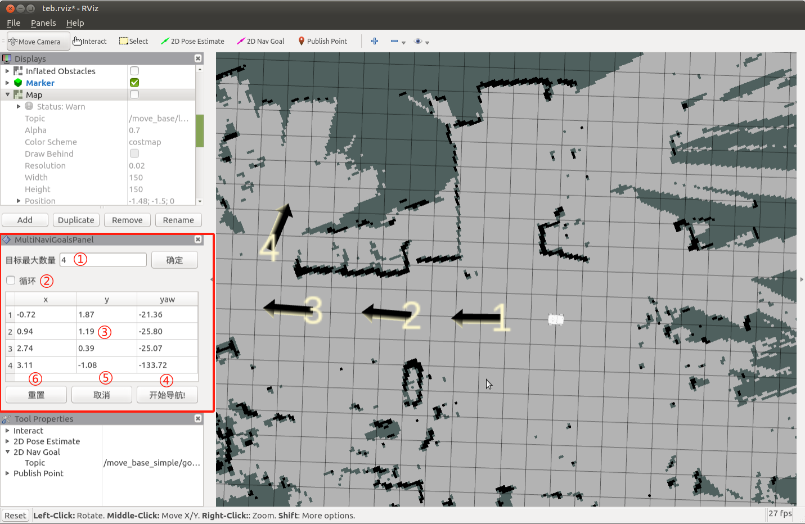
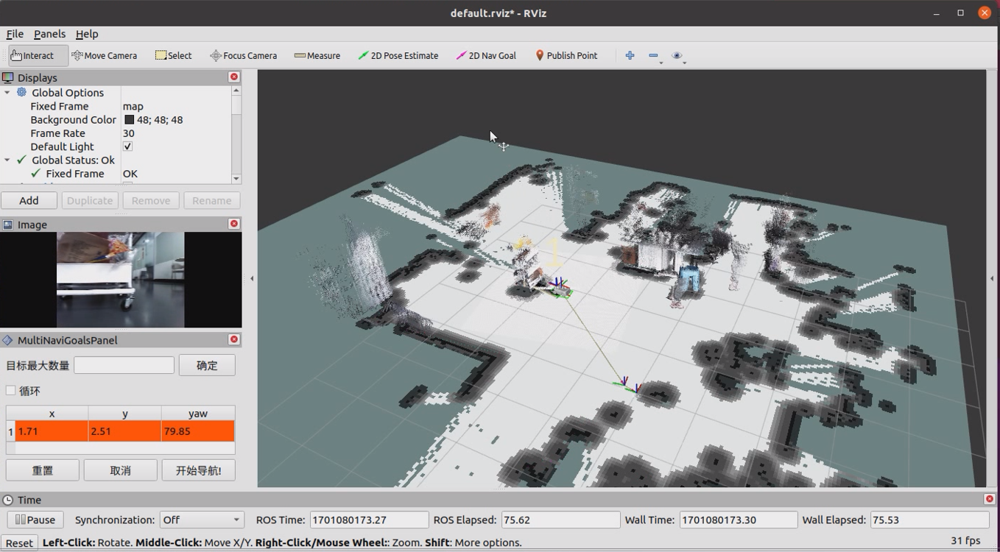

# myAGV Plus-rtabmap build map

## Open slam laser scanning launch file

First, check whether the LiDAR is powered on and enabled. If it is not on, the terminal needs to start the LiDAR by powering it on through a script file. If the LiDAR is powered on and enabled, the step of powering on and enabling the LiDAR can be skipped.

```bash
sudo busybox devmem 0x2434098 w 0x000
python start_ydlidar.py
ros2 launch ydlidar_ros2_driver ydlidar_launch.py
```

After powering on and enabling the radar, open 3 console terminals (shortcut <kbd>Ctrl</kbd> <kbd>Alt</kbd> <kbd>T</kbd>), and enter the following commands in the command line respectively:

```bash
//启动里程计和激光雷达
ros2 launch  myagv_plus_bringup myagv_plus_bringup
//启动深度相机对应的launch文件
ros2 launch orbbec_camera astra_pro2.launch
//启动rtabamp建图算法
ros2 launch rtabmap_demos robot_mapping_demo.launch.py rviz:=true rtabmap_viz:=false
```

## 2.Open the keyboard control file

Open a new terminal console and enter the following command in the terminal command line:

```bash
ros2 run teleop_twist_keyboard teleop_twist_keyboard
```


|   按键    |                 方向                 |
| :-------: | :----------------------------------: |
|     i     |               Forward                |
|     ,     |               Backward               |
|     j     |              Move Left               |
|     l     |              Move Right              |
|     u     |        Move to the left-front        |
|     o     |       Move to the right-front        |
|     k     |                 Stop                 |
|     m     |        Move to the left-rear         |
|     .     |        Move to the right-rear        |
| Shift + j |           Move to the left           |
| Shift + l |          Move to the right           |
| Shift + u |       Move forward to the left       |
| Shift + o |      Move forward to the right       |
| Shift + m |     Move backward  to the  left      |
| Shift + . |     Move backward  to the  left      |
|     q     | Increase Linear and Angular Velocity |
|     z     | Decrease Linear and Angular Velocity |
|     w     |       Increase Linear Velocity       |
|     x     |       Decrease Linear Velocity       |
|     e     |      Increase Angular Velocity       |
|     c     |      Decrease Angular Velocity       |


Now the robot car can start moving under keyboard control. Operate the car to make a round in the space where you want to map. At the same time, you can see that in the Rviz space, our map is gradually being built as the car moves.
***Note: When operating the car with the keyboard, make sure that the terminal running the teleop_twist_keyboard.py file is the currently selected window, otherwise the keyboard control program will not recognize the keystrokes. Also, the slower the speed, the better the mapping effect. It is recommended to set the linear speed to 0.2 and the angular speed to 0.4 for keyboard control.***
After using the keyboard to move the car and complete the mapping, use ctrl+c to stop the mapping node, and the map data will be generated in ~/.ros/rtabmap.db. `~/.ros` is a hidden folder; you can press `ctrl+h` on the keyboard to show hidden folders.

## 3.Navigation

In addition to keyboard control, simultaneous mapping and navigation can also be performed. Similarly, after powering on and enabling the radar, myagv opens three console terminals (shortcut <kbd>Ctrl</kbd> <kbd>Alt</kbd> <kbd>T</kbd>), and enters the following commands in the command line:

```bash
//启动里程计和激光雷达
roslaunch myagv_odometry myagv_active.launch
//启动深度相机对应的launch文件
roslaunch orbbec_camera astra_pro2.launch
//启动rtabamp建图算法
roslaunch myagv_navigation 3d_navigation_active.launch
```

1. Description of the lower-left corner navigation operation area

① Maximum number of target points that can be set: The number of target points set cannot exceed this parameter (it can be less).

② Loop: If checked, after navigating to the last target point, it will navigate back to the first target point. Example: 1->2->3->1->2->3->···. This option must be checked before starting navigation.

③ Task target point list: x/y/yaw, the pose of the specified target points on the map (xy coordinates and heading yaw).

* After setting the maximum number of targets and saving, the list will generate the corresponding number of entries.
* Each time a target point is given, the coordinates and orientation of the target point will be read here.

④ Start Navigation: Start Task

⑤ Cancel: Cancel the current target navigation task, and the robot will stop moving. After clicking Start Navigation again, it will start from the next task point.

Example: 1->2->3, if you click Cancel during the 1->2 process, the robot will stop moving. After clicking Start Navigation, the robot will go from the current coordinate point to 3.

⑥ Reset: This will clear all current target points



2. Set the number of task target points and click confirm to save. Then click 2D Nav Goal on the ToolBar, and specify the target points on the map. (Each time you set it, you need to click 2D Nav Goal first.) The target points have orientation distinctions, with the arrow tip indicating the front of the vehicle. Click start navigation, the navigation will begin, and in rviz you will see a planned path for the vehicle from the start point to the target point. The vehicle will move along the route to the target point.


3.Actual usage effect

The effect is as follows: Publish navigation points through rviz, while simultaneously performing navigation and mapping, reaching the navigation points.




---

[← Previous Page](6.2.6-Navigation-Map_Navigation.md) | [Next Chapter →](../../7.1-InstallationInstructions.md)
