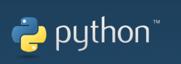

## What is Python?

**Python**  was designed in the early 1990s by Guido van Rossum of the Netherlands Society for Mathematics and Computer Science as an alternative to a language called ABC.

**Python** not only provides efficient, advanced data structures, but also can be used to do simple and effective object-oriented programming.

The Syntax and dynamic typing of **Python** as well as the nature of interpreted languages, make it become a programming language for scripting and rapid application development on most platforms. With the continuous updating of the version and the addition of new features, it is gradually used to develop independent, large-scale projects.

The interpreter of **Python** is easily extensible, and new functions and data types can be extended using the C or C++ language (or other languages that can be called through C language).。

**Python** can also be used for extending program languages in customizable software. **Python** has rich standard libraries and provides source or machine codes suitable for each major system platform.

**Skip to sections:**

- [6.1.1 Environment Setup](6.1.1-download.md)
- [6.1.2 API](6.1.2-API.md)
- [6.1.3 RGB Control](6.1.3-controlRGB.md)
- [6.1.4 Control Car Movement](6.1.4-controlmove.md)
- [6.1.5 IO Status Reading and Peripheral Control](6.1.5-iotest.md)

---

[← Previous Chapter](../../6-Software Development Guide/README.md) | [Next Page →](6.1.1-download.md)

