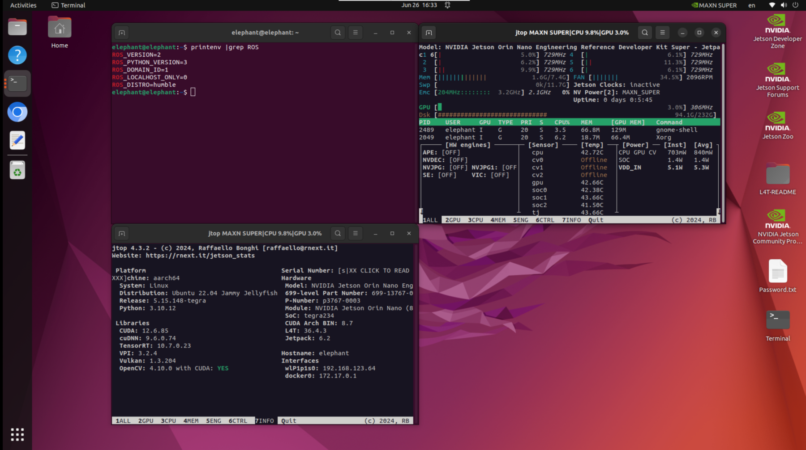
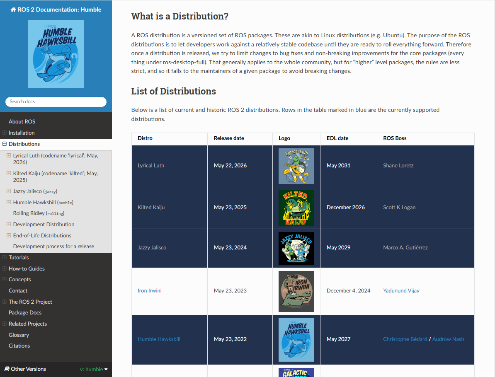

# ROS2

myAGV Plus is developed based on Jetson Orin Nano Super, running Ubuntu 22.04 LTS, and operates with ROS 2 Humble.



[ROS 2 Humble](https://docs.ros.org/en/humble/index.html) is the official stable version recommended for Ubuntu 22.04, offering better real-time support, DDS middleware communication, and a component-based architecture.



Humble Hawksbill is the eighth official release of ROS 2, launched in May 2022, with long-term support (LTS) until May 2027. Humble supports key features suitable for mobile robot development:

- **Nav2 framework**: Modules for path planning, localisation (AMCL, SLAM), and control
- **Sensor integration**: Efficient integration for LiDAR, IMU, GPS, and Camera
- **rclcpp/rclpy**: Supports both C++ and Python development
- **ros2 launch**: Parameterised launch using YAML/param files
- **ros2 bag**: Supports recording and playback of sensor data
- **Real-time support**: With PREEMPT-RT, a certain level of control real-time capability is achievable

ROS 2 can also integrate with Jetson hardware using Nvidia acceleration packages like [Isaac ROS](https://github.com/NVIDIA-ISAAC-ROS/isaac_ros_visual_slam) or [ros_deep_learning](https://github.com/dusty-nv/ros_deep_learning) for efficient perception tasks.

## myAGV Plus ROS2 code

The myAGV Plus ROS2 source code packages are stored in the [github-humble](https://github.com/elephantrobotics/myagv_plus_ros2) branch and managed using git. 

When myAGV Plus is shipped, the ROS2 source code is compiled beforehand, so it’s ready to use straight out of the box. If you need to update the code, you can check the two update points below.

<details>
<summary class="expand-summary">
<span class="arrow">▶</span>1. If you need to update the ros2 code at the same time, you can sync the latest code using the following steps.</summary>
<p>Enter the Ubuntu desktop system, press (Ctrl Alt T) on the keyboard to open the terminal and enter the following command</p>
<pre><code>cd ~/myagv_plus_ros2/src
git pull
cd ..
colcon build
</code></pre>
 <p>If you run into errors when compiling large packages like rtabmap or nav2, it's recommended to limit the build concurrency：</p>
<pre><code>cd ~/myagv_plus_ros2/src
git pull
cd ..
export MAKEFLAGS="-j5"
colcon build --parallel-workers 1 --cmake-args -DCMAKE_BUILD_TYPE=Release
</code></pre>
<style>
.expand-summary {
    cursor: pointer;
    list-style: none;
}
summary.expand-summary:hover {
    color: #1a73e8;
}
.arrow {
    display: inline-block;
    transition: transform 0.2s;
}
details[open] .arrow {
    transform: rotate(90deg);
}
</style>
</details>

<details>
<summary class="expand-summary">
<span class="arrow">▶</span>2. If you are compiling and installing the myAGV Plus ROS2 workspace source code for the first time, you can follow the steps below to compile and install the latest code.</summary>
<p>Create a workspace and clone the myAGV Plus ROS2 source code.</p>
<pre><code>git clone https://github.com/elephantrobotics/myagv_plus_ros2.git myagv_plus_ros2/src
</code></pre>

Install dependencies

<pre><code>cd ~/myagv_plus_ros2
rosdep install --from-paths src --ignore-src -r -y
</code></pre>

Build the workspace (the first time compiling the source on Jetson Orin Nano Super will take about 30 minutes)

<pre><code>cd ~/myagv_plus_ros2
colcon build
</code></pre>
If you encounter errors while compiling large packages like rtabmap or nav2, it is recommended to limit build concurrency:

<pre><code>cd ~/myagv_plus_ros2
export MAKEFLAGS="-j5"
colcon build --parallel-workers 1 --cmake-args -DCMAKE_BUILD_TYPE=Release
</code></pre>
<style>
.expand-summary {
    cursor: pointer;
    list-style: none;
}
summary.expand-summary:hover {
    color: #1a73e8;
}
.arrow {
    display: inline-block;
    transition: transform 0.2s;
}
details[open] .arrow {
    transform: rotate(90deg);
}
</style>

</details>

------


> Notes-1

When using the terminal to launch a launch file, remember to `source ~/myagv_plus_ros2/install/local_setup.bash`

For example: launching the myAGV Plus LiDAR and lower-level communication launch

```
source ~/myagv_plus_ros2/install/local_setup.bash
ros2 launch myagv_plus_bringup myagv_plus_bringup.launch.py
```

You can also go to the /home directory, press ctrl h to show hidden files like .bashrc, and add the following command at the end of the file so that every time you open the terminal, it will source the ros2 workspace environment variables automatically.


> Notes-2

The default [middleware for ROS 2 communication is DDS](https://docs.ros.org/en/humble/Concepts/Intermediate/About-Domain-ID.html). In DDS, the main mechanism for sharing a physical network across different logical networks is called the Domain ID. ROS 2 nodes on the same domain can freely discover each other and exchange messages, while nodes on different domains cannot. By default, all ROS 2 nodes use Domain ID 0. To avoid interference between different groups of computers running ROS 2 on the same network, you should set a different Domain ID for each group.

For example, if you have two myAGV Plus robots on the same LAN, you should assign different Domain IDs to each group to prevent data interference.

myAGV Plus1 Modify .bashrc

```
export ROS_DOMAIN_ID=1
```


myAGV Plus2 modify .bashrc

```
export ROS_DOMAIN_ID=2
```


Or set the environment variable to restrict communication to just the local host.

```
export ROS_LOCALHOST_ONLY=1
```


---

[←  Previous Page](README.md) | [Next Page →](6.2.2-Using_Common_ROS2_Tools.md)
