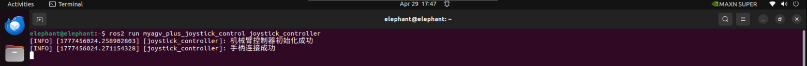

# Basic Control Based on ROS2

Basic controls include **keyboard control and joystick control**. Here's an example video of how to use them:

<video id="my-video" class="video-js" controls preload="auto" width="100%"
poster="" data-setup='{"aspectRatio":"16:9"}'>
<source src="https://download.elephantrobotics.com/video/myAGV%20Plus/myAGV%20Plus%20ROS2%20%E5%9F%BA%E6%9C%AC%E6%8E%A7%E5%88%B6.mp4"></video>

- 1 Start the car's underlying communication.

Open the terminal console (shortcut <kbd>Ctrl</kbd> <kbd>Alt</kbd> <kbd>T</kbd>) and type the following command in the command line:

```bash
ros2 launch myagv_plus_bringup myagv_plus_bringup.launch.py
```

The terminal will show the following status:


- 2 Start Keyboard Communication

Open a new terminal console and enter the following command in the terminal command line:

```bash
ros2 run teleop_twist_keyboard teleop_twist_keyboard
```


|    Key    |              Direction               |
| :-------: | :----------------------------------: |
|     i     |               Forward                |
|     ,     |               Backward               |
|     j     |              Move Left               |
|     l     |              Move Right              |
|     u     |        Move to the left-front        |
|     o     |       Move to the right-front        |
|     k     |                 Stop                 |
|     m     |        Move to the left-rear         |
|     .     |        Move to the right-rear        |
| Shift + j |           Move to the left           |
| Shift + l |          Move to the right           |
| Shift + u |       Move forward to the left       |
| Shift + o |      Move forward to the right       |
| Shift + m |     Move backward  to the  left      |
| Shift + . |     Move backward  to the right      |
|     q     | Increase Linear and Angular Velocity |
|     z     | Decrease Linear and Angular Velocity |
|     w     |       Increase Linear Velocity       |
|     x     |       Decrease Linear Velocity       |
|     e     |      Increase Angular Velocity       |
|     c     |      Decrease Angular Velocity       |

Handle control

- 1 Start the underlying communication of the trolley.

Open the terminal console (shortcut <kbd>Ctrl</kbd> <kbd>Alt</kbd> <kbd>T</kbd>) and type the following command in the command line:

```bash
ros2 launch  myagv_plus_bringup myagv_plus_bringup.launch.py
```

The terminal will show the following status:


- 2 Start joystick control file

The first step is to plug the Bluetooth controller's USB receiver into the car, open a new console terminal, and enter the following in the command line:

```bash
ros2 run myagv_plus_joystick_control joystick_controller 
```

At this time, the handle lights up green and red, and the terminal shows:




If the controller only shows a red light, you need to press and hold MODE for 3 seconds to switch modes.


If you've made it this far, you can now successfully use the controller to drive the car.


------

[← Previous Page](6.2.2-Using_Common_ROS2_Tools.md) | [Next Page →](6.2.4-Real-time_Mapping_with_Gmapping.md)
