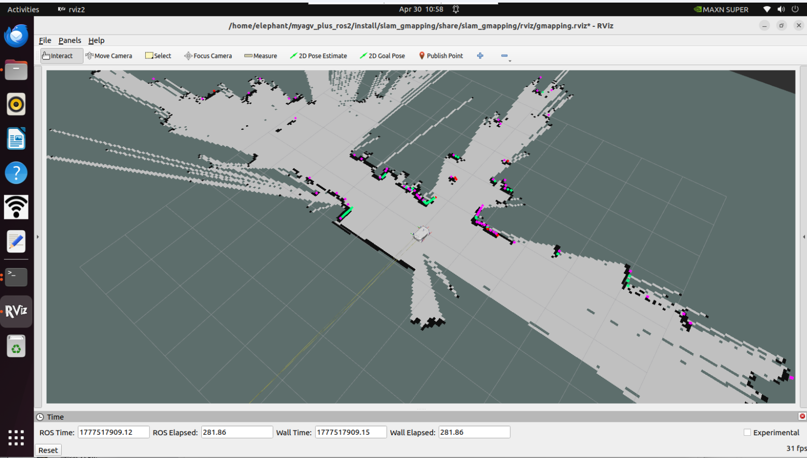
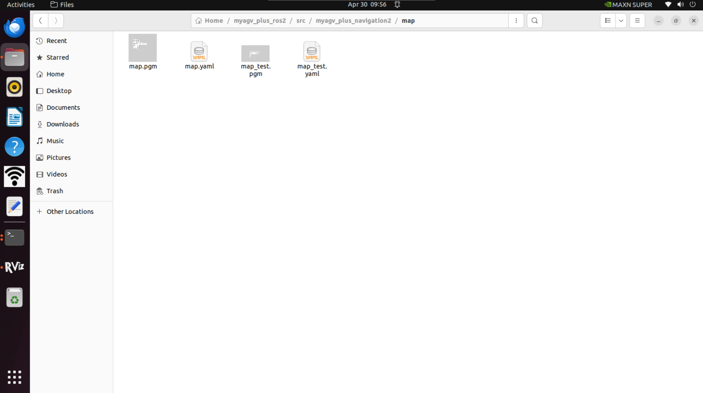

# Real-time Mapping with Gmapping

## 1. Start the communication of the car's lower layer.

Open the terminal console (shortcut <kbd>Ctrl</kbd> <kbd>Alt</kbd> <kbd>T</kbd>), and type the following command in the command line:

```bash
ros2 launch  myagv_plus_bringup myagv_plus_bringup.launch.py
```

The terminal will show the following status:


## 2.  Open the GMapping mapping launch file

Open a new terminal console and enter the following command in the command line:

```
ros2 launch slam_gmapping slam_gmapping.launch.py 
```

## 3. Open the keyboard control file

Open a new terminal console and enter the following command in the terminal command line:

```
ros2 run teleop_twist_keyboard teleop_twist_keyboard
```


|    Key    |              Direction               |
| :-------: | :----------------------------------: |
|     i     |               Forward                |
|     ,     |               Backward               |
|     j     |              Move Left               |
|     l     |              Move Right              |
|     u     |        Move to the left-front        |
|     o     |       Move to the right-front        |
|     k     |                 Stop                 |
|     m     |        Move to the left-rear         |
|     .     |        Move to the right-rear        |
| Shift + j |           Move to the left           |
| Shift + l |          Move to the right           |
| Shift + u |       Move forward to the left       |
| Shift + o |      Move forward to the right       |
| Shift + m |     Move backward  to the  left      |
| Shift + . |     Move backward  to the  left      |
|     q     | Increase Linear and Angular Velocity |
|     z     | Decrease Linear and Angular Velocity |
|     w     |       Increase Linear Velocity       |
|     x     |       Decrease Linear Velocity       |
|     e     |      Increase Angular Velocity       |
|     c     |      Decrease Angular Velocity       |

## 4. Start Mapping

Now, the small car can start moving under keyboard control. Maneuver the small car to rotate within the desired mapped space. At the same time, you can observe in the Rviz space that as the small car moves, our map is gradually being constructed.

Note: When operating the vehicle using the keyboard, please make sure that the terminal running the teleop_twist_keyboard.py file is the **currently selected terminal**; otherwise, the keyboard control program will not be able to recognize the key presses. In addition, for better mapping results, it is recommended to **use the default speed for keyboard control** during keyboard operation, as **lower speeds** often produce better mapping results.

## 5. Save the Constructed Map

Open another new terminal console, and enter the following command in the command line to save the scanned map:

```
ros2 run nav2_map_server map_saver_cli -f ~/myagv_plus_ros2/src/myagv_plus_navigation2/map/map_test
```

After successful execution, two default map parameter files will be generated in the current path **(~/myagv_plus_ros2/src/myagv_plus_navigation2/map)**, namely **map_test.pgm** and **map_test.yaml**.




---

[← Previous Page](6.2.3-Basic_Control_Based_on_ROS2.md) | [Next Page →](6.2.5-Navigation-Map_Navigation.md)

