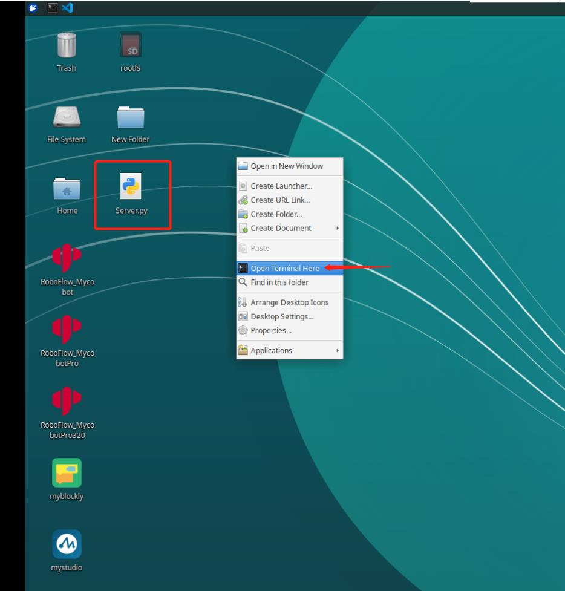
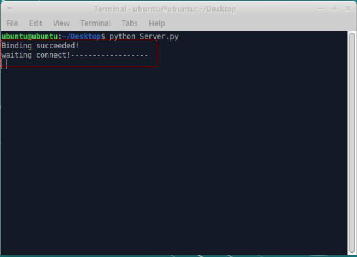
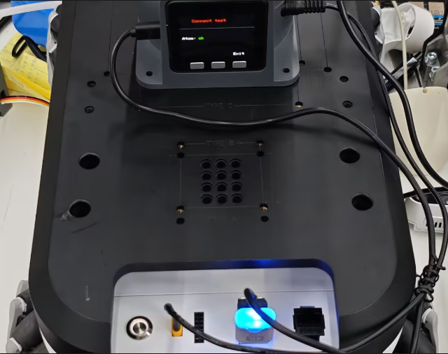
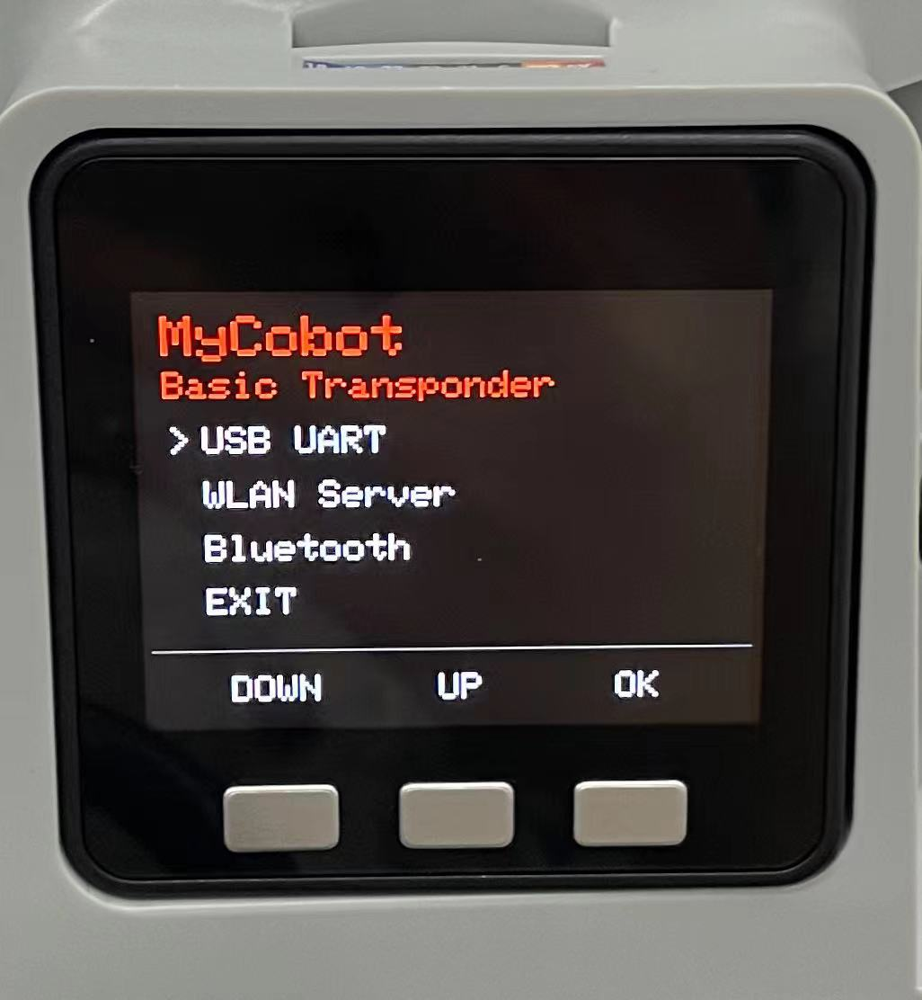
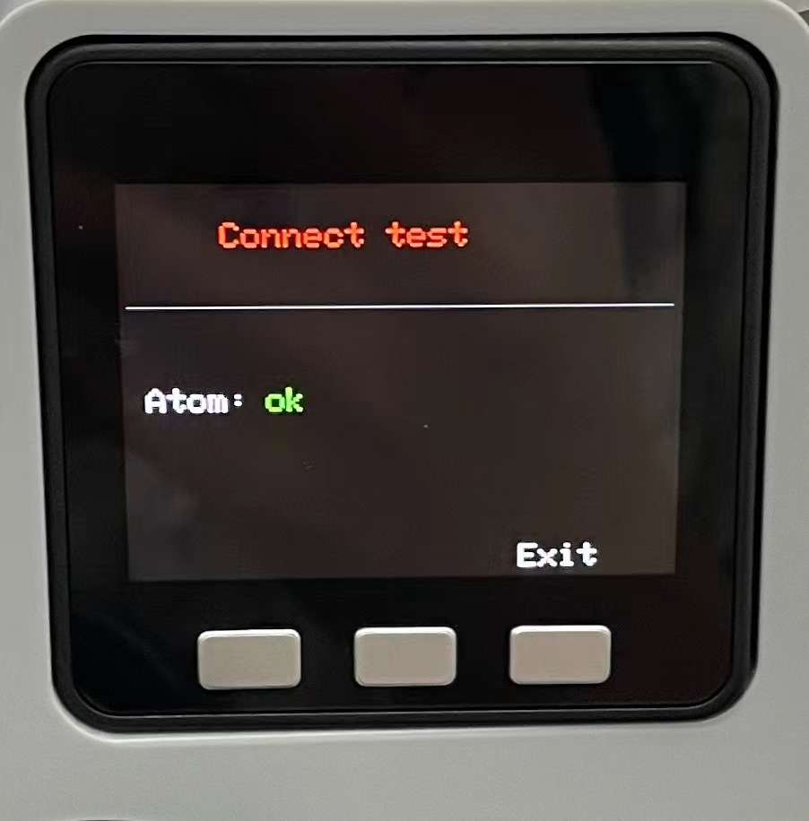
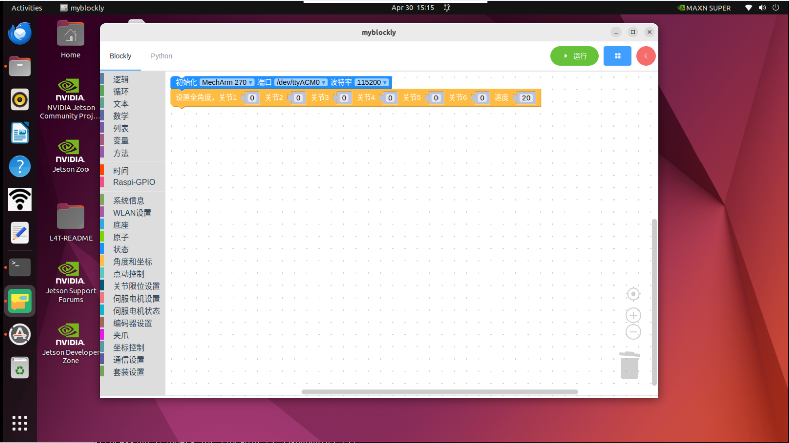
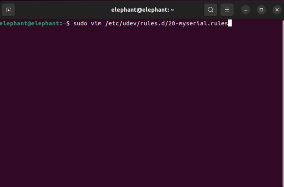
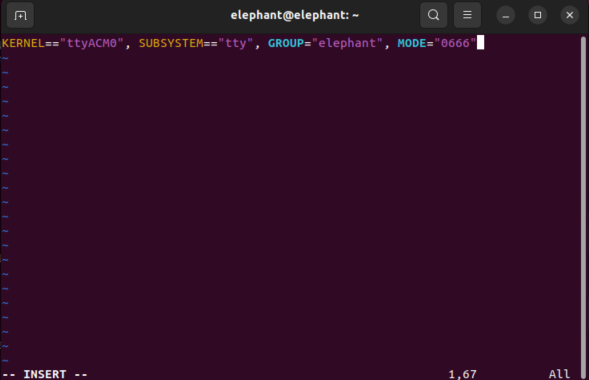
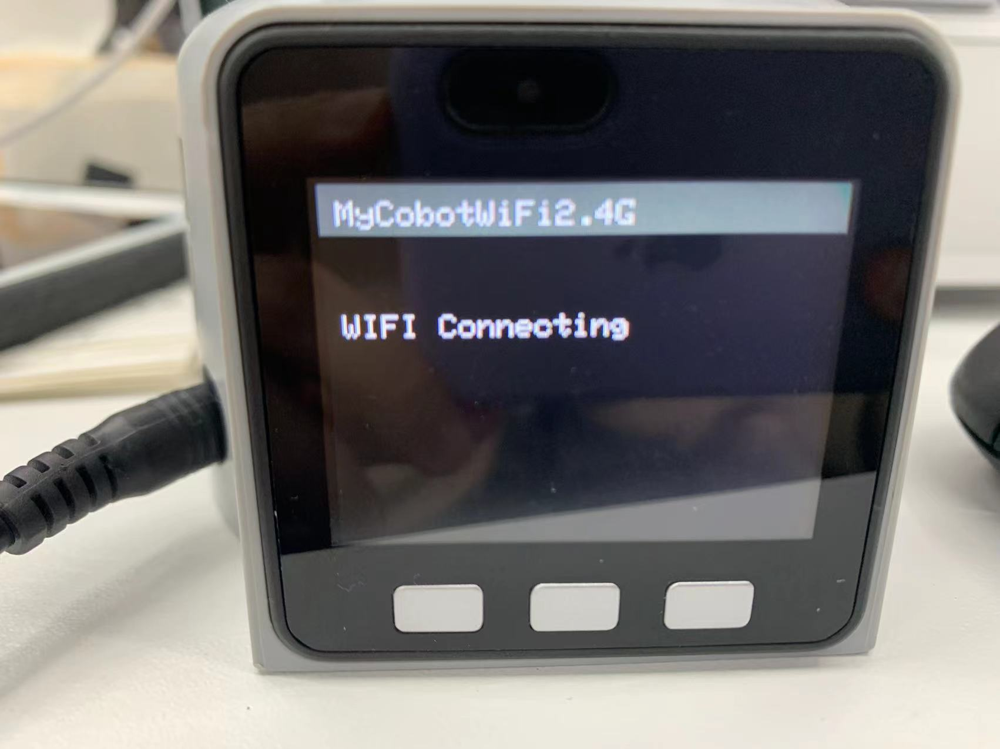
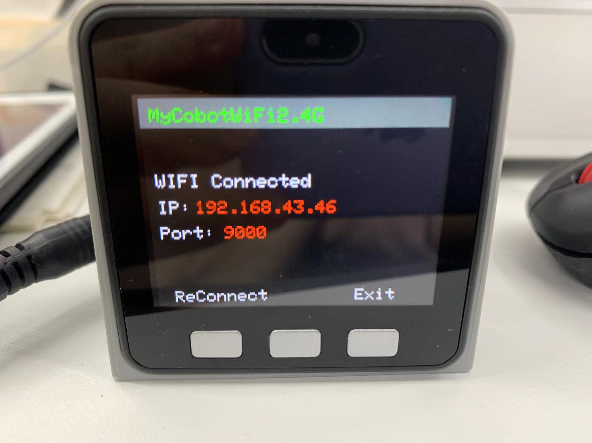

# myAGV Plus Communication and Control with Robotic Arm

## Pi Version

### WIFI Communication Control

**Note:** Only supports myCobot 280 Pi, myPalletizer 260 Pi, mechArm 270 Pi

1. Configure the Robotic Arm

**Step 1** First, turn on the robotic arm connected to the display, click the WIFI icon, connect to WIFI, enter the WIFI password, click Connection, and connect successfully.

**Step 2** Click the pymycobot file on the desktop, open the demo folder, and copy the Server.py file to the desktop.

**Step 3** Open the command terminal



**Step 4** Enter the following code to run the script:

```python
sudo python3 Server.py
```

**Step 5** Successful run as shown:



2. myAGV Plus Communication Control Example

The vehicle starts up normally and connects to the display and keyboard/mouse. After completing the above steps to ensure the connections are good, you can then use the vehicle to control the robotic arm.

**Note: The robotic arm needs to be on the same network segment as the vehicle, that is, on the same WIFI.**

- myCobot 280、mechArm 270：

```python
from pymycobot import MyCobotSocket
# Default use of port 9000
# '192.168.10.22' is the robot arm IP, please enter your own robot arm IP
mc = MyCobotSocket("192.168.10.22",9000)
mc.connect()

#Once the connection is normal, you can control the robotic arm
mc.send_angles([0,0,0,0,0,0],20)
res = mc.get_angles()
print(res)

...
```

- myPalletizer 260：

```python
from pymycobot import MyPalletizerSocket
# Default use of port 9000
# '192.168.10.22' is the robot arm IP, please enter your own robot arm IP
mc = MyPalletizerSocket("192.168.10.22"，9000)
mc.connect()

#Once the connection is normal, you can control the robotic arm
mc.send_angles([0,0,0,0],20)
res = mc.get_angles()
print(res)

...
```

---

## M5 Version

### USB Serial Communication Control

**Note:** Only supports myCobot 280 M5, myPalletizer 260 M5, mechArm 270 M5

This section uses the mechArm 270 M5 version as an example.

1. Connect the Robotic Arm

When using USB serial communication control, first connect the chassis and the robotic arm using a Type-C to USB cable.



2. USB Communication Connection

Click Transponder, then click USB UART, with the robotic arm remaining on the Atom: ok interface.





3. myAGV Communication Control

After the AGV is powered on normally and connected to the display screen and keyboard and mouse, ensure that the above steps are completed. Next, you can use the AGV to control the robotic arm.

If after running, an error occurs indicating that the serial port does not have permission

```
PermissionError:[Errno 13]Permission denied:'/dev/ttyACM0'
```

you can add a serial port rule to resolve it:



Fill in the following content



Then save the serial port rules, then reload the rules in the terminal and restart

```
sudo udevadm control --reload

sudo reboot
```

After that, you will be able to control the robotic arm normally.

For a more detailed myBlockly tutorial, you can refer to
[**Section 6.1 myBlockly**](../5-BasicApplication/5.2-ApplicationUse/5.2.1-myblockly/README.md)

### WIFI Communication Control

**Note:** Only supports myCobot 280 M5 and myPalletizer 260 M5

1. Mobile Network Settings

**Step 1:** You need to change the Wi-Fi or mobile hotspot to match the robotic arm network:

* That is, "MyCobotWiFi2.4G", where the robotic arm mobile network password is "mycobot123";

* That is, "MyPalWiFi2.4G", where the robotic arm mobile network password is "mypal123".

2. WIFI Connection

**Step 1:** Click WLAN Server, and if the "WIFI Connecting" prompt appears, it means the wireless network is connecting.




**Step 2:** When 'WIFI Connected' appears along with the IP and Port information, it indicates that the WIFI has been successfully connected.



3. myAGV Communication Control Case

After the vehicle is powered on normally, connect the display screen and keyboard and mouse. The above steps ensure proper connection, and then you can use the vehicle to control the robotic arm.

* myCobot 280：

```python
from pymycobot import MyCobotSocket
# Default use of port 9000
# '192.168.11.15' is the robot arm IP, please enter your own robot arm IP
mc = MyCobotSocket("192.168.11.15",9000)

#Once the connection is normal, you can control the robotic arm
mc.send_angles([0,0,0,0,0,0],20)
res = mc.get_angles()
print(res)

...
```

* myPalletizer 260：

```python
from pymycobot import MyPalletizerSocket
# Default use of port 9000
# '192.168.11.15' is the robot arm IP, please enter your own robot arm IP
mc = MyPalletizerSocket("192.168.11.15",9000)

#Once the connection is normal, you can control the robotic arm
mc.send_angles([0,0,0,0],20)
res = mc.get_angles()
print(res)

...
```

---

[← 上一页](7.1-InstallationInstructions.md) | [下一页 →](7.1.3-PS2+270.md)
