# myAGV Plus 270M5 Joystick Remote Control Example

**Function**: Use a joystick to control the myAGV Plus 270M5 for movement

## 1 Hardware Installation

### Robotic Arm Installation

Fix the 270M5 onto the AGV

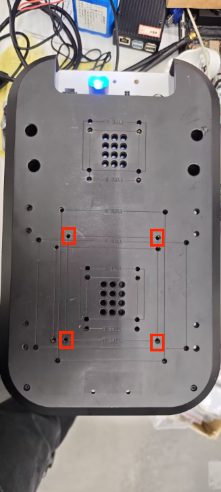

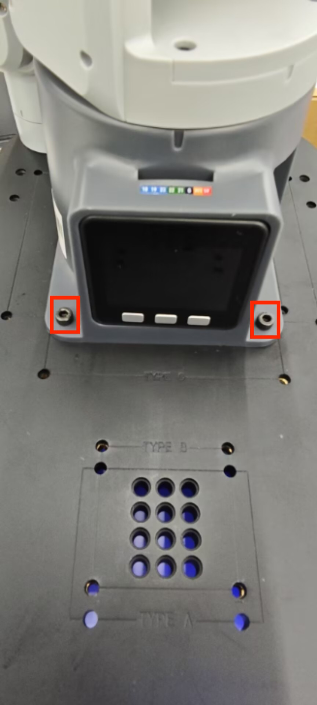

Then connect the 12V power cable, Type-C cable, and controller receiver according to the diagram below, and press the AGV power button.

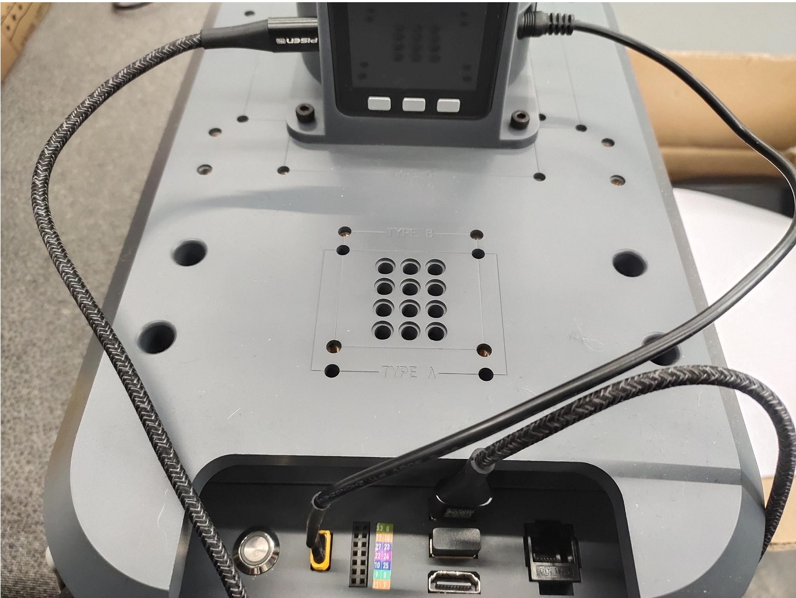


After powering on, make sure the bottom screen of the 270M5 displays ATOM: OK


The end effector can be either a gripper or a suction pump.

### Suction Pump Installation

Insert the LEGO connector into the reserved slot on the suction pump.

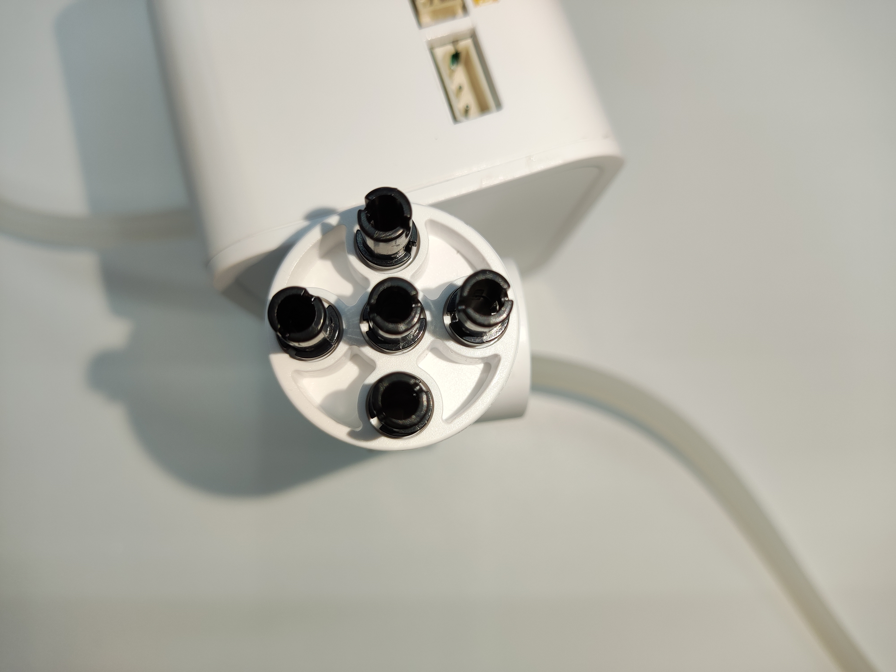

Align the suction pump with the connector inserted to the end hole of the robotic arm and insert it.

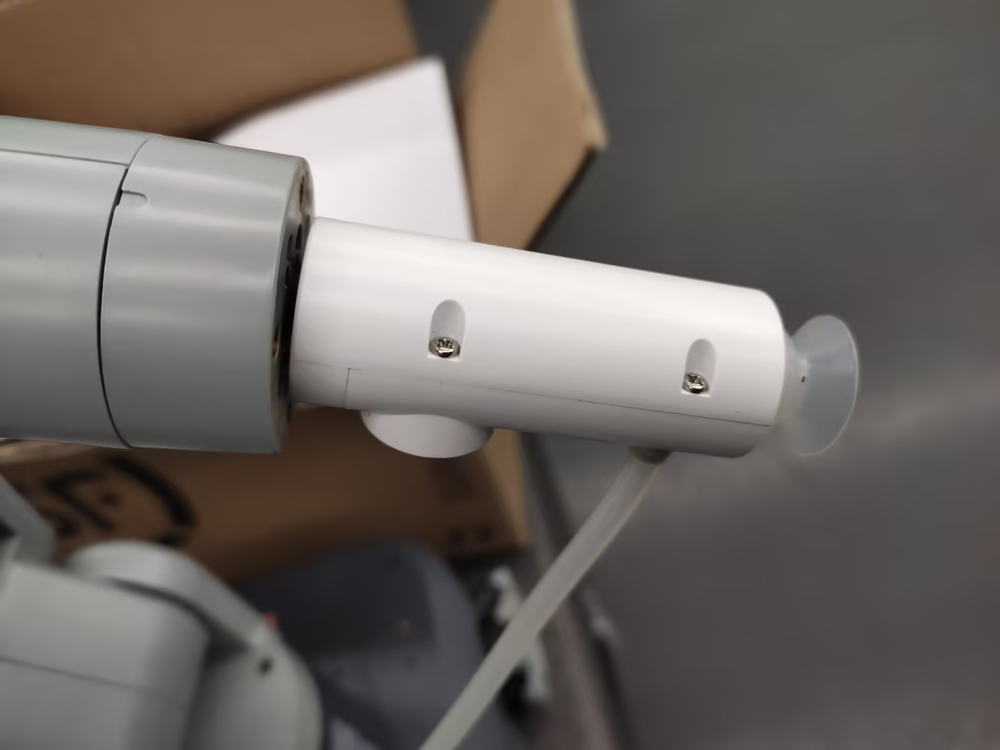

Then connect the male and female Dupont wires to the base IO of the robotic arm

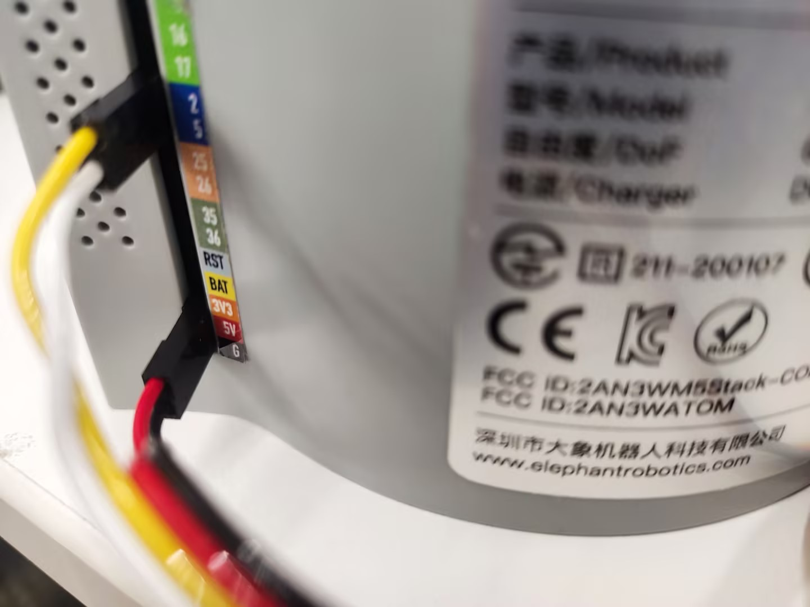


> The left side is the suction pump pin, the right side is the robotic arm pin
> GND -> GND
> 5V -> 5V
> G2 -> 2
> G5 -> 5

### Gripper Installation

Insert the LEGO connector into the reserved slot on the gripper

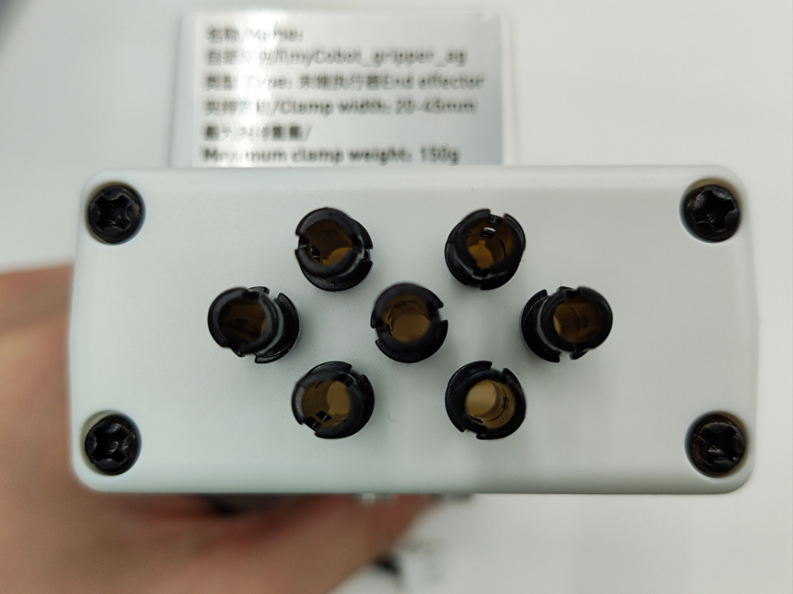

Align the gripper with the connector inserted with the end of the robotic arm and insert it into the socket

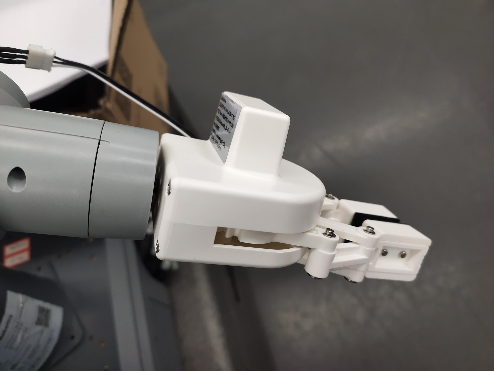

Insert the gripper cable into the robotic arm control interface

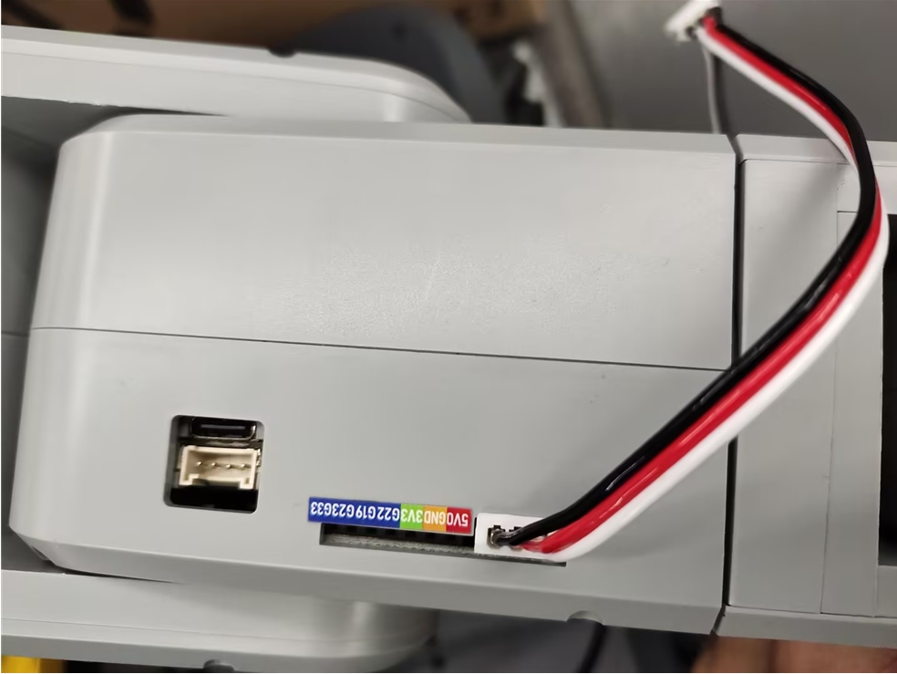


## 2 Dependency Installation

```bash
pip install pygame pymycobot --upgrade
```

## 3 Controller Function Description
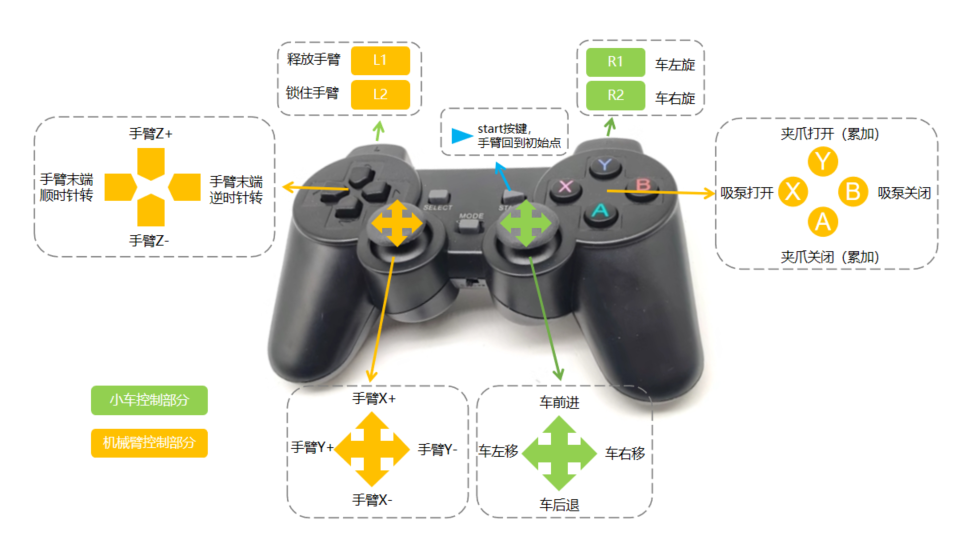

## 4 Controller Activation

Turn on the controller's switch

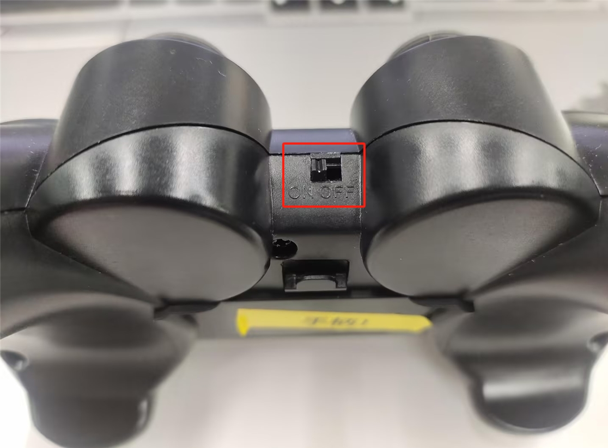

After running the program, press and hold the MODE button on the handle. When the MODE light on the handle turns red, you can release the MODE button.

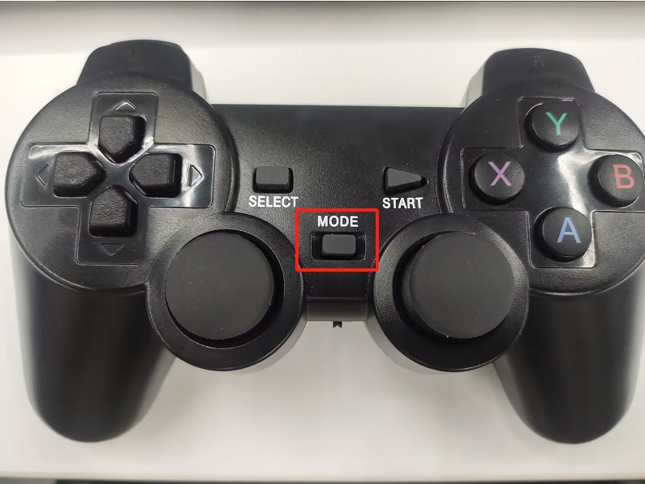

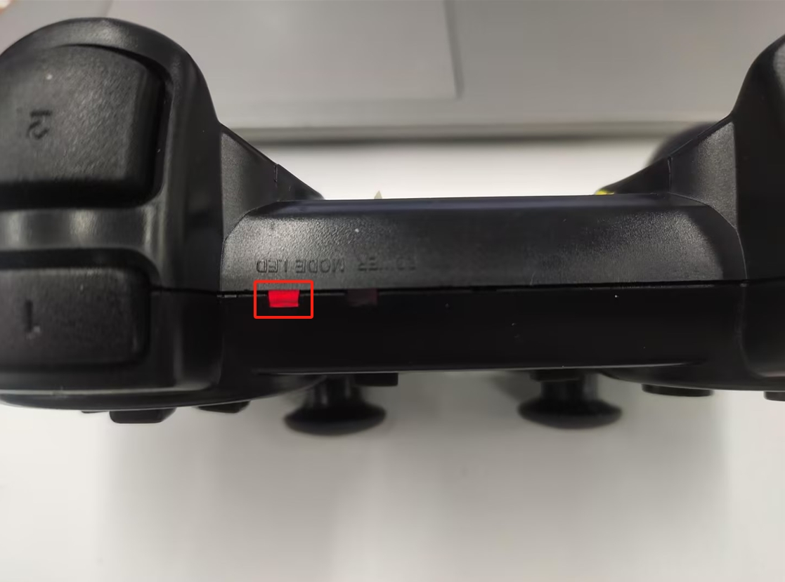

**Note**: The robotic arm can only be controlled when the MODE LED is lit. If the controller is not used for a long time, it will enter standby mode. You can press the START button on the controller to activate it.

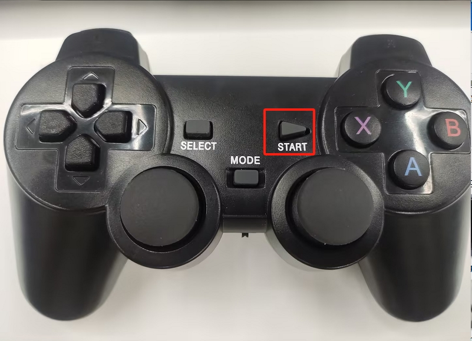

## 5 Case Reproduction

### Start the Odometry Node and Lidar Node

```bash
ros2 launch myagv_plus_bringup myagv_plus_bringup
```

### Case Program

After running the following program, the terminal will print the following information and you can start control:
**Robotic Arm Controller Initialization Successful**

**Joystick Connected Successfully**

```python
#!/usr/bin/env python3
"""
手柄控制节点
- 接收手柄输入
- 发布速度控制指令
"""

import rclpy
from rclpy.node import Node
from geometry_msgs.msg import Twist
from myagv_plus_joystick_control.joystick import InputJoystick, Hotkey
from myagv_plus_joystick_control.mecharm_controller import MechArm270Controller
from pymycobot import MechArm270

class JoystickController(Node):
    def __init__(self):
        super().__init__('joystick_controller')
        
        # 速度参数
        self.max_linear_speed = 0.25  # 最大线速度
        self.max_angular_speed = 1.0  # 最大角速度
        
        # 当前速度
        self.linear_speed_x = 0.0  # 前后移动
        self.linear_speed_y = 0.0  # 左右平移
        self.angular_speed = 0.0   # 旋转

         # 机械臂控制标志
        self._arm_motion_control = False

        try:
            
            self.arm_controller = MechArm270Controller(port='/dev/ttyACM0')  # 根据实际端口修改
            self.arm_controller.set_fresh_mode(0) # 0: 自动模式, 1: 刷新模式
            self.get_logger().info("机械臂控制器初始化成功")
        except Exception as e:
            self.get_logger().error(f"机械臂控制器初始化失败: {e}")
            self.arm_controller = None
    
        # 发布速度指令
        self.cmd_vel_publisher = self.create_publisher(Twist, '/cmd_vel', 10)
        
        # 初始化手柄
        self.joystick = InputJoystick(raw_mapping=False)
        self.joystick.inject_caller(self)
        
        # 注册手柄事件
        self.register_joystick_events()
        
        # 检测手柄
        if self.init_joystick():
            self.get_logger().info("手柄连接成功")
            # 启动手柄监听线程
            import threading
            self.joystick_thread = threading.Thread(target=self.joystick.run_with_loop)
            self.joystick_thread.daemon = True
            self.joystick_thread.start()
            # 启动速度发送定时器（10Hz）
            self.create_timer(0.1, self.send_speed_timer)
        else:
            self.get_logger().error("未检测到手柄")
    
    def init_joystick(self) -> bool:
        device = InputJoystick.get_gamepad(0)
        if device is not None:
            self.joystick.set_device(device)
            return True
        return False
    
    def register_joystick_events(self):
        """注册手柄事件回调"""
        # 右摇杆 - 左右移动（平移，线速度Y）
        @self.joystick.register(hotkey=Hotkey.RIGHT_X_AXIS)
        def RIGHT_X_AXIS(self, value: int):
            # 0-127: 左移, 128: 中心, 129-255: 右移
            if value < 128:
                self.linear_speed_y = self.max_linear_speed  # 线速度Y（左移）
            elif value > 128:
                self.linear_speed_y = -self.max_linear_speed  # 线速度Y（右移）
            else:
                self.linear_speed_y = 0.0
            self.publish_speed()
        
        # 右摇杆 - 前后移动（线速度X）
        @self.joystick.register(hotkey=Hotkey.RIGHT_Y_AXIS)
        def RIGHT_Y_AXIS(self, value: int):
            # 0-127: 前移, 128: 中心, 129-255: 后移
            if value < 128:
                self.linear_speed_x = self.max_linear_speed  # 线速度X（前移）
            elif value > 128:
                self.linear_speed_x = -self.max_linear_speed  # 线速度X（后移）
            else:
                self.linear_speed_x = 0.0
            self.publish_speed()
        
        # L2 - 速度减小（按钮事件，值为0或1）
        @self.joystick.register(hotkey=Hotkey.L2, value_filter=lambda value: value == 1)
        def L2(self, value: int):
            self.max_linear_speed = max(0.1, self.max_linear_speed - 0.1)
            self.max_angular_speed = max(0.5, self.max_angular_speed - 0.2)
            self.get_logger().info(f"速度减小: 线速度={self.max_linear_speed:.2f}, 角速度={self.max_angular_speed:.2f}")
        
        # R2 - 速度增大（按钮事件，值为0或1）
        @self.joystick.register(hotkey=Hotkey.R2, value_filter=lambda value: value == 1)
        def R2(self, value: int):
            self.max_linear_speed = min(1.6, self.max_linear_speed + 0.1)
            self.max_angular_speed = min(4.0, self.max_angular_speed + 0.2)
            self.get_logger().info(f"速度增大: 线速度={self.max_linear_speed:.2f}, 角速度={self.max_angular_speed:.2f}")
        
        # L1 - 车左旋
        @self.joystick.register(hotkey=Hotkey.L1)
        def L1(self, value: int):
            if value == 1:
                self.angular_speed = self.max_angular_speed  # 角速度
            else:
                self.angular_speed = 0.0
            self.publish_speed()
        
        # R1 - 车右旋
        @self.joystick.register(hotkey=Hotkey.R1)
        def R1(self, value: int):
            if value == 1:
                self.angular_speed = -self.max_angular_speed  # 角速度
            else:
                self.angular_speed = 0.0
            self.publish_speed()
               
        # START - 停止并回到零点
        @self.joystick.register(hotkey=Hotkey.STARTUP, value_filter=lambda value: value == 0)
        def STARTUP(self, value: int):
            self.linear_speed_x = 0.0
            self.linear_speed_y = 0.0
            self.angular_speed = 0.0
            self.publish_speed()
            self.arm_controller.go_home()
            self.get_logger().info("机械臂复位")

        @self.joystick.register(hotkey=Hotkey.Y)
        def Y(self, value: int):
            print(f"{Hotkey.Y} {value}")
            if value == 1:
                # print(f" # Open gripper.")
                self.arm_controller.open_gripper(1)
            else:
                self.arm_controller.stop()
                # print(f" # Stop opening the gripper.")

        @self.joystick.register(hotkey=Hotkey.A)
        def A(self, value: int):
            if value == 1:
                # print(f" # Close gripper.")
                self.arm_controller.close_gripper(1)
            else:
                self.arm_controller.stop()
                # print(f" # Stop closing the gripper.")

        @self.joystick.register(hotkey=Hotkey.X, value_filter=lambda value: value == 0)
        def X(self, _: int):
            try:
                self.arm_controller.open_suction_pump()
                # print(f"Open suction pump.")
            except NotImplementedError as e:
                print(e)

        @self.joystick.register(hotkey=Hotkey.B, value_filter=lambda value: value == 0)
        def B(self, _: int):
            try:
                self.arm_controller.close_suction_pump()
                # print(f"Close suction pump.")
            except NotImplementedError as e:
                print(e)

        @self.joystick.register(hotkey=Hotkey.HORIZONTAL)
        def HORIZONTAL(self, value: int):
            if value == 1:
                # print(f" # The end is rotated counterclockwise.")
                self.arm_controller.set_end_rotate(direction=-1, speed=20)

            elif value == -1:
                # print(f" # The end is rotate clockwise.")
                self.arm_controller.set_end_rotate(direction=1, speed=20)

            else:
                # print(" # Stop spinning.")
                self.arm_controller.stop()

        @self.joystick.register(hotkey=Hotkey.VERTICAL)
        def VERTICAL(self, value: int):
            if value == -1:
                # print(f"axis z +.")
                self.arm_controller.coordinate(axis=3, direction=1)
            elif value == 1:
                # print(f"axis Z -.")
                self.arm_controller.coordinate(axis=3, direction=0)
            else:
                # print("axis z stop.")
                self.arm_controller.stop()

        @self.joystick.register(hotkey=Hotkey.LEFT_X_AXIS)
        def LEFT_X_AXIS(self, value: int):
            if value > 128 and not self._arm_motion_control:
                # print(f"axis y -.")  # Y+
                self.arm_controller.coordinate(axis=2, direction=0)
                self._arm_motion_control = True

            elif value < 128 and not self._arm_motion_control:
                # print(f"axis y +.")  # Y-
                self.arm_controller.coordinate(axis=2, direction=1)
                self._arm_motion_control = True

            elif value == 128 and self._arm_motion_control:
                self._arm_motion_control = False
                # print(f"axis y stop.")
                self.arm_controller.stop()

        @self.joystick.register(hotkey=Hotkey.LEFT_Y_AXIS)
        def LEFT_Y_AXIS(self, value: int):
            if value < 128 and not self._arm_motion_control:
                # print(f"axis x +.")  # X+
                self.arm_controller.coordinate(axis=1, direction=1)
                self._arm_motion_control = True

            elif value > 128 and not self._arm_motion_control:
                # print(f"axis x -.")  # X-
                self.arm_controller.coordinate(axis=1, direction=0)
                self._arm_motion_control = True

            elif value == 128 and self._arm_motion_control:
                self._arm_motion_control = False
                # print(f"axis x stop.")
                self.arm_controller.stop()
    
    def publish_speed(self):
        """发布速度指令"""
        twist = Twist()
        twist.linear.x = self.linear_speed_x  # 前后移动
        twist.linear.y = self.linear_speed_y  # 左右平移
        twist.angular.z = self.angular_speed   # 旋转
        self.cmd_vel_publisher.publish(twist)
    
    def send_speed_timer(self):
        """定时器回调，定期发送速度指令"""
        self.publish_speed()
        
def main(args=None):
    rclpy.init(args=args)
    node = JoystickController()
    
    try:
        rclpy.spin(node)
    except KeyboardInterrupt:
        pass
    finally:
        node.destroy_node()
        rclpy.shutdown()

if __name__ == '__main__':
    main()
```

## 6 Case Studies


[← Previous Page](7.1.2-CommunicationsControl.md) | [Next page →](../7.2-Pedestrian tracking feature/7.2.1-Pedestrian following feature.md)

