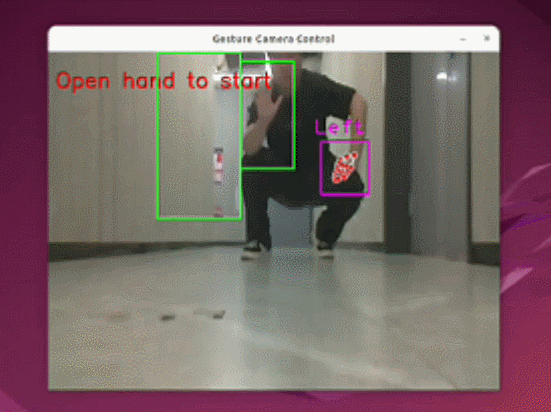

# myAGV Plus Pedestrian Follow Case

**Function**: myAGV Plus Pedestrian Follow Function

## 1 Function Activation

1. Open a terminal and enter a command to start the pedestrian follow function.

**Note: Starting the function via SSH may result in errors. It is recommended to use VNC or connect a display and use a keyboard to start the function**

```bash
ros2 launch  myagv_plus_pedestrian_follower pedestrian_follower.launch.py 
```


2. After the function successfully starts, squat about 2 meters away and wave your hand to activate the pedestrian following function.

## 2 Case Demonstration




[← Previous Page](../7.1-AGVPIus 270M5Pi Handle Control/7.1.3-PS2+270.md) | [Next Chapter →](../../8-FilesDownload/README.md)

