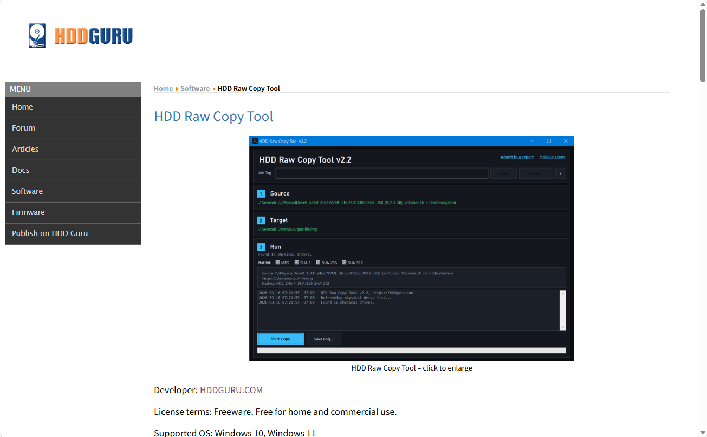
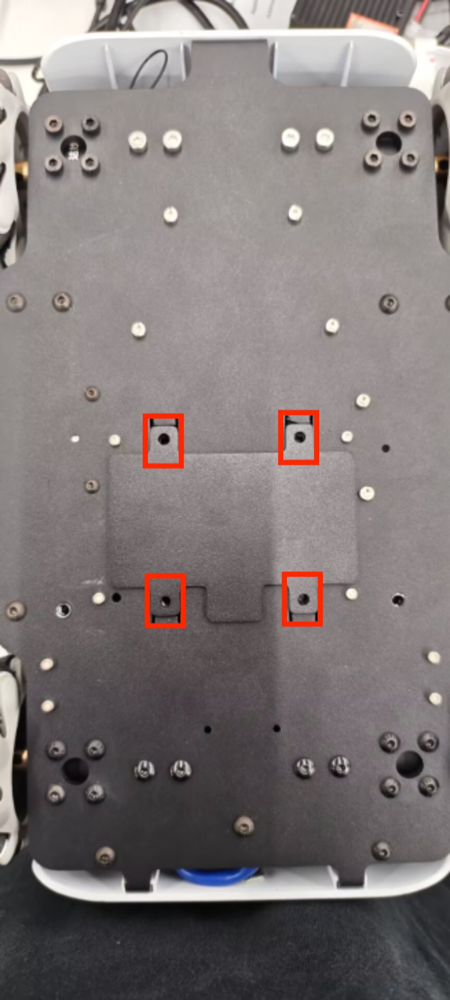
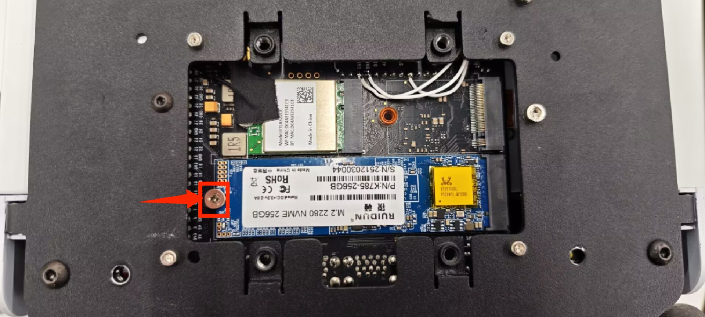
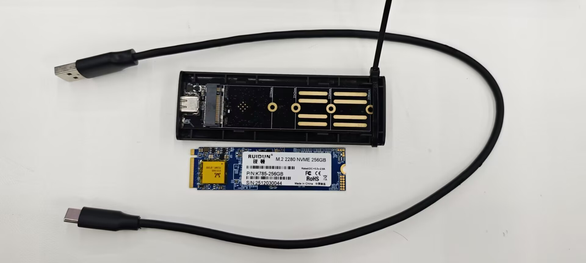

# Image Burning

### 1.1 Steps to Download

**Step 1:** Unzip the package and [a file of image](8.4.1-System_Image.md) style appears.

**Step 2:** Download HDD Raw Copy Tool.

Please visit [HDD Raw Copy Tool](https://hddguru.com/software/HDD-Raw-Copy-Tool/) to download.

**Step 3:** Remove the corresponding screws according to the picture, and use tweezers to take out the solid-state drive of myAGV PLUS. Then connect the solid-state drive to the computer.

**Step 4:** Connect the hard drive enclosure to the computer and open HDD Raw Copy Tool.

**Step 5:** Select the software and device (E drive), then write the software to the PC.

---

[← Previous Page](8.4.1-System_Image.md) | [Next Section →](../8.5-PublicityMaterial.md)
